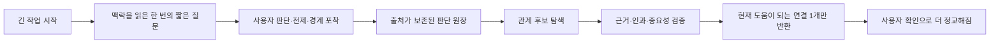
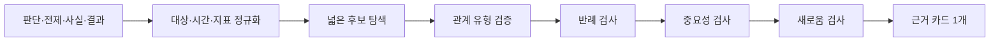

# Argus: 기다림을 판단 자산으로 바꾸고, 흩어진 판단 사이의 진짜 연결을 찾는 설계

> Fable 5와의 제품·기술 검토용 제안서
> 작성일: 2026-07-13
> 상태: 아이디어와 검증 계획. 이 문서의 두 신기능은 아직 구현하지 않는다.

## 0. 결론부터

두 아이디어는 별도 기능이 아니라 하나의 축적 루프다.

1. 사용자가 AI에게 일을 맡기고 기다리는 동안, 방금 내린 판단의 기준·전제·경계를 아주 가볍게 포착한다.
2. 포착된 판단 재료가 세션과 프로젝트를 건너 누적된다.
3. Argus는 단어가 비슷한 기록이 아니라, 실제로 같은 사실·제약·인과관계에 닿는 기록만 연결한다.
4. 그 연결이 현재 판단을 바꿀 수 있을 때만 사용자에게 한 장으로 보여준다.

이 루프의 제품적 의미는 다음과 같다.

> 기다림은 빈 시간이 아니라 판단이 아직 생생한 시간이다.
> Argus는 그 순간의 판단을 부담 없이 남기고, 시간이 지난 뒤 서로 무관해 보였던 결정 사이에서 근거 있는 관계를 되돌려준다.

권고안은 다음과 같다.

- 기본 입력은 빈 주관식이 아니다. Argus가 현재 맥락에서 만든 2~3개의 구체적인 가설을 보여주고 사용자가 고르거나 고쳐 쓰게 한다.
- 기록을 위한 질문은 작업을 멈추지 않는다. 진행 메시지 안에 짧게 보여주고 에이전트는 계속 일한다.
- 답이 현재 작업의 방향을 바꾸는 경우에만 네이티브 선택창으로 잠깐 멈춘다.
- 세션당 최대 한 질문만 허용한다. 물을 만한 날카로운 질문이 없으면 침묵한다.
- 연결은 유사도가 아니라 `구체적인 관계 + 양쪽 근거 + 현재 중요성`을 모두 만족할 때만 보여준다.
- 첫 버전은 한 저장소 안에서 시작하고, 여러 프로젝트를 가로지르는 연결은 사용자가 명시적으로 켠 뒤 확장한다.

## 1. 왜 이 둘을 함께 설계해야 하는가

연결 기능만 먼저 만들면 신뢰할 만한 연결 재료가 부족하다. 대화 원문에는 사실, 농담, 탐색 중인 생각, AI가 제시한 아이디어, 사용자가 실제로 채택한 판단이 섞여 있다. 이 전체를 임베딩해서 연결하면 그럴듯한 쓰레기가 대량으로 나온다.

반대로 기다림 중 포착만 만들면 한 줄 메모가 쌓이지만 장기적인 보상이 약하다. 사용자는 “그래서 이걸 왜 계속 남겨야 하지?”라고 느낀다.

두 기능을 합치면 서로의 약점을 해결한다.



첫 기능은 좋은 데이터를 얻는 입구이고, 두 번째 기능은 데이터가 쌓일수록 커지는 보상이다.

## 2. 먼저 바로잡아야 할 오해: `AskUserQuestion`이 기본 해법은 아니다

Claude Code의 `AskUserQuestion`은 1~4개의 질문과 각 2~4개의 선택지를 네이티브 UI로 보여줄 수 있다. 자유 입력도 지원한다. 시각적으로는 우리가 원하는 모습과 가장 가깝다. 그러나 이 도구가 호출되면 Claude의 실행은 사용자가 답할 때까지 멈춘다. 서브에이전트 안에서는 사용할 수도 없다. [Claude Code 사용자 입력 문서](https://code.claude.com/docs/en/agent-sdk/user-input)

MCP에도 `elicitation/create`가 있어 서버가 호스트에게 enum이나 짧은 입력 폼을 요청할 수 있다. Argus는 이미 일부 핵심 입력에서 이 기능을 사용한다. 하지만 MCP 규격은 구체적인 UI를 보장하지 않고, 호스트가 elicitation을 지원할 때만 동작한다. 또한 활성 MCP 요청 안에서 이루어지는 입력 요청이므로 그 도구 호출은 응답을 기다리게 된다. [MCP Elicitation 규격](https://modelcontextprotocol.io/specification/2025-11-25/client/elicitation)

따라서 네이티브 질문창은 나쁜 기술이 아니라 용도가 다르다.

### 네이티브 질문창을 써야 할 때

- 답에 따라 현재 작업 결과가 달라진다.
- 선택지가 실제로 두세 갈래로 나뉘어 있다.
- AI가 임의로 가정하고 계속하면 재작업 비용이 크다.
- 사용자가 몇 초 안에 답할 수 있다.

예:

> 이 개편에서 기존 사용자 호환성과 새 구조의 단순함 중 어느 쪽을 우선해야 하나요?

이것은 작업을 멈추고 물을 가치가 있다. 답이 구현 방향을 바꾸기 때문이다.

### 네이티브 질문창을 쓰면 안 되는 때

- 답이 현재 작업에 꼭 필요하지 않고 장기 기록에만 유용하다.
- 사용자가 이미 “알아서 진행해”라고 맡긴 상태다.
- 작업이 한창 도는 중인데 단지 메모를 얻기 위해 멈추게 한다.
- 매 세션 반복될 수 있다.

예:

> 이 판단에서 가장 중요했던 전제는 무엇인가요?

이 질문이 단지 Argus 기록을 풍부하게 하려는 목적이라면, 작업을 멈추게 해서는 안 된다.

## 3. 권고 UX: 두 속도의 질문 체계

### 속도 A. 방향을 바꾸는 질문: 잠깐 멈추는 네이티브 선택창

현재 결과에 필요한 질문은 Claude Code의 `AskUserQuestion`, 지원 호스트의 MCP elicitation, Codex가 제공하는 구조화된 사용자 입력처럼 각 호스트의 네이티브 UI를 쓴다.

원칙:

- Argus 기록을 위해 묻는 것이 아니라 현재 작업의 오류를 막기 위해 묻는다.
- 최대 한 질문, 2~3개 선택지, 자유 입력 하나.
- 답을 받은 즉시 작업에 반영하면서 사용자 원문을 판단 기록으로 남긴다.
- `왜 그런가요?`처럼 넓은 주관식부터 요구하지 않는다.

### 속도 B. 판단을 포착하는 질문: 작업을 멈추지 않는 인라인 카드

이것이 기다리는 시간을 활용하는 기본 방식이다.

에이전트가 프롬프트를 받자마자 묻는 것이 아니다. 저장소나 문서를 조금 읽고, 사용자의 요청과 실제 작업 맥락을 이해한 뒤 첫 의미 있는 진행 업데이트에 한 번만 넣는다.

```text
Argus · 선택사항

제가 지금 읽은 핵심 갈림길은 이것입니다.
이번 개편에서 더 지키려는 것은 어느 쪽에 가깝나요?

1. 사용자가 새 방식을 배우지 않아도 되는 것
2. 내부 구조가 예외 없이 단순해지는 것
3. 기존 설치와의 호환성이 깨지지 않는 것

번호만 보내거나 한 줄로 고쳐 써도 됩니다.
답하지 않아도 작업은 계속됩니다.
```

에이전트는 이 메시지를 낸 직후 그대로 검색·수정·테스트를 계속한다. 사용자는 작업 중 `1`, `2`, `3` 또는 짧은 수정안을 입력한다.

Claude Code와 Agent SDK는 작업 중 입력을 큐에 넣어 순차 처리하는 흐름을 지원한다. Claude Code의 최신 대화형 모드에는 작업 중에도 독립적으로 쓸 수 있는 `/btw`와 백그라운드 세션도 있지만, `/btw`는 단일 응답이고 기록에 들어가지 않으며 도구도 쓸 수 없어 Argus 입력창으로 직접 재사용하기에는 부적합하다. 여기서 얻을 교훈은 “주 작업을 방해하지 않는 별도 상호작용”이 실제 호스트 UX로 가능하다는 점이다. [Claude Code 대화형 모드](https://code.claude.com/docs/en/interactive-mode), [Streaming Input](https://code.claude.com/docs/en/agent-sdk/streaming-vs-single-mode)

Codex는 `UserPromptSubmit`, `PostToolUse`, `Stop` 훅을 제공하므로 질문 후보의 세션 상태와 답변 포착을 연결할 수 있다. 다만 현재 문서상 command hook만 실행되고 비동기 hook은 지원되지 않으며, plugin/MCP가 임의의 네이티브 선택 카드 UI를 만드는 계약은 없다. 따라서 Codex의 기본은 진행 중 commentary에 같은 인라인 카드를 보여주고, 사용자가 보내는 steering 메시지를 다음 입력으로 포착하는 방식이 현실적이다. [Codex Hooks](https://learn.chatgpt.com/docs/hooks)

중요한 기술적 정직성:

- Claude와 Codex 모두에서 “인라인 메시지를 낸 뒤 에이전트가 정말 계속 도는가”를 실제 버전별로 스파이크해야 한다.
- 호스트가 진행 중 새 입력을 받지 못하면 같은 카드를 작업 종료 직후의 다음 입력 제안으로 내린다.
- 터미널을 직접 조작하는 별도 프로세스, 비표준 ANSI 오버레이, 로컬 웹 UI는 사용하지 않는다. TUI를 깨뜨리고 설치 마찰을 키운다.

## 4. 왜 빈 주관식부터 물으면 안 되는가

다음 질문은 인지 비용이 너무 크다.

> 이 작업에서 당신의 판단 근거와 전제를 적어주세요.

사용자는 무엇을 어느 정도 써야 할지 다시 설계해야 한다. AI에게 일을 맡겨 머리를 비우려던 순간에 또 하나의 일을 받는다.

Argus는 먼저 현재 맥락을 읽고 “확인 가능한 가설”을 만들어야 한다. 사용자는 생성자가 아니라 편집자 역할을 맡는다.

좋은 기본 형태:

> 제가 이렇게 읽었는데 맞나요?

- 맞다
- 일부만 맞다
- 아니다
- 한 줄로 고치기

조금 더 정보가 필요할 때:

> 이 방향이 맞으려면 무엇이 가장 먼저 사실이어야 하나요?

- 현재 사용자는 새 용어를 거의 보지 않는다.
- 기존 설치가 자동으로 새 체계로 이동한다.
- 내부 호환 계층이 사용자 표면에 새지 않는다.
- 아직 모르겠다 / 직접 입력

선택지는 `속도`, `품질`, `사용자`처럼 추상적인 단어가 아니라 현재 작업에서 실제로 참·거짓이나 우선순위를 가릴 수 있는 완전한 문장이어야 한다.

## 5. 무엇을 물을지 고르는 질문 엔진

Argus가 질문을 많이 만드는 것이 목표가 아니다. “지금 가장 값비싼 빈칸 하나”를 찾는 것이 목표다.

### 질문 자격 조건

아래를 모두 만족해야 인라인 카드를 낼 수 있다.

1. 현재 작업에 실제 판단이나 선택이 있다.
2. 사용자가 이미 같은 내용을 명확히 말하지 않았다.
3. 답이 향후 기록이나 연결을 실질적으로 개선한다.
4. 사용자가 지금 조사하지 않고도 답할 수 있다.
5. 문맥에 맞는 선택지 두 개 이상을 만들 수 있다.
6. 이 세션에서 아직 Argus 질문을 보여주지 않았다.
7. 작업이 충분히 길어 실제 기다림이 생긴다.

하나라도 만족하지 못하면 침묵한다.

### 질문 우선순위

Argus는 다음 빈칸 중 가장 위에 있는 하나만 묻는다.

1. **판단의 경계**: 무엇은 포기해도 되지만 무엇은 깨지면 안 되는가?
2. **결정적 기준**: 여러 좋은 것 중 실제 선택을 가르는 기준은 무엇인가?
3. **핵심 전제**: 이것이 틀리면 방향이 바뀌는 사실은 무엇인가?
4. **변경 신호**: 어떤 증거가 나오면 지금 판단을 다시 볼 것인가?
5. **미결 질문**: 아직 답하지 않았지만 나중에 확인해야 할 것은 무엇인가?

단순한 감상, 기분, 작업 만족도는 기본 질문 대상이 아니다.

### 질문 생성 절차

1. 사용자 요청에서 명시적으로 정한 내용을 추출한다.
2. 에이전트가 초기에 읽은 자료에서 실제 갈림길을 찾는다.
3. 이미 답한 내용은 제거한다.
4. 남은 빈칸이 현재 작업에 미치는 차이를 계산한다.
5. 가장 정보량이 큰 빈칸 하나에 대해 상호 배타적인 선택지 2~3개를 만든다.
6. 선택지마다 현재 문맥의 구체적인 명사를 넣는다.
7. `아직 모르겠다`와 수정 경로를 남긴다.

### 나쁜 질문

- 왜 그렇게 생각하세요?
- 가장 중요한 것은 무엇인가요?
- 이 결정의 전제를 적어주세요.
- 품질과 속도 중 무엇이 중요하나요?

### 좋은 질문

- “기존 사용자의 명칭을 그대로 유지”와 “내부 개념과 화면 명칭을 완전히 통일”이 충돌하면 어느 쪽을 지키나요?
- 이 출시 판단이 바뀌려면 `베타 사용자 10명의 재방문`과 `결제 성공률 99%` 중 어느 신호가 더 결정적인가요?
- 이번 채용이 맞으려면 “3개월 안에 신규 매출이 생긴다”와 “현재 팀의 병목이 실제로 영업 인력이다” 중 무엇이 먼저 사실이어야 하나요?

## 6. 답변의 저장 규칙

질문 UI보다 더 중요한 것은 출처를 훼손하지 않는 것이다.

### 사용자 답변

- 사용자가 번호를 고르면 그 번호가 가리킨 완전한 문장을 사용자 확인 문장으로 저장한다.
- 사용자가 고쳐 쓰면 수정한 원문을 그대로 저장한다.
- 사용자 답변은 자동 만료시키지 않는다.
- 선택 당시의 질문, 선택지, 세션, 관련 결정 후보를 함께 보존한다.

### AI가 만든 가설

- 사용자가 고르지 않은 선택지는 사용자 생각으로 저장하지 않는다.
- AI가 대화에서 자동으로 포착한 판단·전제는 `AI가 포착한 후보`로만 저장한다.
- AI 후보는 기존 v2 정책처럼 일정 기간 후 자동 정리할 수 있다.
- AI 가설을 사용자 전제나 사실로 자동 승격하지 않는다.

### 무응답

- 사용자가 무시했다는 사실을 판단 원장에 남기지 않는다.
- “응답하지 않은 사용자”라는 행동 프로필을 만들지 않는다.
- 세션 중 다시 묻지 않는다.
- 무응답은 정상적인 제품 사용이다.

## 7. 호스트별 최적 표면

| 상황 | Claude Code | Codex | 공통 원칙 |
|---|---|---|---|
| 현재 작업에 답이 꼭 필요함 | `AskUserQuestion` | 호스트의 구조화 질문이 가능할 때 사용 | 잠깐 멈춰도 됨 |
| 기록용 질문, 작업은 계속 가능 | 진행 출력의 인라인 번호 카드 + queued input | commentary 인라인 번호 카드 + steering input | 절대 기다리지 않음 |
| MCP 도구 안에서 필수 필드가 빠짐 | MCP elicitation 지원 시 네이티브 폼 | MCP elicitation 지원 시 네이티브 폼 | 호스트 미지원 시 짧은 텍스트 fallback |
| 사용자가 백그라운드로 맡김 | Agent view의 `Needs input`은 필수 질문에만 | 작업 알림 후 돌아왔을 때 필수 질문 | 기록용 질문 때문에 blocked 상태를 만들지 않음 |
| 질문 가치가 낮음 | 침묵 | 침묵 | 침묵이 기본값 |

Claude Code의 Agent view는 백그라운드 세션을 `Working / Needs input / Completed`로 구분하고, multiple-choice 질문에 숫자로 답할 수 있다. 그러나 연구 프리뷰 기능이며 모든 사용자가 쓰는 기본 진입점이 아니므로 핵심 기능의 필수 조건으로 삼으면 안 된다. [Claude Code Agent view](https://code.claude.com/docs/en/agent-view)

## 8. “연결”의 정의를 엄격하게 다시 세우기

이 기능의 목표는 관련 콘텐츠 추천이 아니다. 다음 네 조건을 모두 만족하는 관계만 연결이다.

1. **대상이 맞다**: 같은 사람·회사·제품·지표·자원·기간·제약을 가리킨다.
2. **관계가 구체적이다**: 지지, 충돌, 갱신, 의존, 공유 제약 등 이름 붙일 수 있다.
3. **양쪽 근거가 있다**: 두 세션 각각에서 관계를 입증하는 원문이나 확인된 사실이 있다.
4. **현재 중요하다**: 이 관계를 알면 사용자가 확인할 것, 다시 볼 결정, 반복할 실수를 구체적으로 바꿀 수 있다.

키워드가 같거나 의미 벡터가 가깝다는 것은 후보를 찾을 이유일 뿐, 연결을 보여줄 이유가 아니다.

제품 문장으로는 이렇게 정의할 수 있다.

> Argus의 연결은 “두 기록이 비슷하다”가 아니라 “한 기록의 사실이나 판단이 다른 결정의 전제·제약·결과에 실제로 닿는다”는 뜻이다.

## 9. 연결의 층위

### 1층. 같은 현실을 가리키는 연결

가장 확실하고 먼저 만들 수 있다.

- 같은 URL과 문서
- 같은 회사·팀·사람
- 같은 수치·지표·기간
- 같은 계약·정책·기술 의존성

예:

> “결제 파트너의 무료 API 제공은 12월까지”라는 사실이 제품 출시 결정과 비용 계획에 동시에 쓰였다.

### 2층. 한 결정이 다른 결정의 조건이 되는 연결

결정끼리 닮지 않았어도 실제 의존관계가 있다.

예:

- 마케팅 캠페인 일정은 신규 결제 API 출시일에 의존한다.
- 결제 API 이전 일정은 외부 파트너의 인증 완료에 의존한다.
- 따라서 파트너 인증 지연은 마케팅과 기술 이전 두 결정을 동시에 움직인다.

표면 단어는 `마케팅`, `API 이전`, `파트너 인증`으로 다르지만 하나의 실제 연쇄에 있다.

### 3층. 같은 숨은 제약에 기대는 연결

사용자가 처음 생각한 “서로 전혀 다른 세션이 더 높은 층위에서 연결되는” 가치에 가장 가깝다.

예:

> 가격 결정에서는 프리미엄 고객 지원을 유지하기 위해 낮은 판매량을 택했다.
> 채용 결정에서는 신규 영업 인력을 늦췄는데, 새 고객을 온보딩할 인력이 없기 때문이었다.

두 결정은 `가격`과 `채용`이라는 다른 주제지만 실제로는 같은 제약인 `고객 온보딩·지원 처리량`에 묶여 있다. 지원 처리량이 개선되면 두 결정을 함께 다시 볼 이유가 생긴다.

이 연결은 단어 유사도로 찾기 어렵다. 각각의 결정에서 “무엇 때문에 다른 선택을 포기했는가”라는 인과 구조를 추출해야 한다.

### 4층. 새 사실이 과거 전제를 지지·충돌·갱신하는 연결

이것은 앞선 예시의 범주지만 전체 연결 기능 중 하나일 뿐이다.

- 새 사실이 기존 전제를 강화한다.
- 새 사실이 기존 전제와 양립할 수 없다.
- 과거 사실이 오래되어 새 값으로 바뀌었다.
- 질문 상태였던 것이 확인된 사실이 되었다.

### 5층. 반복되는 판단 구조

가장 매력적이지만 가장 위험하다.

예:

> 서로 다른 세 번의 결정에서 사용자는 수요보다 내부 처리 용량을 늦게 확인했고, 실제 결과에서도 같은 병목이 반복되었다.

이것은 “사용자는 항상 운영을 과소평가한다” 같은 성격 판정이 아니다. 최소 세 건 이상의 독립 사례와 실제 결과가 있고, 각 사례에서 같은 인과 구조가 확인될 때만 `반복 가능성이 있는 패턴`으로 제안해야 한다.

한두 건으로 사람의 성향, 편향, 능력을 추론해서는 안 된다.

## 10. 연결 엔진: 유사도 검색이 아니라 검증 파이프라인



### 단계 1. 대상을 맞춘다

각 기록에서 다음을 구조화한다.

- 주체와 대상
- 사실 또는 주장
- 시간 범위
- 수치와 단위
- 상태와 부정 여부
- 근거 출처
- 이 사실이 영향을 주는 결정

“매출이 오른다”와 “A 제품의 한국 월 매출이 2026년 3분기에 오른다”는 같은 사실이 아니다.

### 단계 2. 후보를 넓게 찾는다

다음 신호를 함께 쓴다.

- 동일 출처, URL, 문서 ID
- 동일 엔티티·지표·기간
- 사용자가 직접 지정한 관련 결정
- 의미 검색과 임베딩
- 인과 역할의 유사성: 병목, 선행조건, 포기 이유, 변경 신호

임베딩은 여기까지만 쓴다. 진실 판정에 쓰지 않는다.

### 단계 3. 관계를 검증한다

검증기는 양쪽 전체 맥락을 보고 다음 중 하나만 반환한다.

- 같은 사실
- 지지함
- 충돌함
- 갱신함
- 의존함
- 같은 제약을 공유함
- 관계 없음

`관계 없음`이 가장 흔한 정상 결과여야 한다.

### 단계 4. 반례를 먼저 찾는다

연결을 확정하기 전에 스스로 깨뜨려 본다.

- 같은 단어지만 다른 대상인가?
- 시간 범위가 달라 동시에 참일 수 있는가?
- 한쪽이 계획이고 다른 쪽이 실제 사실인가?
- 부정문이나 조건문을 반대로 읽지 않았는가?
- 같은 회사명이지만 다른 법인·팀·제품인가?
- 비슷한 구조처럼 보이지만 실제 선택을 움직인 이유는 다른가?

이 검사를 통과하지 못하면 숨긴다.

### 단계 5. 중요성과 새로움을 별도로 검사한다

관계가 참이어도 사용자에게 보여줄 가치가 없을 수 있다.

보여줄 수 있는 경우:

- 현재 결정의 핵심 전제를 바꾼다.
- 여러 결정을 묶는 동일 제약을 발견한다.
- 이미 조사한 사실을 다시 조사하지 않게 한다.
- 확인해야 할 질문을 구체적으로 줄인다.
- 실제 결과가 반복되는 판단 구조를 지지한다.

숨겨야 하는 경우:

- 단지 같은 주제다.
- 사용자가 이미 현재 메시지에서 명시했다.
- 행동이나 재검토 대상을 바꾸지 않는다.
- 설명하려면 추측을 여러 단계 쌓아야 한다.

## 11. 사용자에게 보이는 것은 그래프가 아니라 한 장의 다리

사용자에게 노드·엣지·임베딩·신뢰도 숫자를 보여줄 필요가 없다.

```text
Argus · 과거 기록과 연결 1개

이번 채용 결정과 4월의 가격 결정은
같은 제약인 “신규 고객 온보딩 처리량”에 기대고 있습니다.

지금 결정
“영업 인력을 늘려도 고객을 받을 운영 인력이 부족하다.”

4월 기록
“프리미엄 지원 품질을 유지하려면 판매량을 제한해야 한다.”

왜 중요한가
온보딩 처리량이 바뀌면 두 결정을 함께 다시 볼 수 있습니다.

[같은 제약이 맞음] [관련 없음] [나중에 보기]
```

표면 규칙:

- 한 세션 최대 한 연결
- 제목에서 관계를 한 문장으로 말함
- 양쪽 원문 또는 확인된 사실을 나란히 보여줌
- AI의 권고가 아니라 “왜 함께 볼 이유가 있는지”만 설명함
- 사용자가 관련 없다고 하면 같은 연결을 다시 제안하지 않음
- 전체 그래프 탐색 화면은 MVP에서 만들지 않음

## 12. 현재 v2에서 재사용할 수 있는 것과 새로 필요한 것

### 이미 있는 좋은 기반

- append-only 내구 원장
- 저장소·워크스페이스·세션 provenance
- 사용자 발화와 AI 포착 구분
- `decision / premise / fact / question / outcome`에 가까운 상태 모델
- 결정에 아직 속하지 않은 후보
- 후보의 승격·보류·폐기
- 동일한 전제 문장의 기본 그룹화
- byte 단위 근거 포인터

### 새로 필요한 데이터

- 사용자 응답이 있는 경우에만 생기는 `reflection_answered`
- 독립된 사실·제약의 안정적인 ID
- 엔티티·지표·시간 범위의 정규화 표현
- `connection_proposed / confirmed / rejected / superseded`
- 관계 양쪽의 evidence pointer
- 중요성 판단 근거
- 사용자별 거절·확인 이력

### 만들지 말아야 할 것

- 새 공개 MCP 도구 여러 개
- 사용자가 직접 관리하는 “그래프”
- `BIND / SETTLE / REVIEW / REFRAME` 같은 새 ritual 세트
- 모든 대화의 무제한 원문 중앙 업로드
- AI가 자동 확정한 사용자 성향 프로필

공개 MCP는 현재 7개 목적형 도구를 유지한다. 기다림 답변의 임시 상태와 자동 포착은 host adapter와 원장 내부에서 처리하고, 사용자가 직접 확인하거나 수정할 때만 기존 `argus_clarify_decision`, `argus_check_in`, `argus_history`로 들어온다.

## 13. 개인정보와 범위

이 기능은 판단·전제처럼 민감한 데이터를 다루므로 연결 범위를 제품이 임의로 넓히면 안 된다.

기본값:

- 현재 저장소 안에서만 연결
- 원문과 인덱스는 로컬 저장
- 사용자 답변만 영구 자산
- AI 자동 포착은 만료 가능한 후보
- 외부 모델로 임베딩이나 검증을 보낼 경우 명시적 opt-in

확장 순서:

1. 한 저장소
2. 사용자가 선택한 여러 저장소
3. 개인 계정 전체
4. 팀 공유 사실은 별도 동의와 권한 모델 이후

임베딩도 의미를 담은 데이터다. “원문을 보내지 않았으니 안전하다”고 간주해서는 안 된다. 로컬 임베딩 모델을 우선 검토하고, 클라우드 인덱싱은 별도의 선택으로 둔다.

## 14. 실패하기 쉬운 설계

### 실패 1. 매번 묻는다

사용자는 곧 자동으로 건너뛰고 Argus 전체를 끈다.

### 실패 2. 빈 주관식부터 준다

기록이 아니라 숙제가 된다.

### 실패 3. 예쁜 선택창을 위해 작업을 멈춘다

기다리는 시간을 활용하려다가 기다리는 시간을 늘린다.

### 실패 4. AI 선택지를 곧바로 사용자 생각으로 저장한다

provenance가 무너지고 이후 연결 전체가 오염된다.

### 실패 5. 임베딩 유사도를 연결로 보여준다

“둘 다 성장 이야기입니다” 같은 무가치한 카드가 쌓인다.

### 실패 6. 연결이 맞지만 중요하지 않다

사실상 맞는 잡학 추천이 사용자의 주의를 빼앗는다.

### 실패 7. 너무 일찍 성향을 추론한다

두세 문장으로 사용자를 규정하는 불쾌하고 위험한 제품이 된다.

### 실패 8. 별도 로컬 UI를 요구한다

설치·전환·학습 비용이 기능 가치보다 커진다.

## 15. 구현 전에 반드시 할 스파이크

### 스파이크 A. Claude Code 비차단 질문

검증할 것:

- assistant가 인라인 카드를 먼저 출력하고 같은 turn에서 도구 작업을 계속할 수 있는가?
- 사용자가 작업 중 입력한 `1`, `2`, `3`이 중단 없이 queued message로 들어가는가?
- queued answer를 다음 `UserPromptSubmit`에서 안전하게 pending card와 매칭할 수 있는가?
- 터미널, VS Code, Agent view에서 동작 차이가 무엇인가?

### 스파이크 B. Codex 비차단 질문

검증할 것:

- commentary 카드가 작업 중 즉시 보이는가?
- 사용자의 steering answer가 현재 turn에 도착하는가, 다음 turn에 도착하는가?
- plugin hook이 pending question ID와 답변을 안정적으로 연결할 수 있는가?
- CLI, IDE, app에서 어떤 fallback이 필요한가?

### 스파이크 C. 네이티브 질문의 비용

같은 질문을 두 방식으로 비교한다.

- 네이티브 blocking choice
- non-blocking inline choice

측정:

- 답변율
- 답변까지 걸린 시간
- 작업 완료 시간 증가
- 사용자의 방해감
- 답변 품질
- 기능 끄기 비율

기술적으로 가능하다는 것과 사용자가 좋아한다는 것은 다르다. 작은 스파이크 없이 전체 원장 배선부터 만들면 안 된다.

## 16. 제안하는 단계별 출시

### P0. 표면 스파이크

- 저장하지 않는 가짜 인라인 카드
- Claude Code와 Codex 각각 20개 이상의 실제 긴 작업에서 관찰
- 질문 타이밍, 입력 큐, 방해감만 검증

### P1. 사용자 답변 포착

- 세션당 한 질문
- 문맥형 선택지 2~3개
- 사용자 답변만 로컬 원장에 보존
- AI 후보와 사용자 답변 분리
- 연결 기능은 아직 없음

### P2. 확실한 연결

- 동일 URL·문서·엔티티·지표·기간
- 명시적인 의존관계
- 양쪽 evidence pointer 필수
- 의미 검색 없음 또는 후보 탐색에만 제한

### P3. 공유 제약과 전제 갱신

- 의미 검색으로 후보 생성
- 관계 검증기 + 반례 검사 + 중요성 검사
- 사용자에게 한 카드만 제안

### P4. 반복 판단 구조

- 최소 세 건의 독립 기록과 실제 결과 필요
- 자동 확정 금지
- 사용자 확인 후 개인 패턴으로만 보존

## 17. 초기 품질 게이트

수치는 실제 사용자 데이터로 조정해야 하지만, 방향은 정밀도 우선이어야 한다.

### 기다림 포착

- 비차단 질문 때문에 본 작업이 멈춘 사례 0건
- 세션당 중복 질문 0건
- 이미 답한 내용을 다시 묻는 비율 5% 미만
- 사용자가 기능을 시끄럽다고 평가하거나 끈 비율 5% 미만
- 사용자 답변을 AI 원문으로 잘못 귀속한 사례 0건

### 연결

- 사람이 검토한 연결 정밀도 90% 이상부터 제한 출시
- 같은 키워드·다른 대상 hard negative 오연결 5% 미만
- 양쪽 근거 없는 카드 0건
- 관계는 맞지만 중요하지 않은 카드의 표면화 10% 미만
- `관련 없음`으로 거절한 동일 연결 재등장 0건

정확한 연결을 놓치는 것은 초기에 허용할 수 있다. 틀린 연결을 자신 있게 보여주는 것은 허용하면 안 된다.

## 18. Fable 5와 논의할 핵심 질문

1. 기본 표면을 `작업을 계속하는 인라인 선택 카드`로 두는 데 동의하는가?
2. 현재 작업 방향에 필요한 질문과 장기 기록용 질문을 구분하는 더 좋은 기준이 있는가?
3. 질문 우선순위 `경계 → 결정적 기준 → 핵심 전제 → 변경 신호 → 미결 질문`이 맞는가?
4. 사용자에게 선택지부터 주는 것이 어떤 종류의 anchoring bias를 만들 수 있으며, 이를 어떻게 줄일 것인가?
5. 사용자가 고른 문장은 곧바로 사용자 자산으로 보존하고, AI 후보만 만료시키는 구분이 충분한가?
6. 연결의 최소 정의 `대상 일치 + 관계 유형 + 양쪽 근거 + 현재 중요성`에 빠진 조건이 있는가?
7. 공유 제약 연결을 전제 충돌보다 앞선 핵심 가치로 볼 것인가?
8. 반복 판단 구조를 보여주기 위한 최소 사례 수와 실제 결과 조건은 무엇이어야 하는가?
9. 연결 한 세션 한 개 제한이 지나치게 보수적인가, 아니면 출시 초기에는 필수인가?
10. P0 스파이크에서 어떤 실패가 나오면 이 기능을 접어야 하는가?

## 19. 최종 제품 원칙

이 기능이 성공하면 사용자는 더 많이 기록하는 사람이 되는 것이 아니다. 더 적은 노력으로 중요한 순간만 남기고, 과거의 판단이 현재에 실제로 도움이 되는 경험을 하게 된다.

따라서 최종 원칙은 네 문장이다.

1. **빈칸을 쓰게 하지 말고, 날카로운 가설을 고치게 한다.**
2. **기록을 위해 작업을 멈추지 않는다.**
3. **유사한 것을 연결하지 말고, 서로의 조건이 되는 것을 연결한다.**
4. **확실하고 중요한 연결이 없으면 아무것도 말하지 않는다.**
