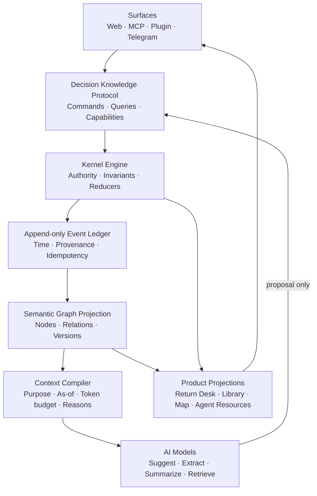

# ARGUS DECISION KNOWLEDGE KERNEL v0

## 인간이 소유한 판단을 위한 AI-native 지식 아키텍처 — 연구 기반 1차안

Date: 2026-07-14<br>
Revision: v0.1 — research synthesis / constitutional draft<br>
Status: **PROPOSAL · 코드 구현 전 · 반증과 축소가 필요한 1차안**<br>
Authoring context: 창업자의 명시적 요청으로 작성한 BLUEPRINT §7 문서 신설 금지의
계획 수립 예외<br>
Relationship:

- `docs/ARGUS-BLUEPRINT.md`를 대체하지 않는다. 채택 전에는 §8 대기 항목이다.
- `docs/DESIGN-judgment-record-system-2026-07-14.md`보다 **상위 층**이다. 그 문서가
  Return Desk·기록실·지도·내비게이션이라는 제품 projection을 설계한다면, 이 문서는
  모든 projection이 따라야 할 지식 언어·권한·원장·프로토콜을 설계한다.
- 현재 제품 코드 변경은 이 문서의 범위가 아니다.

---

## 0. 첫 판정

### 0.1 우리가 뒤늦게 발견한 진짜 중심

Argus의 핵심 자산은 웹앱의 한 화면도, MCP 도구 묶음도, Telegram 알림도 아니다.
그 모든 표면이 함께 읽고 쓸 수 있는 **판단의 지식 체계**다.

이 문서에서는 이를 `Decision Knowledge Kernel`, 줄여서 **DKK**라고 부른다. 이름은
임시지만, “제품 화면보다 아래에서 의미와 권한을 집행하는 core”라는 뜻은 고정한다.

> **Argus는 AI가 붙은 의사결정 앱이 아니라, 인간이 소유한 판단을 시간과 표면을
> 건너 보존·귀환·정산하는 runtime이어야 한다.**

현재의 제품 설계는 `WorkItem → DecisionRecord → Return Promise → Settlement`라는
좋은 생애주기를 얻었다. 그러나 생애주기만 같다고 의미가 같은 것은 아니다.

- 웹의 `Project.decision_contract`
- MCP v2의 append-only ledger
- Plugin의 decision item
- Review receipt
- Telegram callback

이들이 각자 `decision`, `premise`, `authorship`, `settle`을 조금씩 다르게 이해하면,
화면을 통합해도 제품은 내부에서 계속 번역된다. 번역할 때마다 저자·시간·검증 상태가
조금씩 손실되고, 결국 “같은 판단”이 표면마다 다른 사실이 된다.

따라서 순서는 다음이어야 한다.

```text
Decision Knowledge Constitution
  → Semantic Language
  → Authority & Provenance
  → Temporal Event Ledger
  → Command / Query Protocol
  → Conformance Suite
  → Source Adapters
  → Web · MCP · Plugin · Telegram projections
```

### 0.2 이 문서의 강한 주장

**결정은 문서도, 태스크도, 답변도, 예측값도 아니다.**

결정은 특정 시점에 한 사람이 다음을 함께 소유한 묶음이다.

1. 답하려던 질문
2. 실제로 내린 판단
3. 그 판단이 기대고 있던 주장과 전제
4. 당시 확인했거나 확인하지 못한 근거
5. 무엇이 일어나면 다시 보겠다는 약속
6. 이후 현실에서 관찰한 것
7. 원래 판단과 현실을 대조해 남긴 해석

이 묶음에는 **내용뿐 아니라 저자, 채택자, 기록자, 근거, 시간, 수정 이력**이 포함된다.
그중 하나라도 빠지면 AI가 나중에 그럴듯한 이야기를 재구성할 여지가 생긴다.

### 0.3 이 설계가 만들려는 moat

모델은 바뀌고 UI는 복제된다. 하지만 다음 능력은 쉽게 복제되지 않는다.

- 사람이 어떤 판단을 **그때 무엇을 알고** 내렸는지 재구성
- AI 제안과 사용자 소유 판단을 한 글자도 세탁하지 않고 구분
- 같은 판단을 여러 표면에서 중복 없이 이어감
- 시간이 지나 바뀐 전제와 원래 전제를 정확히 대조
- 필요한 과거만 토큰 예산 안에 이유와 함께 다시 구성
- 모델이 바뀌어도 판단 원장의 의미가 바뀌지 않음
- 새 표면이 공통 conformance test만 통과하면 곧바로 호환

이것이 사실이라면, Return Desk나 지도는 moat 자체가 아니라 Kernel의 힘을 사용자가
느끼게 하는 훌륭한 projection이다.

---

## 1. 조사 범위와 방법

이번 1차 조사는 “누가 이미 완성했는가”를 찾기 위해 다음 계보를 1차 자료와 공식
제품 문서 중심으로 대조했다.

1. 인간 지식 증강과 연결: Memex, Engelbart
2. 의사결정학: Decision Analysis, Influence Diagrams, Decision Quality
3. 논증과 설계 근거: IBIS, AIF
4. 규칙 기반 의사결정 자동화: DMN
5. provenance와 책임성: W3C PROV-O, Decision Provenance
6. 운영 온톨로지: ontology-driven decision making, Palantir Ontology
7. 협업 결정과 예측 제품: Loomio, Metaculus
8. 개인 소유·동기화: local-first software
9. AI memory와 agent protocol: Generative Agents, MemGPT, MCP, Agent Context Graph

아래 비교는 각 체계의 공개 문서가 표방하는 범위를 바탕으로 한 **Argus 관점의
해석**이다. “그 체계가 기능을 전혀 지원하지 않는다”는 전수 감사 판정이 아니다.

---

## 2. 선행 체계에서 가져올 것과 넘어서야 할 것

### 2.1 Memex와 Engelbart — 기억의 연결이 아니라 지적 증강

Vannevar Bush의 Memex는 계층 분류보다 사용자가 만든 **associative trail**을
중심에 놓았다. 한 항목은 여러 trail에 속할 수 있고, 오랜 뒤 다시 불러오거나 다른
사람의 trail과 연결할 수 있다. Doug Engelbart는 도구를 단순 저장소가 아니라
인간의 이해와 문제 해결 능력을 함께 높이는 **human-artifact system**으로 봤다.

**가져올 것**

- 지식은 한 폴더에만 들어가지 않는다. 판단은 전제·사람·시점·후속 판단이라는 여러
  trail에 동시에 속한다.
- 회수는 검색 결과가 아니라 “그때의 사고 경로”를 복원해야 한다.
- AI의 목적은 인간을 대체하는 것이 아니라 인간의 판단 능력을 증강하는 것이다.

**넘어설 것**

- trail만으로는 주장과 근거, 사용자 판단과 AI 제안, 당시와 지금을 구별하지 못한다.
- 연결이 많다는 것과 올바른 의미를 보존한다는 것은 다르다.

참고: [Vannevar Bush, *As We May Think* — associative trails](https://www.w3.org/History/1945/vbush/vbush7.shtml),
[Doug Engelbart, *Augmenting Human Intellect*](https://dougengelbart.org/pubs/augment-3906-Framework.html)

### 2.2 Decision Analysis·Influence Diagrams·Decision Quality — 결정의 구조

Howard와 Matheson의 Influence Diagram 계보는 결정, 불확실성, 정보, 가치의
의존관계를 compact graph로 표현한다. Decision Quality는 좋은 frame, 대안, 유용한
정보, 가치, 건전한 추론, 실행 commitment라는 여섯 요소를 제시하며, 좋은 결정과
좋은 결과를 구분한다.

**가져올 것**

- 결과가 나빴다고 당시 판단 과정이 나빴다고 단정하지 않는다.
- 질문(frame), 전제/정보, 선택지, 가치, 판단, 실행 약속을 서로 다른 개념으로 본다.
- “무엇을 알면 판단이 바뀌는가”가 지식 구조의 중요한 edge다.

**넘어설 것**

- 모든 일상 판단을 완전한 influence diagram이나 효용 계산으로 강제하면 over-fire다.
- 전통적 decision analysis는 대개 한 의사결정 시점의 품질에 집중하며, AI가 여러
  표면에서 제안하고 사람이 채택하고 현실과 다시 만나는 provenance protocol은
  제공하지 않는다.
- Argus는 사용자의 판단 품질을 점수화하지 않는다. 구조를 빠뜨리지 않게 도울 뿐이다.

참고: [Howard & Matheson, *Influence Diagrams*](https://doi.org/10.1287/deca.1050.0020),
[Alliance for Decision Education, Decision Quality](https://www.decisioneducation.org/principles-of-decision-quality/defining-decision-quality),
[Annie Duke — outcome과 decision quality의 분리](https://www.annieduke.com/the-science-and-strategy-of-decision-making-with-annie-duke-decision-strategist-and-speaker/)

### 2.3 IBIS와 AIF — 결론보다 논의 구조를 남김

Kunz와 Rittel의 IBIS는 복잡한 문제 해결을 issue, position, argument의 네트워크로
다뤘다. AIF는 premise, conclusion, inference, conflict와 argument scheme을 서로
다른 도구가 교환할 수 있는 ontology로 발전시켰다.

**가져올 것**

- 질문, 가능한 입장, 지지·반대 근거를 한 문단에 뭉개지 않는다.
- 결론만이 아니라 “왜 이 결론에 왔는가”를 구조적으로 남긴다.
- 서로 다른 도구가 같은 논증 구조를 교환할 수 있어야 한다.

**넘어설 것**

- Argus의 기본 단위는 토론이나 논증이 아니라 **사용자가 소유한 판단**이다.
- 평평한 판단에 position과 pro/con을 제조하지 않는다.
- 논거가 강하다는 것과 사용자가 그것을 자신의 판단 근거로 채택했다는 것을 분리한다.
- 논증 graph에는 귀환 약속, 실제 관찰, 정산, 시간 변화가 기본 개념으로 들어 있지 않다.

참고: [Kunz & Rittel, *Issues as Elements of Information Systems*](https://escholarship.org/uc/item/5cj786v8),
[Rahwan et al., *The Argument Interchange Format*](https://web.mit.edu/~irahwan/www/docs/chapter2009b.pdf)

### 2.4 W3C PROV-O와 Decision Provenance — 누가 무엇으로 무엇을 만들었는가

W3C PROV는 Entity, Activity, Agent와 `wasGeneratedBy`, `wasDerivedFrom`,
`wasAttributedTo`, revision 관계를 이용해 이질적인 시스템 사이의 provenance를
표현한다. Decision Provenance 연구는 알고리즘 시스템의 입력, 의사결정, 후속 효과가
여러 조직과 시스템을 건너며 불투명해지는 문제를 지적한다.

**가져올 것**

- 판단 문장만이 아니라 생성 활동, 사용한 입력, 관여한 agent, 파생·수정 관계를 남긴다.
- provenance는 감사 로그가 아니라 의미의 일부다.
- 표면 사이의 정보 흐름과 후속 효과까지 추적한다.

**넘어설 것**

- PROV-O는 의도적으로 범용이다. `wasAttributedTo`만으로 “처음 말한 사람”, “기록한
  시스템”, “판단 근거로 채택한 사람”을 충분히 구분하지 못한다.
- accountability용 decision provenance는 주로 자동화 시스템을 추적한다. Argus는
  인간 판단의 주권과 AI 제안의 경계를 더 강하게 타입으로 막아야 한다.

참고: [W3C PROV-O Recommendation](https://www.w3.org/TR/prov-o/),
[Singh, Cobbe & Norval, *Decision Provenance*](https://arxiv.org/abs/1804.05741)

### 2.5 DMN — 실행 가능한 결정 규칙

OMG의 Decision Model and Notation은 business rule과 decision table을 명확히
기술하고 검증·실행하기 위한 표준이다.

**가져올 것**

- 기계가 실행할 규칙은 자연어 암묵지에 묻지 말고 명시적 schema와 결정론으로 둔다.
- 같은 rule을 여러 프로세스와 표면에서 재사용할 수 있어야 한다.

**넘어설 것**

- DMN은 반복 가능한 조직 규칙과 자동화에 강하다. 한 인간이 불완전한 정보 아래
  내린 판단, 미확인 전제, 감정과 가치, 시간이 지난 뒤의 배움은 중심 대상이 아니다.
- Argus의 판단을 decision table로 환원하거나 자동 실행하지 않는다.

참고: [OMG Decision Model and Notation](https://www.omg.org/dmn/index.htm)

### 2.6 Ontology-driven systems와 Palantir — nouns만이 아니라 verbs

ontology-driven decision research는 데이터의 종류, 추론 방식, 다중 시간,
provenance를 하나의 선언적 framework로 묶으려 했다. Palantir Ontology는 objects,
links, properties뿐 아니라 actions, functions, security를 함께 모델링해 여러 앱과
agent가 같은 운영 세계를 읽고 쓰게 한다. 이번 조사에서 구조적으로 가장 가까운
상용 선례다.

**가져올 것**

- ontology는 얇은 semantic label이 아니라 Language + Engine + Toolchain이어야 한다.
- 명사(판단·전제·근거)와 동사(채택·봉인·연기·정산), 권한을 함께 정의한다.
- 앱은 ontology를 자기 방식으로 복제하지 않고 공통 action을 호출한다.

**넘어설 것**

- Palantir의 중심은 운영 세계의 객체와 조직 action이다. Argus의 중심은 **한 사람이
  무엇을 믿고 어떤 판단을 소유했는가**라는 epistemic world다.
- LLM function이 action logic이 될 수 있다는 것만으로 인간 판단 주권이 보장되지는
  않는다. Argus는 특정 terminal event를 인간만 만들 수 있게 한다.
- 거대한 enterprise ontology를 먼저 만들지 않는다. 최소한의 판단 ontology로 시작한다.

참고: [Baclawski et al., *Framework for ontology-driven decision making*](https://doi.org/10.3233/AO-170189),
[Palantir, The Ontology system](https://www.palantir.com/docs/foundry/architecture-center/ontology-system)

### 2.7 Loomio와 Metaculus — 기록과 귀환의 실전 선례

Loomio는 discussion을 proposal과 outcome으로 전환하고, 투표 이유와 decision
history를 남기며 review date도 지원한다. Metaculus는 예측 질문의 resolution
criteria를 독립적 계약처럼 다루고 ambiguous/annulled 경로를 둔다.

**가져올 것**

- 결정 자체와 그것을 만든 논의·이유를 함께 보존한다.
- review date는 사후 설정이 아니라 결정 기록의 일부다.
- 현실이 애매하거나 질문의 전제가 무너지면 억지 Yes/No로 정산하지 않는다.
- resolution criteria는 배경 설명과 구분해 명시적으로 남긴다.

**넘어설 것**

- Loomio는 집단 제안·합의·투표가 중심이고 Argus는 개인 또는 명시적 owner의 판단이
  중심이다.
- Metaculus의 scoring과 ranking은 예측 시장에는 유용하지만 Argus의 zero-judgment와
  충돌한다. Argus는 outcome을 남겨도 사용자를 점수화하지 않는다.

참고: [Loomio Proposals](https://help.loomio.com/en/user_manual/polls/proposals/index.html),
[Loomio Outcomes and review date](https://help.loomio.com/en/user_manual/polls/outcomes/index.html),
[Metaculus Resolution](https://www.metaculus.com/faq/)

### 2.8 Local-first — 원장의 소유권

Ink & Switch의 local-first 원칙은 offline 동작, 여러 기기 협업, 장기 보존, 사용자
통제를 함께 다룬다. CRDT는 병합에 도움을 주지만 전송·의미 충돌까지 자동으로 풀지는
않는다고 명시한다.

**가져올 것**

- 판단 원장은 클라우드 연결이 끊겨도 사용자의 것이어야 한다.
- sync는 저장의 전제 조건이 아니라 복제와 협업의 수단이다.
- 데이터 merge와 의미 merge는 다르다. 같은 문장이라고 같은 판단이 아니다.

**넘어설 것**

- 일반 CRDT는 `settled`를 stale client가 `sealed`로 되돌리면 안 된다는 domain
  invariant를 모른다. Kernel reducer가 의미 전이를 소유해야 한다.

참고: [Kleppmann et al., *Local-first software*](https://www.inkandswitch.com/essay/local-first/)

### 2.9 Generative Agents·MemGPT·MCP — AI memory와 protocol

Generative Agents는 observation을 memory stream에 저장하고 reflection과 planning을
만들어 다시 회수한다. MemGPT는 context window를 제한된 주기억장치로 보고 외부
memory tier와 paging한다. MCP는 tool, resource, prompt 및 capability negotiation을
통해 AI application과 외부 system의 연결을 표준화하지만, 제공된 context를 모델이
어떻게 사용할지는 규정하지 않는다.

**가져올 것**

- 모든 기억을 매번 prompt에 넣지 않고 목적에 맞는 context를 compile한다.
- raw event, reflection, active context를 서로 다른 memory tier로 본다.
- 표면은 capability를 선언하고 protocol로 상호운용한다.

**넘어설 것**

- AI-generated reflection은 사실이나 사용자 배움이 아니다. 언제나 derived artifact다.
- recursive summary는 손실이 누적된다. summary가 raw ledger를 대체하지 못하게 한다.
- relevance/importance를 모델이 정한 점수 하나로 숨기지 않는다. 왜 선택됐는지 남긴다.
- MCP는 transport/capability protocol이지 decision semantics가 아니다. Argus Kernel은
  MCP 위에서 동작하는 domain protocol이어야 한다.

참고: [Generative Agents](https://arxiv.org/abs/2304.03442),
[MemGPT](https://arxiv.org/abs/2310.08560),
[Model Context Protocol Architecture](https://modelcontextprotocol.io/docs/learn/architecture)

### 2.10 최근의 Agent Context Graph — 인접하지만 다른 문제

Google의 공개 codelab은 agent event log에서 선택지·사용 데이터·결과를 추출해 agent
decision trace graph로 만드는 패턴을 보여준다. 이는 agent accountability에 유용한
인접 영역이다.

Argus는 방향을 반대로 잡는다. **AI agent가 무엇을 결정했는지**를 추적하는 것보다,
**사람이 무엇을 결정했고 AI가 어디까지 관여했는지**를 보존한다. agent trace는
보조 evidence가 될 수 있지만 사용자의 `Judgment`를 대신할 수 없다.

참고: [Google, Agent Context Graph codelab](https://codelabs.developers.google.com/bqaa-context-graph)

### 2.11 OODA와 Cynefin — 한 방식으로 모든 상황을 다루지 않음

John Boyd의 OODA는 단순한 네 칸 workflow보다, 관찰과 행동의 피드백 속에서 계속
바뀌는 orientation을 강조한다. Cynefin은 명확한 인과가 있는 상황과 사후에만 패턴이
보이는 복잡한 상황에는 다른 대응 방식이 필요하다고 본다.

**가져올 것**

- 판단 context는 고정 form이 아니라 새로운 관찰로 계속 갱신된다.
- 복잡한 문제에서 완전한 분석을 가장하기보다 작은 probe와 귀환을 설계한다.
- 같은 ontology depth를 모든 결정에 적용하지 않는다.

**넘어설 것**

- OODA와 Cynefin은 sensemaking과 행동 선택을 돕지만, 판단의 저자·근거·수정·정산을
  여러 software surface가 교환하는 persistent knowledge protocol은 아니다.
- Kernel이 상황을 자동 분류해 사용자에게 방법론을 강요하지 않는다. 구조의 깊이는
  사용자가 겪는 불확실성과 실제 필요에 따라 점진적으로 열린다.

참고: [John Boyd, *A Discourse on Winning and Losing* — Air University Press](https://www.airuniversity.af.mil/Portals/10/AUPress/Books/B_0151_Boyd_Discourse_Winning_Losing.pdf),
[Kurtz & Snowden, *The New Dynamics of Strategy*](https://doi.org/10.1147/sj.423.0462)

---

## 3. 선행 체계 비교 — 빈칸이 곧 기회다

아래는 공개 사양을 Argus의 요구에 맞춰 비교한 **추론 표**다.

| 체계 | 결정 구조 | 논거/관계 | provenance | 시간·귀환 | 인간-only 판단 | 표면 호환 | AI memory |
|---|---:|---:|---:|---:|---:|---:|---:|
| Decision Analysis / DQ | 강함 | 중간 | 약함 | 약함 | 암묵적 | 약함 | 없음 |
| IBIS / AIF | 중간 | 강함 | 중간 | 약함 | 없음 | 강함 | 없음 |
| PROV-O / Decision Provenance | 약함 | 약함 | 강함 | 중간 | 없음 | 강함 | 없음 |
| DMN | 강함 | 중간 | 중간 | 약함 | 자동화 중심 | 강함 | 없음 |
| Palantir Ontology | 운영 결정 강함 | 강함 | 강함 | 강함 | 권한화 가능 | 강함 | 강함 |
| Loomio | 집단 결정 강함 | 토론 중심 | 중간 | review date | 집단 절차 | 제품 내부 | 약함 |
| Metaculus | 예측 구조 강함 | rationale | resolution 강함 | 강함 | admin resolve | 제품 내부 | 약함 |
| Generative Agents / MemGPT | 약함 | 생성 관계 | 모델 중심 | 기억 시간 | 없음 | 약함 | 강함 |
| MCP | 의미 없음 | 의미 없음 | 구현 의존 | lifecycle만 | 구현 의존 | 매우 강함 | context 운반 |
| OODA / Cynefin | 과정·맥락 강함 | 약함 | 약함 | feedback loop | 암묵적 | 없음 | 없음 |
| **Argus 목표** | 충분히 강함 | 필요한 만큼 | 필드·관계 단위 | 귀환·정산 중심 | 타입으로 강제 | protocol+test | 원장 보존형 |

완전히 새로운 구성요소는 거의 없다. 새로운 것은 **조합과 권력 배치**다.

> Decision Analysis의 구조 + IBIS/AIF의 관계 + PROV-O의 계보 + Palantir의
> objects/actions/security + local-first 원장 + MCP capability + AI memory compiler를,
> **인간만 판단을 소유한다**는 헌법 아래 묶는다.

---

## 4. Argus가 새로 발명해야 할 다섯 가지 분리

### 4.1 판단 품질과 결과 품질

결과는 판단을 돌아보게 하는 evidence이지 사용자의 판단력 점수가 아니다. `Outcome`
과 `Judgment`는 다른 node이며 `Settlement`가 둘을 대조한다. outcome이 좋았다는
이유로 original judgment의 provenance나 uncertainty를 수정하지 않는다.

### 4.2 내용의 기원과 판단 근거로서의 채택

AI 시대의 가장 중요한 분리다.

```text
originator  누가 이 내용을 처음 제공했는가
recorder    누가/무엇이 구조화해 기록했는가
adopter     누가 이 내용을 자신의 판단에 load-bearing하게 채택했는가
verifier    누가 어떤 출처에 비추어 확인했는가
```

예시:

| 상황 | originator | recorder | adopter |
|---|---|---|---|
| 사용자가 Telegram에서 직접 말함 | user | telegram system | 아직 없음 |
| 그 말을 사용자가 봉인 | user | kernel | user |
| AI가 전제를 찾아냄 | model run | MCP/web | 없음 |
| 사용자가 그 전제를 채택 | model run 유지 | kernel | user |
| AI가 사용자 문장을 요약 | user | model run | 없음; raw source에서 파생됨 |

AI 전제를 사용자가 채택했다고 `originator=user`로 바꾸지 않는다. 사용자의 말을 AI가
옮겼다고 `originator=ai`로 바꾸지도 않는다. 기존의 `authored: user|ai` 한 필드는 이
차이를 담기에 부족하다.

### 4.3 제안 plane과 committed knowledge plane

AI output은 바로 지식 원장에 들어가지 않는다.

```text
Proposal Plane
  capture · extraction · suggested claim · suggested link · draft reflection
               │ user accepts/edits/owns
               ▼
Committed Knowledge Plane
  adopted premise · human judgment · sealed return promise · settlement
```

채택은 기존 AI node의 저자를 user로 변경하는 동작이 아니다. AI proposal은 그대로
남고, 사용자의 `adoption` event가 새로운 관계를 만든다. 거절과 무응답도 사용자
판단력 평가에 사용하지 않는다.

### 4.4 raw ledger와 compiled memory

AI가 만든 summary, pattern, context pack은 원본의 대체물이 아니라 materialized
view다.

- raw events: append-only, 장기 보존, 직접 수정 불가
- semantic graph: raw event를 결정론 reducer로 fold
- summaries/patterns: model-generated derived artifact
- active context: 특정 작업과 token budget을 위한 일시적 compilation

derived artifact는 입력 node id, event cursor, model/prompt version을 가진다. 새 event가
입력 범위를 바꾸면 stale로 표시하거나 다시 만든다. summary만 남기고 raw를 버리는
“기억 압축”은 금지한다.

### 4.5 공통 의미와 표면 capability

호환은 모든 표면이 같은 기능을 갖는다는 뜻이 아니다.

- Web은 전체 graph를 편집·탐색할 수 있다.
- MCP는 tool/resource로 구조를 읽고 command를 제출한다.
- Plugin은 현재 작업의 evidence와 judgment candidate를 잘 포착한다.
- Telegram은 원래 판단을 전달하고 `정산/아직`을 최소 입력으로 받는다.

모두 같은 command와 event semantics를 쓰되, 각 표면은 자신이 지원하는 capability를
정직하게 선언한다. 지원하지 않는 필드를 가짜 기본값으로 채우지 않는다.

---

## 5. Decision Knowledge Constitution v0

이 헌법은 schema보다 위에 있다. schema가 허용해도 헌법을 어기는 command는 Kernel이
거절해야 한다.

### C1. Human Sovereignty

`JudgmentOwned`, `DecisionSealed`, `SettlementCompleted`는 사용자 권한 없이는 발생할
수 없다. agent는 초안을 만들 수 있지만 terminal human event를 흉내 내지 못한다.

### C2. No Authorship Laundering

originator, recorder, adopter, verifier를 분리하고 표면 이동·요약·번역·채택 중에도
원래 provenance를 보존한다. 불명확하면 더 낮은 주장인 `host_reported/unknown`으로
남긴다.

### C3. Claim, Not Fact

Kernel은 외부 세계에 대한 문장을 기본적으로 `Claim`으로 저장한다. `verified`는
“진실”이 아니라 “누가 어떤 source와 method로 확인했다”는 관계다. AI가 여러 번
동의해도 사실로 승격되지 않는다.

### C4. Append, Do Not Rewrite History

판단·전제·귀환 약속의 변경은 과거 값을 덮지 않고 revision event를 만든다. 사용자는
언제든 “그때 무엇을 알고 무엇을 판단했는가”를 재구성할 수 있어야 한다.

### C5. Return Is Semantic

귀환은 notification setting이 아니라 `Checkpoint + ReturnPromise`라는 지식 구조다.
채널 전달 실패는 decision state가 아니라 delivery state다.

### C6. Outcome Is Not Verdict on the Person

정산은 original judgment와 observation을 연결하지만 사람의 능력·성실성·등급을
생성하지 않는다. retro 기록은 미래 판단의 track record와 분리한다.

### C7. Minimal Necessary Structure

대안·가치·논거가 실제로 중요할 때만 확장한다. 모든 판단에 pro/con, 확률, utility,
counterfactual을 강요하지 않는다. free text escape hatch를 유지한다.

### C8. Deterministic Spine, Generative Edges

권한, 상태 전이, due 계산, idempotency, merge, provenance 보존은 결정론 코드가
소유한다. AI는 extraction, suggestion, summarization, retrieval을 맡는다.

### C9. Local Ownership and Portability

네트워크와 특정 vendor 없이도 사용자가 자신의 판단 원장을 읽고 export할 수 있어야
한다. sync는 복제이며 소유권의 전제 조건이 아니다.

### C10. Model Independence

어떤 모델도 Kernel의 정본이 아니다. model/prompt가 바뀌어도 event와 human-owned
state의 의미는 유지된다. AI artifact에는 run provenance가 붙는다.

### C11. Explain Retrieval, Not Just Generation

과거 판단을 AI context에 넣을 때 포함 이유, 기준 시점, 사용한 node version을 남긴다.
사용자는 “왜 이 기억이 지금 나왔는가”를 확인할 수 있어야 한다.

### C12. Honest Incompleteness

모르는 필드, 끊긴 link, 지원하지 않는 capability는 비어 있거나 명시적 unknown이다.
완성된 객체처럼 보이기 위해 plausible default를 만들지 않는다.

---

## 6. Kernel Architecture v0



### 6.1 Constitution

가장 위의 규칙. actor별 허용 command, 금지된 전이, provenance 하향 규칙을 정의한다.

### 6.2 Language

node, relation, command, event, capability의 versioned schema. TypeScript/Zod에서 먼저
구현하더라도 JSON Schema로 export되어 다른 runtime이 검증할 수 있어야 한다.

### 6.3 Ledger

사건의 정본. 순서는 append order이며, event id는 identity/idempotency에 쓴다. graph와
UI state는 ledger를 fold한 projection이다.

### 6.4 Engine

- command authorization
- domain invariant 검사
- command → event 변환
- deterministic reducer
- alias/id resolution
- conflict detection
- due/attention 파생
- derived artifact invalidation

### 6.5 Context Compiler

AI에게 raw database나 임의 summary를 주지 않고 목적별 `ContextPack`을 만든다.

### 6.6 Protocol and Profiles

MCP, HTTP, local function call, Telegram webhook은 transport다. 모두 Kernel command/query
계약으로 변환된다. 새 표면은 자기 profile의 conformance suite를 통과해야 한다.

### 6.7 모듈 경계와 의존 방향

초기 package 이름은 가안이지만 경계는 다음처럼 둔다.

```text
decision-schema          node/relation/command/event/capability schema
decision-kernel-core     authority, command handlers, reducers, temporal queries
decision-conformance     normative fixtures, profile test harness
decision-context         deterministic context selection + derived artifact contract

adapters/web             current Project/DecisionContract ↔ Kernel
adapters/mcp             MCP v2 ledger ↔ Kernel
adapters/plugin          Plugin ledger ↔ Kernel
adapters/telegram        callback/payload ↔ Kernel command
```

의존은 surface에서 core 방향으로만 흐른다.

```text
surface → adapter → protocol/schema → kernel-core
                                     ↑
                           storage/model ports
```

`kernel-core`는 Next.js, React, Supabase, Telegram SDK, MCP SDK, model provider SDK를
import하지 않는다. AI generation도 Kernel 안에서 직접 호출하지 않는다. 외부
ProposalService가 candidate를 만들고 Kernel은 schema·provenance·권한을 검증한다.

```ts
interface KernelPorts {
  events: EventStore;
  projections: ProjectionStore;
  evidence: EvidenceBlobStore;
  clock: Clock;
  ids: IdGenerator;
  authorization: AuthorizationPolicy;
}
```

local JSONL, IndexedDB/localStorage, Supabase는 서로 다른 `EventStore` 구현이다. graph
database는 `ProjectionStore`의 가능한 구현 중 하나일 뿐 architecture 자체가 아니다.

---

## 7. Minimum Viable Ontology — 작게 시작한다

처음부터 일반 세계 ontology나 graph database를 만들지 않는다. v0는 현재 Argus의
seal→return→settle을 손실 없이 표현하는 최소 타입만 가진다.

### 7.1 Aggregate root

#### `DecisionRecord`

사용자가 판단을 소유한 순간 생기는 안정된 identity다. 내용 전체를 한 JSON 문서로
보는 대신 관련 node와 event를 묶는 aggregate root다.

```ts
interface DecisionRecord {
  record_id: string;
  schema_version: string;
  record_kind: 'current' | 'retrospective';
  question_id: string;
  current_judgment_id: string;
  context_snapshot_id: string;
  lifecycle: 'sealed' | 'due' | 'settled' | 'archived';
  aliases: string[];
}
```

`draft`는 여전히 `WorkItem` 또는 Proposal Plane에 있다. 사용자 소유가 없는 draft는
DecisionRecord가 아니다.

### 7.2 Core node 9종

| Node | 의미 | human-only 여부 |
|---|---|---:|
| `Question` | 실제로 답하려던 질문 | 아니오, AI 제안 가능 |
| `Judgment` | 사용자가 내린 판단 | **소유/봉인은 human-only** |
| `Claim` | 전제·기대·제약·위험·미확인 주장 | 아니오, provenance 필수 |
| `Evidence` | 문서·인용·측정·외부 source pointer | 아니오 |
| `Checkpoint` | 나중에 확인할 질문·resolution rule | 채택은 human-only |
| `ReturnPromise` | 때·조건·채널·silence cap | 확정은 human-only |
| `Observation` | 실제로 관찰·보고된 일 | recorder/verifier 분리 |
| `Reflection` | 사용자가 남긴 해석·배움 | 사용자 승인 없는 AI 초안은 proposal |
| `ContextSnapshot` | 봉인 시 사용된 node version manifest | system-derived |

`Settlement`는 v0에서 별도 content node가 아니라 **인간 권한 event**다. 이 event가
DecisionRecord, Observation, 당시 Checkpoint를 연결하고 terminal state를 만든다.
정산 뒤 사용자가 해석을 남기면 그것은 별도 `Reflection` node다. 이렇게 해야
“무슨 일이 일어났다”와 “나는 거기서 무엇을 배웠다”가 한 문장으로 합쳐지지 않는다.

### 7.3 optional extension

- `Option`: 실제 대안 비교가 필요한 결정
- `Criterion`: 사용자가 중요하게 여긴 가치·조건
- `StakeholderPosition`: 집단 판단/협업 확장
- `Argument`: explicit inference/conflict가 필요한 고위험 판단
- `ActionCommitment`: 결정 후 실행 의무
- `CausalHypothesis`: 사용자가 명시적으로 인과를 주장한 경우

optional type이 없다고 정보를 버리지 않는다. 처음에는 Claim 또는 free-text context로
보존하고, 현실 사용이 반복될 때만 core 승격을 검토한다.

### 7.4 Claim role

```ts
type ClaimRole =
  | 'premise'
  | 'expectation'
  | 'constraint'
  | 'risk'
  | 'unknown';
```

`fact`는 role로 두지 않는다. 사실성은 `Verification` 관계가 설명한다.

### 7.5 Core relation

| Relation | from → to | load-bearing 가능 | 자동 생성 |
|---|---|---:|---:|
| `answers` | Judgment → Question | 예 | 금지 |
| `relies_on` | Judgment → Claim | 예 | proposal만 가능 |
| `supported_by` | Claim → Evidence | 아니오 | proposal 가능 |
| `challenged_by` | Claim → Evidence/Claim | 아니오 | proposal 가능 |
| `checked_by` | Claim/Judgment → Checkpoint | 예 | proposal 가능 |
| `scheduled_by` | Checkpoint → ReturnPromise | 예 | 금지 |
| `observed_as` | Checkpoint → Observation | 아니오 | source 기반 |
| `settles` | Observation → DecisionRecord | terminal | **human-only** |
| `derived_from` | Reflection/Claim → Node[] | 아니오 | 가능, provenance 필수 |
| `revises` | Node version → prior version | 예 | 명시 event |
| `supersedes` | Judgment → Judgment | 예 | human-only |
| `related_to` | Node → Node | 아니오 | AI proposal 가능 |

`causes`, `proves`, `is_true`는 v0 core relation에서 제외한다. 모델이 인과·증명을 쉽게
과장하기 때문이다.

relation도 anonymous database edge가 아니라 first-class assertion이다. 다음을 가진다.

```ts
interface KnowledgeRelation {
  relation_id: string;
  from_node_id: string;
  relation: CoreRelation;
  to_node_id: string;
  epistemic_state: EpistemicState;
  provenance: ContentProvenance;
  created_at: string;
  supersedes?: string;
}
```

따라서 AI가 `Claim A relies_on Evidence B`를 제안해도 committed graph의 사실이 되지
않는다. proposal relation을 사용자가 채택하거나 named verification activity가
생겨야 다음 plane으로 넘어간다.

### 7.6 Identity — 내용과 id를 분리한다

- `record_id`, `node_id`, `relation_id`는 내용과 독립된 opaque identity다.
- 제목이나 claim text의 hash를 mutable node id로 사용하지 않는다. 문장을 수정했다고
  다른 판단이 되거나 reference가 끊기면 안 된다.
- content digest는 evidence 무결성과 duplicate **후보 탐색**에만 쓴다.
- MCP slug, Project id, receipt id, external URL은 `aliases`로 연결한다.
- alias 연결은 명시적 bridge evidence나 사용자 merge event가 있을 때만 생긴다.
- 유사도 모델은 `same_as`를 제안할 수 있지만 자동 병합하지 않는다.
- merge 뒤에도 이전 id와 deep link는 alias resolver가 영구히 받는다.

---

## 8. Epistemic State — 한 enum으로 뭉개지 않는다

`verified`, `asserted`, `current`를 한 status enum으로 합치면 상태 폭발과 의미 혼동이
생긴다. node 자체에는 서로 독립인 세 축을 둔다. 특정 판단에서 load-bearing하게
채택됐는지는 node status가 아니라 `AdoptionRecord`가 표현한다.

```ts
interface EpistemicState {
  assertion: 'proposed' | 'asserted' | 'withdrawn';
  verification: 'unverified' | 'source_checked' | 'contested' | 'unknown';
  currency: 'current' | 'superseded';
}
```

- `proposed`: AI 또는 사람이 검토 후보로 제안했지만 아직 자신의 주장으로 말하지 않음.
- `asserted`: 어떤 actor가 이 내용을 주장했다는 사실. 판단 근거로 채택한 것과 다름.
- `adopted`: 이 enum에 없다. 특정 DecisionRecord에 대한 별도 AdoptionRecord다.
- `source_checked`: named source/method와 대조했다. 참이라는 전역 선언이 아니다.
- `contested`: 상충 evidence나 actor가 있다. 시스템의 최종 판정이 아니다.
- `superseded`: 나중 version이 있지만 당시 snapshot에서는 여전히 유효했다.

AI가 같은 claim을 여러 번 생성하거나 여러 model이 동의해도 `source_checked`나
AdoptionRecord가 생기지 않는다.

---

## 9. Provenance v0 — 네 역할과 증거

```ts
interface ContentProvenance {
  originator: ActorRef;
  recorder: ActorRef;

  capture_method:
    | 'direct_input'
    | 'elicited_input'
    | 'quoted_input'
    | 'ai_extraction'
    | 'ai_generation'
    | 'system_derivation'
    | 'import';

  evidence_refs: string[];
  model_run?: {
    provider?: string;
    model_id: string;
    prompt_version: string;
    run_id: string;
  };
}
```

`adopter`와 `verifier`는 reusable node에 단일 필드로 넣지 않는다. 같은 Claim을 여러
DecisionRecord가 서로 다른 시점·사람·맥락에서 채택하거나 확인할 수 있기 때문이다.
둘은 record-scoped first-class activity다.

```ts
interface AdoptionRecord {
  adoption_id: string;
  record_id: string;
  node_or_relation_id: string;
  adopted_by: ActorRef;       // v0에서는 user만 허용
  adopted_at: string;
  source_proposal_id?: string;
}

interface VerificationRecord {
  verification_id: string;
  node_id: string;
  verified_by: ActorRef;
  method: 'source_compare' | 'direct_observation' | 'external_attestation';
  evidence_refs: string[];
  checked_at: string;
  result: 'corroborated' | 'challenged' | 'inconclusive';
}
```

따라서 “누가 처음 말했고, 누가 기록했고, 이 판단에서 누가 채택했고, 무엇으로
확인했는가”는 node provenance + adoption + verification join으로 답한다. 한 필드의
현재값으로 역사를 압축하지 않는다.

### 9.1 ActorRef는 권한이지 표시 이름이 아니다

```ts
type ActorRef =
  | { kind: 'user'; user_id: string }
  | { kind: 'model'; run_id: string }
  | { kind: 'system'; component: string; version: string }
  | { kind: 'external_source'; source_ref: string }
  | { kind: 'unknown' };
```

### 9.2 현재 MCP v2에서 계승할 것

`argus-mcp/src/v2/events.ts`는 이미 proto-kernel에 가깝다.

- Zod discriminated union이 payload 정본이다.
- 사용자 소유 가능 필드는 provenanced value로만 존재한다.
- `elicited_user/direct_user_command/host_reported/ai_surfaced`의 하향 provenance가 있다.
- evidence pointer가 source hash, quote offset, raw quote를 보존한다.
- candidate와 committed decision이 다른 event다.
- append order, idempotency, outbox, reducer transition guard가 있다.

새 Kernel은 이것을 버리고 다시 만드는 것이 아니라 **일반화 가능한 core를 추출**해야
한다. 단, 현재 provenance enum은 capture method와 semantic origin을 한 축에 섞는다.
v0.1 adapter는 현 값을 손실 없이 보존하고, 새 네 역할 구조로 무리하게 상향 추론하지
않는다.

### 9.3 채택은 원본을 변조하지 않는다

```text
AI proposal P1: "가격 저항이 낮다"
  originator = model_run_7
  assertion = proposed

User adoption A1:
  actor = user
  adopts = P1 for Decision D1     // 원문 그대로 채택하는 경우

P1 remains:
  originator = model_run_7        // 유지
  assertion = proposed

If user edits it into C1:
  C1 originator = user            // 새 문구의 실제 originator
  C1 derived_from = P1             // AI 기여도 보존
  A1 adopts = C1 for Decision D1
```

이 구조가 `ai_edited_by_user` 같은 단일 label보다 정확하다. 그대로 채택하면 AI 기원과
사용자 채택이 동시에 보이고, 수정하면 AI proposal과 사용자 revision이 각각 남는다.

---

## 10. Temporal Model — “그때”를 정확히 복원한다

판단 지식에는 최소 네 시간이 있다.

```ts
interface TemporalCoordinates {
  occurred_at: string;   // 현실에서 말하거나 관찰한 때
  recorded_at: string;   // Kernel에 기록된 때
  valid_from?: string;   // 이 claim이 가리키는 현실 유효기간
  valid_until?: string;
}
```

DecisionRecord에는 별도로 `owned_at`, `sealed_at`, `due_at`, `settled_at`이 있다.

이 분리는 다음을 가능하게 한다.

- 며칠 뒤 입력한 회고를 당시 작성인 것처럼 보이지 않게 함
- “봉인 당시 알려진 정보”와 “나중에 알게 된 정보” 구분
- 전제가 언제 바뀌었고 사용자가 언제 알았는지 구분
- 과거 snapshot에 최신 사실을 소급 주입하는 hindsight contamination 방지
- 특정 시점 기준 query: `as_of(sealed_at)`

수정은 `valid_until`과 새 version/event를 만든다. 원문 row overwrite는 projection cache
외에는 금지한다.

---

## 11. Command, Event, Query를 분리한다

### 11.1 Surface는 state를 직접 쓰지 않는다

```text
Surface submits Command
  → Kernel checks actor capability and invariant
  → Kernel emits Event(s)
  → Reducer updates Graph Projection
  → Surface queries Projection
```

Telegram callback이 `decision.status = settled`를 직접 쓰거나 Plugin이 receipt를 직접
만들면 안 된다. 둘 다 `CompleteSettlement` command를 제출하고 같은 Kernel 검사를
거친다.

### 11.2 핵심 command

```text
CaptureCandidate
ProposeNode
ProposeRelation
AcceptProposal
RejectProposal
OwnJudgment
SealDecision
AmendClaim
ConfirmReturnPromise
DeferReturn
RecordObservation
CompleteSettlement
RecordReflection
ArchiveDecision
```

### 11.3 actor별 command 권한

| Command | User | AI model | Deterministic system | External source |
|---|---:|---:|---:|---:|
| CaptureCandidate | 예 | 예 | 예 | 아니오 |
| ProposeNode/Relation | 예 | 예 | 제한 | 아니오 |
| Accept/RejectProposal | **예** | 아니오 | 아니오 | 아니오 |
| OwnJudgment | **예** | 아니오 | 아니오 | 아니오 |
| SealDecision | **예** | 아니오 | 아니오 | 아니오 |
| ConfirmReturnPromise | **예** | 아니오 | 아니오 | 아니오 |
| RecordObservation | 예 | proposal | source ingest | evidence 제공 |
| CompleteSettlement | **예** | 아니오 | 아니오 | 아니오 |
| RecordReflection | 예 | draft만 | 아니오 | 아니오 |
| DeriveDue/DeliveryState | 아니오 | 아니오 | **예** | 아니오 |

### 11.4 Event envelope v0

```ts
interface KernelEvent<T> {
  schema_version: string;
  event_id: string;
  record_id?: string;
  event_type: string;

  actor: ActorRef;
  surface: 'web' | 'mcp' | 'plugin' | 'telegram' | 'import';

  occurred_at: string;
  recorded_at: string;
  idempotency_key: string;
  causation_id?: string;
  correlation_id?: string;

  payload: T;
  provenance?: ContentProvenance;
}
```

현 MCP v2 envelope의 `repository_id`, `workspace_id`, `session_id`, `logical_date`, `tz`,
`producer_version`은 extension 또는 context field로 보존한다. 새 추상화가 기존의 더
정밀한 정보를 없애면 채택하지 않는다.

---

## 12. AI-native Context Compiler

### 12.1 RAG가 아니라 목적 있는 compilation

vector similarity만으로 판단 기억을 가져오면 말이 비슷한 기록이 context를 차지하고,
실제로 같은 전제를 공유하는 기록이 빠질 수 있다. Kernel graph와 time/provenance를
먼저 사용하고 semantic search는 후보 탐색에만 쓴다.

```ts
interface ContextPack {
  pack_id: string;
  purpose:
    | 'clarify'
    | 'deliberate'
    | 'seal'
    | 'return'
    | 'settle'
    | 'retrieve';
  as_of: string;
  record_id?: string;
  token_budget: number;

  included: Array<{
    node_id: string;
    version: string;
    reason: string;
    provenance_ref: string;
  }>;
  excluded_candidate_count: number;
  compiler_version: string;
  source_event_cursor: string;
}
```

### 12.2 Context selection order

1. 현재 DecisionRecord의 human judgment와 question
2. load-bearing adopted claims
3. return checkpoint와 original context snapshot
4. 직접 연결된 evidence와 changed premise
5. 명시적 relation이 있는 과거 DecisionRecord
6. semantic similarity 후보 — 낮은 권한, 포함 이유 필수

### 12.3 ContextPack의 불변식

- AI summary만 있고 원문 pointer가 없는 항목을 load-bearing context로 쓰지 않는다.
- latest가 아니라 `purpose + as_of`에 맞는 version을 고른다.
- retro 기록을 미래 calibration evidence로 넣지 않는다.
- contested/unknown을 확정 문장으로 렌더하지 않는다.
- token budget 때문에 빠진 항목 수를 기록한다.
- 동일 입력 cursor와 compiler version의 pack은 재현 가능해야 한다. 모델 생성 문구의
  bit-level 재현이 아니라 **선택된 node set의 재현**을 보장한다.

### 12.4 AI가 할 수 있는 일

- 자연어에서 candidate node/edge 추출
- 중복 후보 제안
- 과거 판단과의 관련성 제안
- missing structure 질문
- context pack 요약
- settlement/reflection 초안

AI가 할 수 없는 일:

- candidate를 채택된 claim으로 자동 승격
- 사용자 judgment를 대신 봉인
- observation을 자기 상식으로 채움
- reflection 초안을 사용자 learning으로 저장
- 여러 outcome을 사용자 성향 verdict로 일반화

---

## 13. Surface Capability Profiles

### 13.1 profile

```text
DKK-Read       record/query/context resource 읽기
DKK-Capture    candidate와 evidence 포착
DKK-Deliberate node/relation proposal과 사용자 elicitation
DKK-Commit     judgment ownership·seal·return promise
DKK-Return     due 전달·원래 snapshot 표시·defer
DKK-Settle     observation 입력·human settlement
DKK-Reflect    reflection과 cross-decision retrieval
```

### 13.2 표면별 목표 profile

| 표면 | Read | Capture | Deliberate | Commit | Return | Settle | Reflect |
|---|---:|---:|---:|---:|---:|---:|---:|
| Web | 예 | 예 | 예 | 예 | 예 | 예 | 예 |
| MCP | 예 | 예 | 예 | user elicitation 필수 | 예 | user command 필수 | 예 |
| Plugin | 예 | 강함 | 제안 | 명시 command | 제한 | 제한/연결 | 제한 |
| Telegram | 최소 | 사용자 입력 | 아니오 | 제한 | 강함 | 최소 4-tap | 링크 |

이 표는 기능 roadmap이지 현재 구현 사실이 아니다. 각 profile은 독립 conformance
suite를 가져야 한다.

### 13.3 MCP에서의 표현

- Resources: record, graph slice, context pack, capability manifest
- Tools: command submit, query, export, validate
- Prompts: optional interaction template. Kernel 의미의 정본이 아님

MCP가 schema discovery와 capability negotiation을 제공하더라도 authority 검사는 MCP
host prompt가 아니라 Kernel server가 수행한다.

---

## 14. Compatibility and Conformance Suite

호환성은 문서가 아니라 동일 fixture에 대한 기계 증거다.

### 14.1 Golden journey

```text
Web      사용자가 가격 인상 여부를 고민
MCP      AI가 “가격 저항이 낮다” premise를 제안
Web      사용자가 premise를 수정·채택하고 “8월 전에는 올리지 않는다” 봉인
System   7월 30일 due 파생
Telegram 사용자가 “아직, 지표 발표 뒤” 선택
Web      실제 전환율 관찰을 입력하고 정산
Plugin   다음 세션에서 같은 record와 reflection을 조회
```

모든 단계가 같은 `record_id`, node identity, provenance chain, append history를 유지해야
한다.

### 14.2 필수 conformance test

#### Identity

- 같은 explicit alias/mirror는 한 record로 fold된다.
- 문장이 비슷한 독립 판단은 fuzzy merge되지 않는다.
- 재전송은 같은 idempotency key로 event를 한 번만 만든다.

#### Authority

- AI actor의 `OwnJudgment`, `SealDecision`, `CompleteSettlement`는 거절된다.
- host-reported content가 user-originated로 상향되지 않는다.
- user adoption 뒤에도 AI originator가 보존된다.

#### Time

- `as_of(sealed_at)`이 나중 evidence를 포함하지 않는다.
- amendment가 prior value를 지우지 않는다.
- retro record의 occurred/recorded time이 구분된다.

#### Round-trip

- Web→MCP→Telegram→Web 뒤 필수 field와 unknown extension이 보존된다.
- 구버전 reader는 모르는 event를 보고 시끄럽게 격리하거나 보존하며, 조용히 삭제하지
  않는다.

#### State

- `due`는 event가 아니라 동일 clock input에서 동일하게 파생된다.
- `아직`은 settlement를 만들지 않는다.
- stale client가 settled record를 sealed로 되돌리지 않는다.

#### Memory

- summary를 삭제해도 ledger에서 재생성 가능하다.
- context pack은 모든 included node에 selection reason과 provenance를 가진다.
- contested/unknown claim을 확정 사실 문구로 렌더하면 테스트가 실패한다.

#### Local-first

- offline command가 로컬 원장에 저장되고 reconnect 뒤 중복 없이 sync된다.
- 익명→계정 이동에서 id, aliases, event count, provenance가 보존된다.

### 14.3 새 surface 승인 기준

새 surface는 UI 완성도 이전에 다음을 제출한다.

1. capability manifest
2. supported schema versions
3. golden fixture round-trip 결과
4. authority negative tests
5. unknown field preservation test
6. disconnect/retry/idempotency test
7. user-visible persistence declaration

---

## 15. 현재 Argus와의 간극 — 재건축이 아니라 추출과 수렴

### 15.1 이미 있는 proto-kernel

MCP v2에는 다음이 이미 구현되어 있다.

- append-only JSONL event ledger
- versioned strict Zod event union
- provenanced fields
- quote evidence pointer와 verification level
- candidate→promote, seal→settle lifecycle
- reducer transition guard
- idempotency와 sync outbox
- v1 reader의 provenance 하향 원칙
- property tests와 performance tests

이는 연구 뒤 새로 상상한 설계와 놀랄 만큼 가깝다. 즉 방향을 처음부터 다시 찾는
문제가 아니다. **MCP 안에서 이미 태어난 좋은 헌법을 웹과 다른 표면이 함께 쓸 수 있는
domain kernel로 추출하는 문제**다.

### 15.2 아직 갈라진 것

| 현재 구조 | 간극 |
|---|---|
| MCP `Provenance` enum | originator/recorder/adopter/verifier 역할이 한 축에 섞임 |
| Web `Predicate.authored` | absence=user 같은 암묵 default가 있음 |
| `DecisionItem.source/authored` | 최초 생성과 현재 소유는 있으나 adoption relation 부족 |
| `Project.decision_contract` | Project aggregate에 판단 knowledge가 종속됨 |
| `LedgerDecision` 공통 shape | 한 predicate=한 decision과 web fan-out의 의미 차이 |
| Review receipt | 별도 lifecycle/vocabulary |
| AI summaries/growth notes | derived artifact의 공통 invalidation/cursor 계약 부족 |
| surface analytics | domain event와 product analytics의 경계가 불균일 |

### 15.3 금지되는 접근

- MCP v2를 새 schema로 한 번에 교체하지 않는다.
- graph database부터 고르지 않는다. event ledger와 in-memory/indexed projection으로
  ontology가 유용한지 먼저 증명한다.
- 기존 `Project`, receipt, decision item을 즉시 migration하지 않는다.
- 문서 ontology와 코드 schema를 별도 관리하지 않는다. schema가 executable SSOT이고
  문서는 헌법·의도·예시를 소유한다.
- 모든 현재 event를 W3C RDF/OWL로 직렬화하지 않는다. 외부 interchange가 필요해질 때
  PROV-O mapping을 제공하면 된다.

---

## 16. 구현 이전 연구·설계 공정

기존 `DESIGN-judgment-record-system`의 Phase 0보다 앞에 이 공정을 둔다.

### K0 · Constitution red-team (문서/fixture only)

**목표:** 이 헌법이 실제 판단을 과도하게 구조화하거나 중요한 의미를 놓치지 않는지
반증한다.

- 실제 의사결정 20건을 익명 fixture로 모델링
- 단순/복잡, 개인/협업, 즉시/장기, outcome 명확/애매, retro 포함
- 각 fixture에서 core node 9종 중 실제로 필요한 것만 사용
- 동일 문장을 AI 제안→사용자 수정→채택하는 provenance 사례 집중 검사
- “이 구조가 사용자의 판단을 왜곡하는가” red-team

**Exit**

- [ ] 20건 모두 원문 손실 없이 표현
- [ ] 단순 판단의 median required field가 과도하지 않음
- [ ] AI/user provenance를 애매하게 만드는 사례 0 또는 명시적 unknown
- [ ] core/extension 경계 확정
- [ ] Constitution C1–C12마다 최소 하나의 failing fixture

### K1 · Executable Language (schema only)

**목표:** node/relation/command/event/capability를 하나의 versioned package로 만든다.

- Zod/JSON Schema
- current MCP v2 lossless adapter
- actor/authority matrix validator
- schema evolution 정책
- normative JSON examples

**Exit**

- [ ] 문서 예시와 schema drift CI
- [ ] MCP v2 fixtures lossless round-trip
- [ ] unknown/older version policy test
- [ ] authorship laundering property test
- [ ] no product UI dependency

### K2 · Reference Kernel (pure TypeScript)

**목표:** 저장소나 UI 없이 command→event→projection을 증명한다.

- pure command handler
- deterministic reducer
- alias resolver
- temporal `as_of` query
- proposal/commit plane
- derived artifact cursor

**Exit**

- [ ] golden journey 전 과정 in-memory 통과
- [ ] replay determinism
- [ ] stale terminal-state reversal 0
- [ ] 10k events 성능 기준
- [ ] model SDK import 0

### K3 · Shadow Adapters

**목표:** 현재 저장을 바꾸지 않고 모든 source를 Kernel projection으로 읽는다.

- MCP v2
- Project/DecisionContract
- DecisionItem
- Review receipt
- Plugin/web mirror

**Exit**

- [ ] 현재 due/settled/record count와 숫자 단위 대조
- [ ] unmapped field report 0 또는 승인된 extension
- [ ] fuzzy merge 0
- [ ] 실제 row read-only audit

### K4 · First Protocol Profile — MCP

**목표:** 이미 가장 강한 MCP v2를 첫 reference surface로 삼아 protocol과
conformance suite를 현실화한다.

- resources: record/graph/context
- tools: command/query/validate/export
- capability manifest
- existing local ledger adapter

**Exit**

- [ ] MCP profile conformance 전체 통과
- [ ] 기존 v2 CLI/tool contract 회귀 0
- [ ] AI terminal command negative tests
- [ ] local-only/export 검증

### K5 · Web·Plugin·Telegram conformance

**목표:** 각 표면의 직접 write를 command adapter로 점진 이관한다.

한 번에 한 vertical event만 이관한다: `seal` 또는 `defer` 또는 `settle`. old/new
dual-read comparison이 안정되기 전 다음 event로 가지 않는다.

**Exit**

- [ ] golden journey 실표면 완주
- [ ] 같은 record id/provenance/event count
- [ ] feature flag rollback
- [ ] channel failure가 decision state를 바꾸지 않음

### K6 · Product Projections

그제야 `DESIGN-judgment-record-system`의 Phase 1 이후를 실행한다. Return Desk,
Library, Map은 Kernel graph의 projection이 된다.

---

## 17. 성공·실패 판정

### 17.1 Kernel이 성공했다는 증거

- 새 AI 모델로 바꿔도 human-owned state와 event 의미가 변하지 않는다.
- 같은 record를 Web, MCP, Plugin, Telegram이 서로 번역 없이 읽는다.
- “이 전제를 누가 처음 말했고, 누가 기록했고, 누가 채택했고, 무엇으로 확인했는가”를
  한 query로 답한다.
- 특정 시점의 판단 context를 미래 정보 오염 없이 복원한다.
- AI가 사용한 과거 기억과 선택 이유를 audit할 수 있다.
- raw ledger만 있으면 graph와 summary를 다시 만들 수 있다.
- 새 surface가 제품별 임시 mapping 없이 conformance profile을 구현한다.
- 사용자가 자신의 원장을 vendor-neutral bundle로 export할 수 있다.

### 17.2 실패 신호

- ontology를 이해해야만 간단한 판단을 남길 수 있음
- node/edge 수가 사용자 가치보다 빠르게 증가
- AI가 만든 relation이 committed graph에 자동 축적
- `verified`가 사실 보증처럼 보임
- graph database와 schema migration이 사용자 여정보다 먼저 커짐
- surface별 예외가 core command보다 많아짐
- Context Compiler가 선택 이유를 설명하지 못함
- human gate가 prompt instruction에만 있고 server validator에는 없음
- 기존 MCP v2의 강한 provenance/evidence가 추상화 과정에서 약해짐

### 17.3 Kill criteria

K0의 실제 판단 20건에서 이 구조가 단순 free-text + append history보다 명확한 회수,
귀환, provenance 이점을 만들지 못하면 ontology 확장을 중단한다. Kernel은 야심 때문에
존재하는 것이 아니라 의미 손실을 실제로 막을 때만 존재해야 한다.

---

## 18. 아직 결정하지 않은 것

| 질문 | v0 기본안 | 결정 증거 |
|---|---|---|
| 이름 | Decision Knowledge Kernel | K0 사용자/개발자 언어 검토 |
| graph DB | 사용하지 않음 | K3 query/성능 병목 |
| RDF/PROV-O export | mapping만 설계 | 외부 interchange 수요 |
| Option/Criterion core 승격 | extension | 20 fixtures 출현 빈도 |
| 협업 판단 | v1 이후 extension | 명시적 owner/approval 요구 |
| probabilities | optional Claim metadata도 보류 | 실제 반복 수요 |
| confidence | 사용자/출처별 명시만, global score 금지 | DQ 사용 사례 |
| open specification | 내부 kernel 증명 후 검토 | 두 번째 독립 client |
| encryption/E2EE | 요구사항으로 유지, 방식 미정 | sync/검색 위협 모델 |
| deletion과 append-only 충돌 | tombstone + crypto erasure 후보 | 법적·제품 요구 검토 |

---

## 19. 다음 문서화 산출물

이 v0.1 다음에 곧바로 제품 코드를 쓰지 않는다. 순서대로 다음을 만든다.

1. `Decision Knowledge Constitution` 짧은 정본 후보
2. core node/relation의 normative example 20건
3. actor/command 권한표와 threat model
4. current MCP v2 → Kernel lossless mapping
5. JSON Schema/Zod package proposal
6. conformance fixture specification
7. 기존 제품 Phase와 K0–K6의 통합 공정표

각 산출물은 이 문서보다 작고 실행 가능해야 한다. 새 아이디어를 계속 한 문서에
붙여 거대한 ontology 논문으로 만들지 않는다.

---

## 20. 연구 출처

### 인간 지식 증강

- [Vannevar Bush, *As We May Think*](https://www.w3.org/History/1945/vbush/vbush7.shtml)
- [Douglas Engelbart, *Augmenting Human Intellect: A Conceptual Framework*](https://dougengelbart.org/pubs/augment-3906-Framework.html)

### 의사결정학과 논증

- [Ronald Howard & James Matheson, *Influence Diagrams*](https://doi.org/10.1287/deca.1050.0020)
- [Alliance for Decision Education, *Defining Decision Quality*](https://www.decisioneducation.org/principles-of-decision-quality/defining-decision-quality)
- [Werner Kunz & Horst Rittel, *Issues as Elements of Information Systems*](https://escholarship.org/uc/item/5cj786v8)
- [Iyad Rahwan et al., *The Argument Interchange Format*](https://web.mit.edu/~irahwan/www/docs/chapter2009b.pdf)
- [Open Organization, *Open Decision Framework*](https://github.com/open-organization/open-decision-framework)
- [John Boyd, *A Discourse on Winning and Losing*](https://www.airuniversity.af.mil/Portals/10/AUPress/Books/B_0151_Boyd_Discourse_Winning_Losing.pdf)
- [Cynthia Kurtz & David Snowden, *The New Dynamics of Strategy*](https://doi.org/10.1147/sj.423.0462)

### 지식표현·provenance·운영 ontology

- [W3C, *PROV-O: The PROV Ontology*](https://www.w3.org/TR/prov-o/)
- [Jatinder Singh, Jennifer Cobbe & Chris Norval, *Decision Provenance*](https://arxiv.org/abs/1804.05741)
- [OMG, *Decision Model and Notation*](https://www.omg.org/dmn/index.htm)
- [Kenneth Baclawski et al., *Framework for ontology-driven decision making*](https://doi.org/10.3233/AO-170189)
- [Palantir, *The Ontology system*](https://www.palantir.com/docs/foundry/architecture-center/ontology-system)

### 실제 제품과 귀환

- [Loomio, Proposals](https://help.loomio.com/en/user_manual/polls/proposals/index.html)
- [Loomio, Outcomes](https://help.loomio.com/en/user_manual/polls/outcomes/index.html)
- [Metaculus, Question Resolution](https://www.metaculus.com/faq/)

### local-first와 AI-native architecture

- [Kleppmann et al., *Local-first software*](https://www.inkandswitch.com/essay/local-first/)
- [Park et al., *Generative Agents*](https://arxiv.org/abs/2304.03442)
- [Packer et al., *MemGPT*](https://arxiv.org/abs/2310.08560)
- [Model Context Protocol, Architecture](https://modelcontextprotocol.io/docs/learn/architecture)
- [Google, Agent Context Graph codelab](https://codelabs.developers.google.com/bqaa-context-graph)

---

## 21. 1차 봉인

선행 체계들은 각각 중요한 부분을 이미 발명했다. 우리가 새로 만들 것은 “더 좋은
의사결정 프레임워크” 하나가 아니다. **서로 다른 강점이 AI 시대에 무너지지 않도록
권한과 provenance를 다시 배치한 실행 가능한 지식 Kernel**이다.

Argus의 결정적 차이는 AI가 더 똑똑하게 판단한다는 데 있지 않다.

> **AI는 구조를 제안하고, 기억을 compile하고, 과거를 다시 찾는다. 인간은 무엇을
> 믿고 어떤 판단을 소유할지 결정한다. Kernel은 그 경계가 시간과 표면을 건너도
> 절대로 흐려지지 않게 한다.**

이 경계가 지켜진다면 Web, MCP, Plugin, Telegram은 별개의 제품이 아니다. 같은 판단
지식 체계를 상황에 맞게 보여주는 서로 다른 표면이다. 그리고 그때 Argus의 핵심은
기능 목록이 아니라, 사람이 AI와 함께 생각하면서도 자신의 판단을 잃지 않게 하는
**새로운 의사결정 인프라**가 된다.
