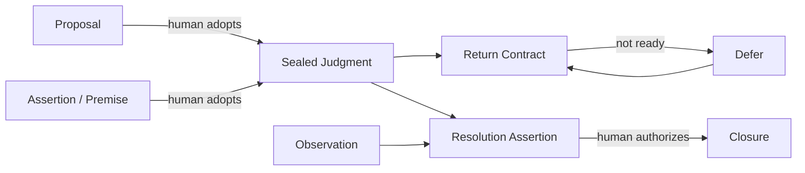

# ARGUS DECISION KNOWLEDGE KERNEL v4

## 판단 원장의 헌법과 실행 의미론

Date: 2026-07-14  
Status: **설계 정본 후보 — 구현 전 헌법·의미론 기준선**  
Supersedes as implementation authority: v0, v2, v3  
Preserves as research history: v0의 선행 체계 조사, v2의 코드베이스 감사, v3의 세계관 정립

---

## 문서의 결정

이 문서는 Argus의 다음 구현을 시작하기 전에 의미를 고정한다. 핵심 결정은 열두 가지다.

1. Argus의 커널은 메모리나 개인 온톨로지가 아니라 **판단 원장(judgment ledger)** 이다.
2. 원장의 정본은 마음의 상태가 아니라 **시간이 찍힌 기록 행위**다.
3. AI·사람·현실을 심급으로 보지 않고 **서기·저자·외부 세계 사이의 권한 분리**로 본다.
4. AI는 내용을 제안하거나 기록하고, 사람의 명령을 실행할 수 있지만 사람 판단의 승인자가 될 수 없다.
5. 현실은 직접 원장에 들어오지 않는다. 출처가 붙은 관찰 주장과 사람의 해석을 통해서만 들어온다.
6. 모든 원장 이벤트를 commitment라 부르지 않는다. 제안, 관찰, 저자 행위, 시스템 행위를 구분한다.
7. `still_pending`은 종결이 아니라 유예다. `indeterminate`와 `moot`만 판정 불가 계열의 종결이다.
8. 판단의 질을 채점하지 않되, 빈 기록·권한 부재·시간 모순 같은 구조적 무결성은 강제한다.
9. 헌법은 이유와 금지를 소유하고, 실행 가능한 의미 모델은 상태와 전이를 소유하며, 저장 형식은 어댑터다.
10. 기존 v2 구현은 자동 승격도 전면 폐기도 하지 않고 `inherit / reforge / reject`로 판정한다.
11. Argus의 독창성은 결정 저널 자체가 아니라 **AI가 개입하는 모든 표면에서 저자성과 시간적 정직성을 동일하게 보존하는 것**에 있다.
12. 가치는 정확도만이 아니라 사용자 비용을 포함한 재구성 델타로 증명하며, 실패하면 커널 주장을 축소하거나 중단한다.

이 열두 결정과 충돌하는 구현은 기존 코드 여부와 관계없이 고쳐야 한다. 충돌하지 않는 기존 구현은 가능한 한 계승한다.

---

## 0. 이 문서가 v2와 v3를 합치는 방법

v2는 중요한 공학적 경고를 남겼다.

> 이미 append-only ledger, reducer, idempotency, candidate plane, outbox, bridge가 있는데 별도의 이상적 커널을 새로 만들면 두 번째 시스템과 두 개의 정본이 생긴다.

v3는 더 근본적인 경고를 남겼다.

> 존재하는 코드가 정당성을 갖는 것은 아니다. 큰 그림이 의미를 소유하고, 코드는 그 의미에 비추어 판정받아야 한다.

둘은 양자택일이 아니다. v4의 방법은 **constitution-first extraction**이다.

1. 세계관과 권한 경계를 먼저 확정한다.
2. 이를 실행 가능한 상태·전이·불변식으로 내린다.
3. 현행 코드를 의미 단위로 감사한다.
4. 맞는 것은 그대로 추출하고, 어긋난 것은 개주하며, 위험한 것은 버린다.
5. 기존 인코딩은 읽되, 기존 의미 오류까지 영구 보존하지 않는다.

따라서 이 작업은 greenfield 재건축도, legacy 승격도 아니다. **의미를 먼저 고정한 뒤 기존 재료로 구조를 다시 세우는 내진 보강**이다.

---

## 1. 정체성

### 1.1 한 문장

> **Argus는 사람이 AI와 함께 사고하는 동안 명시적으로 승인한 판단 행위를 당시의 전제·출처·시간·반환 약속과 함께 보존하고, 이후의 관찰·해석·종결을 분리해 기록함으로써 어떤 표면에서도 저자성과 시간적 정직성을 재구성할 수 있게 하는 판단 원장이다.**

### 1.2 사용자가 얻는 것

Argus는 사용자에게 정답을 주겠다고 약속하지 않는다. 대신 다음 질문에 정직하게 답할 수 있게 한다.

- 나는 당시 무엇을 판단했는가?
- 그 판단은 무엇에 기대고 있었는가?
- 무엇이 내 말이고 무엇이 AI의 제안이었는가?
- 그때는 무엇을 몰랐는가?
- 언제 다시 보기로 했는가?
- 이후 무엇을 관찰했는가?
- 나는 그 관찰을 근거로 어떻게 종결했는가?
- 아직 답이 없는가, 아니면 질문 자체가 사라졌는가?

이 재구성이 가능하면 기억은 판단을 사후 편집하기 어려워진다. 불가능하면 AI는 빈칸을 유창하게 메우고, 사용자는 자기 판단의 저자성을 잃는다.

### 1.3 충성의 대상

Argus가 충성하는 대상은 다음이 아니다.

- 모델의 기억 지속성
- 조직의 운영 효율
- 완전한 개인 지식 그래프
- 사용자의 판단 점수 향상
- 모든 중요한 사건의 완벽한 포착

Argus가 충성하는 대상은 **사람이 자신의 판단 기록을 소유하고, 나중에도 그 판단의 저자와 당시 맥락을 구별할 수 있는 능력**이다.

### 1.4 비목표

커널은 다음을 하지 않는다.

- 마음·성격·무의식·확신의 실체를 추론해 정본으로 만들지 않는다.
- 사용자의 판단 능력이나 사람됨을 점수·등급·티어로 평가하지 않는다.
- AI의 추론을 사용자의 전제나 결론으로 자동 채택하지 않는다.
- 관찰을 객관적 사실로 승격하지 않는다.
- 모든 대화를 판단으로 수확하지 않는다.
- DMN처럼 반복 가능한 의사결정 규칙을 실행 엔진으로 만들지 않는다.
- Palantir처럼 세계의 운영 상태 전체를 모델링하지 않는다.

커널 밖의 제품이 조언, 검색, 분석, 패턴 탐색을 제공할 수는 있다. 그러나 그 결과는 언제나 제안이나 파생물이며 원장의 저자 행위를 대체하지 않는다.

---

## 2. 왜 지금인가

AI는 같은 능력으로 문제와 해법을 함께 만든다.

### 2.1 병

AI는 다음을 너무 쉽게 한다.

- 사용자가 말하지 않은 이유를 그럴듯하게 보충한다.
- 현재의 결과를 과거의 판단에 섞는다.
- 여러 세션의 서로 다른 발화를 하나의 일관된 입장처럼 합성한다.
- AI가 제안한 문장을 사용자의 결론처럼 재진술한다.
- 불확실한 출처를 숨기고 매끄러운 요약을 만든다.

이 문제는 hallucination만이 아니다. 사실 문장이 모두 맞아도 **누가 언제 무엇을 승인했는가**가 사라지면 저자성은 훼손된다.

### 2.2 약

동시에 AI는 판단 기록의 오랜 실패 원인인 구조화 비용을 낮춘다.

- 대화에서 판단 후보를 발견한다.
- 전제와 질문을 제안한다.
- 검토일과 판정 기준을 구체화하도록 돕는다.
- 과거 기록을 출처와 함께 회수한다.
- 서로 관련된 판단을 제안 관계로 연결한다.
- 관찰 자료를 정리하되 채택은 사람에게 돌린다.

AI-native의 의미는 AI가 더 많은 권한을 갖는 것이 아니다. **AI가 구조화 비용을 대부분 부담하면서도 저자 권한은 0으로 유지되는 구조**다.

---

## 3. 선행 체계와 독창성의 정확한 위치

Argus는 부품을 발명하지 않았다.

- append-only 원장은 회계·event sourcing에서 배운다.
- 사전 커밋과 시간적 오염 방지는 preregistration에서 배운다.
- entity/activity/agent provenance는 W3C PROV-O에서 배운다.
- 객체·행동·권한 분리는 Palantir Ontology에서 배운다.
- 판정 불가와 annulment는 예측 시장에서 배운다.
- 결정·이유·기대 결과·검토일은 기존 decision journal에서 배운다.

직접적인 인접 제품도 이미 있다.

- Decision Journal은 결정·맥락·예상 결과·검토일과 draft를 기록한다.
- DecisionLedger는 중립적 개인 결정 원장, 결과 검토, 로컬 소유를 강조한다.
- Reckon은 예측·확률·결과·calibration을 연결한다.
- Lound는 AI가 결정을 대신하지 않고 사용자의 사고를 정리하도록 한다.

따라서 “이런 것은 세상에 없다”는 주장은 하지 않는다. Argus의 검증 가능한 차별 가설은 다음 결합에 있다.

> **AI가 관여하는 대화·MCP·웹·메신저·플러그인 전체에서, 제안과 채택을 분리하고, 저자 권한과 기록 실행을 분리하고, 당시 기록과 사후 관찰을 분리하며, 이를 하나의 실행 의미론으로 재구성할 수 있게 한다.**

이것은 아직 사실로 입증된 독창성이 아니라 제품·연구 가설이다. §11의 비교 실험에서 입증한다.

참고 자료:

- [Palantir Ontology overview](https://www.palantir.com/docs/foundry/ontology/overview/)
- [W3C PROV-O](https://www.w3.org/TR/prov-o/)
- [Metaculus FAQ](https://www.metaculus.com/faq)
- [Decision Journal](https://decisionjournalapp.com/guides/app/adding_decisions.html)
- [DecisionLedger](https://apps.apple.com/us/app/decisionledger/id6757331604)
- [Reckon](https://roland.leth.ro/projects/reckon)
- [Lound](https://lound.ai/decision-journal-app/)

---

## 4. 존재론: 무엇이 원장에 설 수 있는가

### 4.1 마음이 아니라 기록 행위

사람의 실제 마음은 연속적이고 모순되며 완전히 관찰할 수 없다. 커널이 저장하는 것은 마음의 진실이 아니라 특정 시점의 기록 행위다.

> 사용자가 7월 14일 18:20에 이 문장을 판단으로 승인했다.

이 명제는 검증 가능하다. 반면 “사용자는 사실 그전부터 확신하고 있었다”는 심리 해석이다. 필요하면 회고 진술로 기록할 수 있지만 최초 시점을 소급해 바꾸지 않는다.

### 4.2 네 층

모든 원장 항목은 네 층 중 하나다.

| 층 | 의미 | 권한 | 예시 |
|---|---|---|---|
| Proposal | 아직 채택되지 않은 구조화 제안 | AI·사람·호스트 생성 가능 | 판단 후보, 전제 후보, 연결 후보 |
| Assertion | 출처를 단 주장 | 누구나 기록 가능, provenance 필수 | 사용자 발화, 문서 주장, 관찰 |
| Authorial Act | 판단의 의미나 생명주기를 바꾸는 승인 행위 | 사람만 승인 가능 | seal, adopt, defer, resolve |
| System Event | 전달·동기화·집행 상태 | 시스템 | outbox, bridge, gate, sync |

`Proposal`과 `Assertion`은 원장에 존재할 수 있지만 사용자 판단이 아니다. `Authorial Act`가 붙을 때만 사용자 소유의 의미가 생긴다.

### 4.3 일곱 핵심 의미 객체

#### Judgment

사용자가 특정 시점에 봉인한 판단. 최소 필드는 다음이다.

- `judgment_id`
- `statement`
- `sealed_at`
- `recorded_at`
- `temporal_mode`
- `authority`
- `provenance`
- `revision`

`statement`는 “내가 무엇을 판단·선택·약속했는가”다. 이것을 나중에 평가할 질문이나 성공 기준과 한 필드에 섞지 않는다. “A를 채용하기로 했다”는 판단과 “90일 뒤 역할 기대를 충족했는가”라는 반환 질문은 서로 다른 의미다.

#### Premise

판단이 기대고 있다고 사용자가 채택한 주장. 판단문과 독립된 생명주기를 갖는다. AI가 추론한 이유는 premise proposal일 뿐이다.

#### Return Contract

무엇을 언제 또는 어떤 사건이 발생했을 때 다시 볼 것인지에 대한 약속이다. 알림 설정이 아니라 판단 의미의 일부다. 현재 커널에서 return contract가 없는 항목은 sealed judgment가 아니라 proposal·note·work item 중 하나다.

- `review_at` 또는 `review_trigger`
- `review_question`
- 선택적인 `resolution_criterion`
- `promised_at`
- `authority`

`review_question`은 돌아와서 물을 질문이고, `resolution_criterion`은 사용자가 미리 남기고 싶은 판정 기준이다. 기준을 강제로 요구하지 않는다. 둘 다 `Judgment.statement`를 대체하지 않는다.

#### Observation

외부 세계나 이후 상태에 관한 출처 있는 주장이다. 관찰자는 사람·호스트·도구일 수 있다. 관찰은 그 자체로 판정이 아니다.

#### Resolution Assertion

하나 이상의 관찰이 봉인된 판단에 어떤 의미인지에 대한 사람의 해석이다.

#### Closure

판단을 종결하는 저자 행위다. 결과 종류, 해석, 근거 관찰, 종결 시점을 연결한다.

#### Provenance

내용의 출처·수집 방식·기록 경로를 설명한다. 권한과 별개다. “사용자 대화에서 나왔다”와 “사용자가 이 행위를 승인했다”는 서로 다른 사실이다.

### 4.4 의미 그래프



---

## 5. 권한 모델: 서기·저자·외부 세계의 분리

### 5.1 세 주체가 아니라 네 역할

한 이벤트에는 한 명의 actor만 있는 것이 아니다. 다음 역할을 분리한다.

| 필드 | 질문 | 가능한 값 예시 |
|---|---|---|
| `originated_by` | 내용을 처음 만든 주체는 누구인가 | human, ai, host, imported |
| `recorded_by` | 이벤트를 원장에 쓴 주체는 누구인가 | mcp, web, telegram, plugin, migration |
| `authorized_by` | 의미 변화 행위를 승인한 주체는 누구인가 | human identity only |
| `observed_by` | 관찰을 수행하거나 보고한 주체는 누구인가 | human, host, external source |

여기에 승인 근거를 붙인다.

```ts
type AuthorityContext = {
  originated_by: PrincipalRef;
  recorded_by: PrincipalRef;
  observed_by?: PrincipalRef;
  authorized_by?: HumanPrincipalRef;
  authorization_mode?:
    | "direct_command"
    | "explicit_confirmation"
    | "signed_import";
  authorization_ref?: EvidencePointer;
};
```

### 5.2 AI가 할 수 있는 것

- 판단 후보를 제안한다.
- 사용자 발화를 인용해 assertion을 만든다.
- judgment statement, premise, review question, return date의 초안을 만든다.
- 사용자의 직접 명령을 받아 seal·defer·resolve command를 실행한다.
- 관찰 후보와 연결 후보를 제안한다.
- 정본 데이터로 결정론적 요약을 생성한다.

### 5.3 AI가 할 수 없는 것

- 제안 문장을 사용자 승인 없이 judgment로 봉인한다.
- AI가 추론한 이유를 premise로 자동 채택한다.
- 사용자의 침묵을 승인으로 간주한다.
- 모호한 승인 대상을 임의로 선택한다.
- 관찰만으로 closure를 자동 생성한다.
- 사용자의 판단 능력이나 사람됨에 평결을 내린다.

### 5.4 실행과 승인의 분리

“AI는 종결할 수 없다”는 말은 AI가 API를 호출할 수 없다는 뜻이 아니다.

```text
사용자: 이 판단은 질문 자체가 사라졌어. moot로 닫아줘.
AI/MCP: resolve command를 기록한다.
authorized_by: 사용자
recorded_by: MCP
originated_by: 사용자
```

이 이벤트는 합법이다. 반대로 AI가 대화를 보고 “아마 moot일 것”이라며 종결하면 `authorized_by`가 없으므로 거부한다.

### 5.5 침묵과 일괄 승인

- 침묵은 승인도 거절도 아니다.
- “전부 저장해” 같은 일괄 승인은 대상 목록이 사용자에게 표시되고 고정되어야 한다.
- 승인 이후 목록이 바뀌면 새 승인이 필요하다.
- imported legacy 이벤트의 승인자가 증명되지 않으면 `authority_status: legacy_unknown`으로 낮춰 표시한다. 소급해서 사람 승인으로 세탁하지 않는다.

### 5.6 시간의 두 축

Argus는 “그 일이 언제 일어났다고 말하는가”와 “그 말이 언제 원장에 기록되었는가”를 분리한다.

```ts
type TemporalContext = {
  occurred_at?: string;     // 주체가 주장하는 사건·판단 시점
  recorded_at: string;      // 원장에 처음 기록된 시점
  authorized_at?: string;   // 사람이 저자 행위를 승인한 시점
  temporal_mode: "contemporaneous" | "retrospective";
};
```

- 오늘 “지난달에 이미 이렇게 결정했다”고 기록하면 `occurred_at`은 지난달일 수 있지만 `recorded_at`과 `authorized_at`은 오늘이다.
- 회고 진술은 합법이지만 contemporaneous seal로 승격되지 않는다.
- 나중에 premise를 추가하면서 “당시에도 그렇게 믿었다”고 말할 수 있다. 이는 retrospective premise assertion이며, 당시 기록만 보는 `as_of` projection에는 포함되지 않는다.
- 결과를 안 뒤 추가된 정보는 과거 판단의 입력으로 되돌아가지 않는다.
- retrieval은 기본적으로 `as_of`를 표시하고 contemporaneous record와 retrospective testimony를 구분한다.

시간적 정직성은 정확한 심리 시점을 맞히는 것이 아니라, **원장이 실제로 알게 된 시점을 숨기지 않는 것**이다.

---

## 6. 이벤트 문법과 상태 의미론

v3의 “커밋의 대수”는 방향은 맞았지만 연산 법칙이 부족했다. v4는 우선 **이벤트 문법과 결정론적 상태 기계**를 정의한다. 교환법칙·결합법칙까지 증명되는 범위가 생길 때만 대수라는 이름을 사용한다.

### 6.1 이벤트 계열

#### Proposal events

- `proposal_created`
- `proposal_revised`
- `proposal_rejected`
- `proposal_expired`

채택은 proposal 자체를 변이시키는 이벤트가 아니다. `judgment_sealed.source_proposal_id`가 proposal을 참조하면 adopted 상태가 파생된다.

#### Assertion events

- `assertion_recorded`
- `observation_recorded`
- `evidence_attached`
- `assertion_corrected`

수정은 기존 내용을 덮지 않고 새 이벤트로 정정 관계를 만든다.

#### Authorial events

- `judgment_sealed`
- `premise_adopted`
- `premise_retired`
- `return_promised`
- `return_deferred`
- `return_contract_superseded`
- `resolution_asserted`
- `judgment_closed`
- `judgment_withdrawn`
- `judgment_superseded`

#### System events

- delivery, sync, bridge, outbox, gate telemetry 등
- 사용자 의미 상태를 직접 바꾸지 않는다.

### 6.2 한 command와 여러 event

사용자는 한 번에 “이 판단을 이 전제와 함께 봉인하고 8월 1일에 보자”고 말할 수 있다. 제품 command는 하나지만 의미 이벤트는 분리된다.

```text
SealJudgment command
  -> assertion_recorded (필요한 경우)
  -> judgment_sealed
  -> premise_adopted
  -> return_promised
```

이 이벤트 묶음은 하나의 atomic batch로 기록할 수 있다. 의미를 분리한다는 것이 사용자에게 네 번 확인받으라는 뜻은 아니다.

종결도 같은 원칙을 따른다.

```text
CloseJudgment command
  -> observation_recorded (새 관찰이 있는 경우)
  -> resolution_asserted
  -> judgment_closed
```

사람은 한 번에 승인할 수 있지만, 관찰·해석·종결은 replay와 감사에서 구분된다.

### 6.3 판단 상태

정본 상태는 이벤트를 fold해 계산한다.

```text
                           return due
SEALED (return scheduled) ------------> DUE / OVERDUE
          ^                                   |
          |                                   | defer
          +-----------------------------------+
          |
          +---- close ------> RESOLVED
          +---- withdraw ---> WITHDRAWN
          +---- supersede --> SUPERSEDED
```

`DUE`와 `OVERDUE`는 저장된 status가 아니라 return contract와 기준 시각에서 파생된다.

### 6.4 종결 결과

```ts
type Resolution =
  | {
      kind: "answered";
      outcome: "held" | "avoided" | "missed" | "partial";
    }
  | { kind: "indeterminate"; reason?: string }
  | { kind: "moot"; reason?: string };
```

이 타입은 `resolution_asserted`의 내용이다. `judgment_closed`는 채택한 resolution assertion을 참조하며, 별도 결과를 다시 서술하지 않는다.

- `answered`: 봉인된 질문에 사람이 답할 수 있다.
- `indeterminate`: 충분한 시간이 지났지만 현실의 증거로 답을 확정할 수 없다.
- `moot`: 전제 붕괴, 목표 변경, 대체 판단 등으로 질문 자체가 의미를 잃었다.
- `still_pending`: Resolution이 아니다. `return_deferred`다.

### 6.5 withdrawal과 moot

- `withdrawn`: 저자가 더 이상 판단을 유지하지 않기로 한 행위다. 반드시 실패나 판정은 아니다.
- `moot`: 외부 조건이나 문제 구조의 변화로 기존 질문이 의미를 잃었다는 종결 해석이다.

둘은 UI에서 비슷해 보여도 의미가 다르다.

### 6.6 amendment 규칙

봉인 이후에는 원문을 덮어쓰지 않는다.

- 오탈자·표시용 메타데이터 정정: correction event
- premise의 추가·폐기: premise lifecycle event
- 반환 날짜만 변경: `return_deferred`
- review question이나 resolution criterion의 의미 변경: 기존 return contract를 `superseded`하고 새 contract 생성
- 판단문의 의미가 달라지는 변경: 기존 판단을 `superseded`하고 새 판단을 seal
- 결과를 안 뒤 과거 statement·review question·criterion 변경: 금지

이를 통해 “같은 ID를 유지한 채 사실상 다른 판단으로 바꾸는” 사후 오염을 막는다.

### 6.7 결정론적 fold

동일한 유효 이벤트 집합과 동일한 정렬 규칙은 모든 표면에서 동일한 상태를 만들어야 한다.

정렬 우선순위:

1. repository/space 내 monotonic sequence가 있으면 사용
2. 없으면 causal parent와 batch order
3. 마지막 fallback은 occurred_at + event_id

충돌을 timestamp 하나로 조용히 덮지 않는다. 해소할 수 없는 동시 저자 행위는 conflict state로 노출하고 사람에게 선택을 돌린다.

---

## 7. 지저분한 현실을 흡수하는 네 밸브

### 7.1 모호성의 가격

사용자는 모호한 판단이나 반환 질문도 봉인할 수 있다. 커널은 “좋은 판단문”을 채점하지 않는다.

그러나 다음 구조적 조건은 요구한다.

- 비어 있지 않은 판단문
- 사람의 명시적 승인
- 봉인 시점
- provenance
- 반환 시점 또는 반환 trigger

AI는 구체화안을 제안할 수 있고 사용자는 그대로, 수정, 건너뛰기를 선택할 수 있다. 모호함이 남으면 `specification_status: open` 같은 중립적 파생 상태로 표시할 수 있다. `bad`, `weak`, `low-quality` 같은 평결 어휘는 쓰지 않는다.

사용자가 아직 돌아올 약속을 할 의사가 없다면 그 항목은 판단 후보로 남는다. 이것은 기록 실패가 아니라 proposal과 commitment의 경계다.

### 7.2 복수의 정직한 종결

Yes/No 강박을 버린다. partial, indeterminate, moot는 정식 결과다. 다만 “아직 모름”은 유예이고 “끝내 알 수 없음”만 indeterminate다.

### 7.3 침묵의 합법성

- 말하지 않은 이유를 채우지 않는다.
- 판단 없는 관찰은 판단으로 승격하지 않는다.
- 포착되지 않은 중요 사건을 실패로 꾸짖지 않는다.
- 빈칸은 공백으로 남긴다.

공백은 오류가 아니라 provenance의 경계다.

### 7.4 연결의 후행성

현실의 판단은 뒤얽혀 있다. 입력 시 완벽한 분해를 강요하지 않는다.

- 판단은 독립적으로 먼저 설 수 있다.
- `supports`, `contradicts`, `depends_on`, `supersedes`, `same_question` 연결은 이후 제안할 수 있다.
- AI가 만든 연결은 proposal이다.
- 의미를 바꾸는 연결은 사용자 채택이 필요하다.
- 검색용 유사도 연결은 파생 데이터이며 정본이 아니다.

---

## 8. 헌법 v4

각 조항은 문장만으로 채택되지 않는다. 같은 구현 phase에서 최소 하나의 schema/refine, reducer guard, betrayal fixture와 연결되어야 한다.

| 조항 | 명제 | 최소 집행 |
|---|---|---|
| C1 Human Sovereignty | 저자 행위는 사람의 승인 없이는 성립하지 않는다 | authority refine |
| C2 No Authorship Laundering | AI·host·legacy 출처를 사람 저자로 상향 세탁하지 않는다 | provenance downgrade test |
| C3 Claim, Not Fact | 외부 세계는 출처 있는 주장으로만 들어온다 | assertion schema |
| C4 Append-Only History | 과거 의미를 덮어쓰지 않고 정정·폐기·승격을 새 이벤트로 남긴다 | reducer immutability |
| C5 Return Is Semantic | 반환 약속은 알림 설정이 아니라 판단 의미다 | return event + due fold |
| C6 No Verdict on the Person | 개인의 판단 능력·사람됨을 점수·등급·티어로 표현하지 않는다 | forbidden vocabulary fixture |
| C7 Minimal Structure | 재구성과 권한 집행에 필요한 최소 구조만 강제한다 | optionality tests |
| C8 Deterministic Spine | 같은 유효 이벤트는 표면과 모델에 관계없이 같은 상태를 만든다 | conformance vectors |
| C9 Local Ownership | 사용자는 원장을 내보내고 읽고 지울 수 있다 | export/erasure fixture |
| C10 Model Independence | 모델 교체가 승인된 의미를 바꾸지 않는다 | model-free reducer |
| C11 Explain Retrieval | 모든 회수에는 기준 시점과 회수 이유가 있다 | retrieval receipt |
| C12 Honest Incompleteness | 모르는 출처·이유·관찰을 만들어 채우지 않는다 | missing-data fixtures |
| C13 Right of Erasure | append-only는 사용자 데이터의 영구 보존 의무가 아니다 | tombstone + physical purge contract |
| C14 Enforcement Locus | 커널 규칙은 write gateway와 conformance에서 집행한다 | gateway coverage map |
| C15 Plural Resolution | answered·indeterminate·moot를 구분하고 defer를 종결로 위장하지 않는다 | state transition fixtures |
| C16 Encoding Is Not Meaning | 의미 모델과 wire/storage 형식을 분리한다 | adapter round-trip |
| C17 Authority Is Not Provenance | 출처·기록자·승인자를 별도 필드로 보존한다 | authority matrix tests |
| C18 Observation Is Not Closure | 관찰이 자동으로 결과나 종결을 만들지 않는다 | no-auto-resolve guard |
| C19 Portable Semantics | 웹·MCP·메신저·플러그인이 동일 전이와 권한 규칙을 쓴다 | cross-surface vectors |
| C20 Neutral System Measurement | 시스템 품질 측정은 허용하되 개인 평결로 전용하지 않는다 | metric allow/deny list |
| C21 Bi-Temporal Honesty | 주장된 사건 시점과 실제 기록·승인 시점을 섞지 않는다 | retrospective/as-of fixtures |

### 8.1 “사람을 채점하지 않는다”의 정확한 범위

금지:

- judgment score, user tier, good/bad thinker
- outcome을 이용한 사람 순위
- 숨은 calibration 점수로 추천·노출·권한을 차등하는 것
- 도덕적·능력적 평결 어휘

허용:

- 시스템의 재구성 정확도
- provenance 누락률
- 잘못 봉인된 후보 비율
- 반환 알림 전달률
- 중립적 개수·기간·상태 분포
- 사용자가 명시적으로 요청한 개인용 통계

허용된 통계도 기본적으로 비규범적이어야 하며, 원장 정본과 분리된 파생물이어야 한다.

---

## 9. 의미 정본·인코딩·표면의 계약

### 9.1 세 종류의 정본

하나의 파일이 모든 진실을 소유하지 않는다.

| 정본 | 소유하는 것 | 형태 |
|---|---|---|
| Normative SSOT | 왜, 금지, 권리, 헌법 | 이 문서 + ADR |
| Semantic SSOT | 타입, 전이, 불변식, fold | versioned package |
| Instance SSOT | 실제 사용자 이벤트 | space별 canonical ledger |

JSON Schema나 TypeScript 타입만으로 철학을 표현할 수 없고, 철학 문서만으로 동작을 결정할 수도 없다. 둘은 헌법-픽스처 전단사로 연결한다.

### 9.2 semantic package

커널 패키지는 최소 다음을 제공한다.

- canonical event types
- command validation
- authority validation
- deterministic reducer
- temporal projections
- conformance vectors
- legacy adapters
- export/erasure contract
- schema version registry

웹·MCP·Telegram·plugin은 자체 판단 상태 기계를 만들지 않는다. 같은 패키지를 직접 사용하거나 같은 conformance vectors를 통과한 구현을 사용한다.

### 9.3 versioning

- 새 기록은 current semantic version으로 쓴다.
- 과거 인코딩은 adapter로 읽는다.
- upcast는 원본을 덮지 않는다.
- 의미를 복원할 수 없는 필드는 `unknown` 또는 explicit loss로 남긴다.
- unknown extension field를 가능한 한 보존한다.
- downcast가 손실을 만들면 조용히 저장하지 않고 loss report를 반환한다.
- round-trip과 replay equivalence를 테스트한다.

### 9.4 공간과 복제

local-first는 “모든 복사본이 정본”이라는 뜻이 아니다. 각 space마다 다음을 명시한다.

- canonical ledger location
- replica/projection 목록
- write authority
- sync ordering
- conflict policy
- export boundary
- erasure propagation
- backup retention

예:

| 표면 | 역할 | 정본 여부 |
|---|---|---|
| repository JSONL | repository space canonical ledger | 예 |
| web local cache | projection/replica | 아니오 |
| Supabase | 선택된 account space canonical 또는 replica | 배포 설정에 명시 |
| Telegram message | capture source | 아니오 |
| MCP response | command receipt/projection | 아니오 |

canonical 위치가 설정마다 달라질 수는 있지만 한 space 안에서는 모호하면 안 된다.

### 9.5 erasure

append-only는 감사 가능한 생명주기를 뜻하지 영구 감금을 뜻하지 않는다.

erasure는 두 단계다.

1. 논리적 삭제: projection과 검색에서 즉시 제외, deletion receipt 생성
2. 물리적 파기: canonical ledger, replica, index, cache, attachment, backup 정책에 따라 제거

삭제 receipt에는 대상 범위, 완료된 위치, 유예 중인 backup, 실패 위치가 기록된다. 삭제된 본문을 receipt에 복제하지 않는다.

---

## 10. 현행 v2 구현의 재료 판정

### 10.1 Inherit

의미가 헌법과 맞고 구현 자산으로 가치가 높은 것:

- append-only JSONL ledger
- strict event parsing과 schema version
- deterministic reducer의 기본 구조
- idempotency와 atomic append
- candidate proposal plane
- evidence pointer와 source excerpt
- outbox·bridge·gate telemetry
- `still_pending`을 비종결로 처리하는 현행 reducer 원칙
- 공개 도구에서 silent auto-seal을 막는 확인 흐름

### 10.2 Reforge

교훈은 계승하되 의미를 다시 만들어야 하는 것:

- envelope: actor 단일 개념 대신 authority context 도입
- provenance enum: source, collection method, authority 분리
- `seal`: judgment statement·return contract·premise를 atomic batch의 별도 의미 이벤트로 분리
- settlement: observation, resolution assertion, closure 분리
- `amend`: 오탈자 정정, premise lifecycle, defer, supersede로 분해
- current outcome vocabulary: answered/indeterminate/moot와 defer로 재매핑
- repository/personal/account space 소유권과 sync contract
- web localStorage/Supabase 상태 모델을 shared reducer projection으로 교체

### 10.3 Reject

- AI 추론을 사람 premise로 자동 승격
- 결과를 안 뒤 과거 statement·review question·criterion을 동일 의미 객체 안에서 수정
- `still_pending`을 terminal mu로 처리
- keyword ban만으로 헌법 집행을 증명했다고 간주
- UI별로 별도의 judgment/review/outcome 의미 모델 유지
- legacy 이벤트의 불명확한 권한을 사람 승인으로 소급 간주
- 사용자의 판단 점수·티어·좋고 나쁨을 커널에 저장

### 10.4 Legacy mapping의 원칙

v2의 24개 이벤트를 새 타입에 기계적으로 일대일 매핑하지 않는다. 먼저 각 이벤트가 실제로 만든 의미 변화를 판정한다.

매핑 결과는 네 종류다.

- exact: 의미 손실 없이 변환
- split: 하나의 legacy event가 여러 semantic event로 분해
- degraded: 일부 의미만 복원, unknown 표시
- opaque: 의미 변환 없이 legacy extension으로 보존

모든 legacy fixture는 원본 reducer 결과와 새 projection의 차이를 loss report로 남긴다.

---

## 11. 증명 전략

### 11.1 불가능성 증명

커널은 다음 배신이 구조적으로 불가능함을 보여야 한다.

1. AI가 만든 proposal을 사용자 판단으로 조용히 승격할 수 없다.
2. 결과를 안 뒤 과거 sealed statement를 덮어쓸 수 없다.
3. 승인 근거 없는 AI resolve가 terminal state를 만들 수 없다.
4. 관찰 하나가 자동으로 closure가 될 수 없다.
5. 동일 이벤트 replay가 표면마다 다른 상태를 만들 수 없다.
6. `still_pending`이 resolved 통계에 포함될 수 없다.
7. 오늘 기록한 회고 진술이 지난 시점의 contemporaneous projection에 나타날 수 없다.
8. legacy unknown authority가 human-authorized로 상향될 수 없다.
9. erasure 대상 본문이 일반 projection에서 다시 나타날 수 없다.
10. 인용된 사용자 어휘 때문에 시스템 생성 copy의 금지어 검사가 오탐하지 않는다.
11. 모델 교체가 sealed meaning을 바꿀 수 없다.

“코드에 금지어가 없다”는 증명이 아니다. 각 명제는 adversarial command와 저장된 이벤트를 포함하는 executable fixture로 증명한다.

### 11.2 지저분한 현실 corpus

최소 다음 사례를 사람이 정답 라벨과 함께 만든다.

- 결정 순간이 정확하지 않은 회고 봉인
- 반쯤 정했지만 반환 약속은 하고 싶지 않은 상태
- 의도적으로 모호한 statement 또는 review question
- 시간이 지나도 증거가 부족한 판단
- 질문 자체가 사라진 판단
- 판단 없이 일어난 중요한 사건
- 말하지 않은 사적 이유
- 관점이 바뀌어 과거 판단과 현재 입장이 다른 경우
- 서로 얽힌 여러 판단
- AI 초안을 일부만 채택한 경우
- 사용자가 한 명령으로 여러 후보를 일괄 승인한 경우
- 두 표면에서 동시에 defer/resolve한 conflict
- 삭제 후 오래된 replica가 돌아온 경우

각 사례는 다음을 명시한다.

- named entities/events
- 의도적으로 unnamed인 것
- 허용된 손실
- 절대 발생하면 안 되는 fabrication
- 기대 projection
- 사용자 확인 비용

### 11.3 재구성 델타

비교군:

1. raw transcript 검색
2. transcript + RAG + citation
3. 일반 decision-journal template
4. Argus kernel ledger

측정:

- 판단문 정확 복원
- 저자 귀속 오류
- 당시/사후 정보 혼입률
- premise provenance 복원률
- 반환 약속 복원률
- 종결 상태와 근거 복원률
- fabrication rate
- 입력·확인 시간
- 확인 클릭/턴 수
- 잘못 봉인한 후보 비율
- 놓친 판단 비율

실험은 synthetic adversarial corpus와 실제 dogfood corpus를 분리한다. 가능하면 라벨러는 어떤 조건의 출력인지 모르게 한다.

### 11.4 사전 선언할 go/kill 기준

구현 전에 최소 효과 크기를 숫자로 정한다. 최초 수치는 W1에서 corpus를 본 뒤 확정하되 항목은 바꾸지 않는다.

- 저자 귀속과 hindsight leakage에서 baseline 대비 최소 개선
- 허용 가능한 추가 확인 시간
- silent false seal 상한
- cross-surface conformance 100%
- legacy critical-path replay 무손실률
- erasure propagation 성공률

다음이면 중단하거나 주장을 축소한다.

- 구조화 비용을 고려하면 일반 템플릿 대비 재구성 우위가 없다.
- authority model이 실제 대화 UX에서 지속적으로 우회된다.
- 지저분한 corpus를 과도한 예외 없이 흡수할 수 없다.
- 표면마다 semantic fork가 반복된다.
- local ownership과 erasure를 현실적인 비용으로 지킬 수 없다.

---

## 12. 구현 phase

원칙은 **한 phase에 하나의 비가역적 의미 결정**이다. 세션 수는 약속이 아니라 상한 추정이며 exit evidence 없이는 다음 단계로 가지 않는다.

### P0. 정본 봉인

목표: 언어와 권한을 더 이상 흔들리지 않게 한다.

작업:

- v4 리뷰와 founder decisions 반영
- 핵심 용어 glossary 확정
- authority matrix 확정
- resolution taxonomy 확정
- 헌법 C1–C21 승인

Exit:

- 열린 의미 질문에 owner와 deadline 존재
- 같은 예시를 두 사람이 같은 타입·상태로 분류
- 기존 문서와 충돌 목록 완성

### P1. 현실 corpus와 판정 기준

목표: 코드 전에 모델이 현실을 버리지 않는지 검증한다.

작업:

- messy corpus 30건 이상
- named/unnamed/loss/fabrication 라벨
- baseline reconstruction task 고정
- go/kill 수치 사전 선언

Exit:

- 모든 사례가 예외 코드 없이 v4 어휘로 표현됨
- 표현되지 않는 사례는 모델 수정 또는 명시적 scope-out

### P2. 실행 의미 모델 spike

목표: 문서를 타입·전이·불변식으로 내린다.

작업:

- 새 semantic package skeleton
- authority context
- event grammar
- reducer와 temporal projection
- core betrayal fixtures

Exit:

- C1–C21 각각 최소 한 집행 지점
- corpus projection golden test 통과
- 모델/네트워크 없이 replay 가능

### P3. Legacy 재료 판정과 adapter proof

목표: 두 번째 시스템을 만들지 않고 현행 자산을 안전하게 흡수한다.

작업:

- v2 24 event 의미 감사
- inherit/reforge/reject 판정표
- exact/split/degraded/opaque adapter
- read-old/write-new prototype
- round-trip/loss report

Exit:

- 실제 ledger red-team corpus replay
- critical path 의미 손실 0 또는 승인된 loss 목록
- 기존 파일 무변경 읽기 보장

### P4. MCP vertical slice

목표: 한 표면에서 전체 생명주기를 증명한다.

범위:

```text
candidate -> explicit adoption -> seal
          -> return/due -> observation
          -> defer OR human-authorized resolution
```

Exit:

- 공개 도구 회귀 0
- silent seal/resolve 0
- receipts에 authority와 provenance가 구분되어 표시
- telemetry가 개인 평결 없이 시스템 실패를 측정

### P5. Web read·resolve 수렴

목표: 웹이 별도 의미 모델이 아니라 같은 원장의 projection과 command surface가 된다.

작업:

- localStorage/Supabase 중복 계약 제거 계획
- shared reducer read projection
- due/overdue/defer/moot 구분 UI
- observation과 closure 분리 UI
- offline/outbox/conflict UX

Exit:

- MCP와 웹 conformance vectors 100%
- 동일 ledger snapshot의 상태·카운트 일치
- 오프라인 충돌이 silent overwrite되지 않음

### P6. Telegram·plugin·외부 표면

목표: 새로운 표면이 커널 의미를 복제하지 않고 준수하게 한다.

작업:

- capture source adapter
- authority/consent UX contract
- portable command receipts
- conformance kit와 integration checklist

Exit:

- 표면별 별도 outcome enum 없음
- 모든 terminal command에 human authorization evidence
- import/export loss가 명시됨

### P7. 델타 검증과 제품 결정

목표: 체계가 실제로 존재 가치가 있는지 판정한다.

작업:

- §11 비교군 실험
- 정확도와 사용자 비용 동시 측정
- real dogfood failure review
- security/privacy/erasure drill

Exit:

- 사전 선언한 go 기준 충족
- 미충족 시 claim 축소, phase 재설계 또는 kernel 중단 결정

---

## 13. 제품 표면을 위한 최소 규칙

### 13.1 모든 표면이 보여줘야 하는 것

- 이것이 proposal인지 committed judgment인지
- 원문 또는 정확한 sealed statement
- 누가 내용을 만들고 누가 승인했는지
- sealed 시점과 현재 기준 시점
- 반환 약속과 due 이유
- 이후 관찰과 종결 해석의 분리
- amendment/supersession history
- 회수 이유와 provenance

### 13.2 모든 표면이 피해야 하는 것

- “AI가 기억한 당신의 결정”처럼 출처와 승인을 흐리는 문구
- 저장과 승인을 하나의 모호한 버튼으로 합치기
- `partial`, `moot`, `defer`를 모두 “완료”로 평탄화
- 결과 색으로 사람의 판단을 좋음/나쁨으로 암시
- AI 요약을 원문 대신 정본처럼 보여주기
- conflict를 latest timestamp로 조용히 덮기

### 13.3 UX의 목표

헌법 준수는 긴 폼을 의미하지 않는다. 기본 흐름은 짧아야 한다.

```text
AI: “이 문장을 판단으로 남길까요?”
사용자: “남겨. 다음 달 1일에 보자.”
시스템: statement + return date + source를 한 화면에 확인
사용자: 확인
```

한 번의 명시적 확인으로 여러 semantic event가 atomic batch로 기록될 수 있다. 제품의 임무는 권한을 숨기지 않으면서 확인 비용을 최소화하는 것이다.

---

## 14. 미결이지만 구현 전에 닫아야 할 질문

다음은 v4가 일부러 답을 꾸며내지 않은 항목이다.

1. 사용자 identity는 repository-local에서 어떤 키로 안정적으로 표현하는가?
2. CLI/MCP의 직접 명령을 어떤 증거 포인터로 보존하는가?
3. return trigger를 날짜 외 사건 기반으로 v1부터 지원할 것인가?
4. signed import의 신뢰 경계와 key rotation은 무엇인가?
5. account space에서 Supabase가 canonical인지 replica인지 배포별로 어떻게 선언하는가?
6. backup 물리 삭제의 최대 보존 기간은 얼마인가?
7. private personal metric을 허용할 경우 export·삭제·AI 접근 기본값은 무엇인가?
8. 동시에 발생한 resolve와 defer의 conflict UX는 어떤가?

이 질문은 문서의 핵심 의미를 흔들지 않지만 P2–P5 구현을 바꾼다. 각 질문은 해당 phase 진입 전에 ADR로 닫는다.

---

## 15. 최종 기준

Argus가 성공했다는 것은 사용자가 더 많은 판단을 기록했다는 뜻이 아니다. 다음이 가능해졌다는 뜻이다.

> 시간이 지나고 모델과 표면이 바뀌어도, 사용자는 당시 자신이 무엇을 승인했고 무엇을 승인하지 않았는지, 무엇을 근거로 삼았고 무엇은 나중에 알게 되었는지, 왜 다시 돌아왔고 어떤 관찰을 근거로 어떻게 닫았는지를 기계의 창작 없이 재구성할 수 있다.

이 능력을 지키기 위해 Argus는 세 가지 유혹을 계속 거부해야 한다.

1. 더 완전해 보이기 위해 공백을 AI로 채우는 유혹
2. 더 똑똑해 보이기 위해 사용자를 평가하는 유혹
3. 더 빨리 만들기 위해 표면마다 의미를 복제하는 유혹

판단 원장의 핵심은 많이 아는 것이 아니다. **누가, 언제, 무엇을 자신의 판단으로 남겼는지를 끝까지 배신하지 않는 것**이다.
