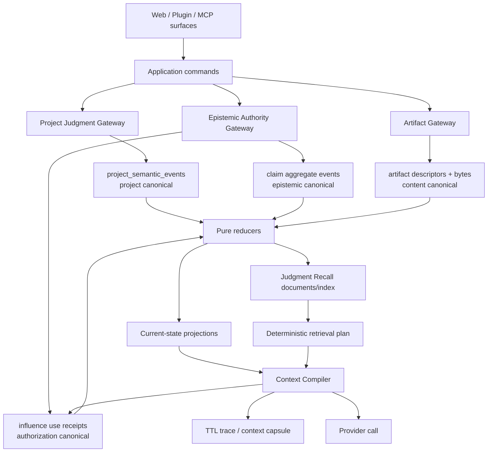

# Argus Judgment Continuity Runtime 설계

> 상태: **창업자 요청 신규 실행 정본**
> 작성일: 2026-07-18
> 기준 코드: `main@cd960536`
> 트랙: **JCR (Judgment Continuity Runtime)**
> 선행: O2 완료, O3 방1/2/3 완료, E1/E2 병합
> 공개 표면 gate: O4 통과 전 E3B 비공개
> 한 줄 정의: **과거 판단을 출처·시간·권한·반례를 잃지 않고 다시 만나는 런타임**

---

## 0. 결정

Argus는 범용 대화 기억 제품을 만들지 않는다. 그러나 세션 사이에서 판단이 끊기지
않게 하는 배관은 최고 수준으로 만든다.

이 둘은 모순이 아니다.

- **범용 memory envelope**는 포착·검색·timeline·호환 projection에 쓴다.
- **Argus domain types**는 저자성·현실 증거·자기지식·미래 영향 권한의 정본에 쓴다.
- 검색 관련성은 권한이 아니다.
- AI 요약은 사용자 사실이 아니다.
- 여러 synthetic persona는 여러 독립 증거가 아니다.
- append-only는 무기한 보존 의무가 아니다.

최종 구조는 다음 다섯 축이다.

1. 기존 project judgment ledger
2. claim별 epistemic authority aggregate
3. immutable content artifact와 append-only influence use receipt
4. 재생성 가능한 Judgment Recall projection
5. injection-safe Context Compiler

이 문서는 저장 엔진만 정하는 문서가 아니다. 포착 → 정본화 → 회수 → prompt 사용 →
철회 → 복원 → 삭제의 전체 의미를 한 번에 닫는다.

---

## 1. 정본 관계

### 1.1 이 문서가 승계하는 것

`DESIGN-epistemic-agency-and-self-knowledge-governance-v1-2026-07-17.md`의 다음은 계속
유효하다.

- E-I1~E-I10 불변식
- L0 Event → L1 Observation → L2 Claim Candidate → L3 Endorsed Principle →
  L4 Influence Grant 계층
- endorse와 influence grant의 분리
- scope, counterexample, revoke, trace
- Synthetic Consensus Firewall의 철학
- E3 사용자 문법과 O4 공개 gate

### 1.2 이 문서가 대체하는 것

기존 문서 §15와 §16의 **저장·회수·동기화·E3/E4 실행 구조 및 PR 순서**는 이 문서가
대체한다. 기존 절은 판단 과정과 감사 근거를 보존하는 historical design record다.

### 1.3 BLUEPRINT와의 관계

`ARGUS-BLUEPRINT.md`의 현재 공정과 O4 gate가 항상 우선한다. 이 문서는 독립 병렬
트랙의 구현 정본이지 새 사용자 표면을 즉시 여는 허가가 아니다.

---

## 2. 현재 기준선: 있는 것과 없는 것

### 2.1 완료되어 되돌리지 않는 기반

| 기반 | merge | 유지할 계약 |
|---|---:|---|
| E1/E2 | PR #177 | claim/grant/review/trace 분리, fail-closed influence |
| O3 one-install | PR #178 | 설치 경로 하나 |
| O3 five-axis | PR #179 | 공개 command 축 고정 |
| O3 seat-first Boss | PR #180 | `owns/goals/authority`, tone은 선택 |
| O2 local ledger | PR #172~#176 | lock, append, fsync, union fold, 정본 화살표 |
| web project ledger | current main | `project_semantic_events`, RPC lock, exact retry |

### 2.2 코드로 확인한 미완료

1. E2 claim/grant/trace/review는 네 localStorage array다.
2. E2 `ask_once` 소비 여부는 retention 가능한 trace에 의존한다.
3. E2 support gate가 독립성에 `lineage_ids >= 3`을 요구한다. 모델 lineage는 독립 현실
   사례의 대리 변수가 아니다.
4. 현재 prompt influence는 raw claim statement를 sanitize해 template에 넣지만, 저장된
   memory 전체를 처리할 전용 typed renderer와 artifact trust tier가 없다.
5. account export는 server table row를 내보내지만 restore하지 못한다.
6. E server schema, object lifecycle, search index, erasure coverage가 없다.
7. background harvest는 queue enqueue까지만 live이고 `runHarvestSweep()` caller가 없다.
8. `/argus:history scan`과 background harvest는 extractor와 writer 의미가 다르다.
9. legacy Rehearse는 `common_agreements`와 influence priority를 새로 쓴다.
10. local runtime은 Node >=18이며 SQLite dependency가 없다. 특정 SQLite driver를 검증
    없이 architecture decision으로 고정할 수 없다.

### 2.3 이번 설계가 바로잡는 이전 초안의 결함

- account 전체 단일 E stream → **claim별 aggregate stream**
- trace가 권한 상태를 겸함 → **use receipt와 trace 분리**
- model lineage가 독립성 증명 → **resolved reality unit + causal cluster**
- SQLite FTS5 선확정 → **SearchPort + 배포 spike gate**
- memory text sanitize 중심 → **typed rendering + untrusted-data boundary**
- artifact row/bytes 이중 쓰기 → **상태 기계와 publish protocol**
- event version 표기만 함 → **upcaster/quarantine/compatibility contract**
- 일반 unit test 중심 → **state-machine/property/fault/fuzz 검증**

---

## 3. JCR 불변식

### JCR-I1 — 저장량은 권위가 아니다

많이 관찰됐거나 자주 검색됐다는 이유로 자기지식·추천·prompt 정책이 되지 않는다.

### JCR-I2 — 검색은 projection이다

FTS, vector, timeline, checkpoint, LOGBOOK, SELF-KNOWLEDGE는 모두 삭제 후 정본에서
재생성할 수 있어야 한다.

### JCR-I3 — user authority는 field 단위다

한 event가 user action이어도 그 안의 AI 제안 문장까지 user-authored가 되지 않는다.
statement, scope, reason, outcome은 각각 provenance를 가진다.

### JCR-I4 — retrieval과 influence 사이에는 compiler가 있다

검색 결과가 system prompt로 직행하는 경로는 0이다.

### JCR-I5 — influence는 fail-closed다

grant validation, authority revision, use reservation, trace/capsule 중 하나라도 실패하면
prompt 영향은 0이다.

### JCR-I6 — 철회가 캐시보다 빠르다

revoke, contest, material counterexample, erase가 확인된 뒤 stale projection이나 offline
device가 권한을 부활시키지 못한다.

### JCR-I7 — 합성 다수는 증거 수를 늘리지 않는다

model/persona/worker가 몇 개든 같은 입력에서 나온 synthetic set의 independence unit은
기본 1이다.

### JCR-I8 — 현실 독립성은 모델 다양성이 아니다

독립 support는 resolved case, user/reality observation, causal/source cluster로 계산한다.
model lineage는 오염 관계이지 독립성 보증이 아니다.

### JCR-I9 — hook은 배관이지 두뇌가 아니다

hook은 빠르게 enqueue/상태 감지만 한다. extractor, reducer, writer, ranking을 복제하지
않는다.

### JCR-I10 — append-only는 erasure보다 위가 아니다

평상시 수정 이력을 보존하되 사용자의 명시적 hard erase와 계정 삭제를 막지 않는다.

### JCR-I11 — unknown은 loud하다

미지 event, 손상 artifact, unsupported bundle, 부분 projection은 skip count와 reason을
남긴다. LLM이 빈칸을 그럴듯하게 메우지 않는다.

### JCR-I12 — surface 권한은 복제되지 않는다

web grant가 plugin/MCP로, local grant가 web provider로 자동 확장되지 않는다.

### JCR-I13 — 한 기능에 한 포착 두뇌

foreground scan과 background capture는 trigger만 다르고 extractor contract, evidence
validator, command, writer가 같다.

### JCR-I14 — current task가 과거 기억보다 우선한다

과거 claim은 현재 사용자의 명시적 요청·제약·새 근거를 덮지 않는다.

### JCR-I15 — conflict를 ranking으로 숨기지 않는다

동시에 유효한 과거 claim들이 충돌하면 하나를 점수로 선택하지 않는다. 영향은 0으로
닫거나 한 번의 중립 질문으로 표면화한다.

### JCR-I16 — local-only는 실제로 local-only다

계정 동기화 opt-in 전 transcript, claim, artifact content의 network egress는 0이다.

### JCR-I17 — export는 restore가 증명할 때만 backup이다

download 버튼의 존재가 아니라 delete→restore roundtrip이 이동성을 증명한다.

### JCR-I18 — canonical ack는 손실되지 않는다

성공으로 확인된 canonical event는 crash/retry/rebuild 뒤에도 동일 semantic state를 만든다.

---

## 4. 위협 모델과 신뢰 경계

### 4.1 신뢰하지 않는 입력

- transcript와 user-pasted content
- AI output과 synthetic summary
- file/document contents
- import bundle
- 다른 device의 stale command
- search index와 checkpoint
- provider/model이 돌려준 tool-shaped JSON
- local archive 안의 사용자가 직접 수정한 bytes

### 4.2 신뢰하는 것

신뢰는 내용이 아니라 검증된 행위에 부여한다.

- 인증된 user가 보낸 authority command
- strict schema를 통과하고 transaction으로 append된 event
- hash와 state가 `ready`인 artifact
- 해당 aggregate version에서 유효한 grant
- unique constraint로 예약된 influence use receipt

### 4.3 방어 범위

| 위협 | 범위 | 방어 |
|---|---:|---|
| cross-account DB access | 포함 | RLS + service gateway + adversarial test |
| prompt injection in memory/file | 포함 | typed renderer, data role/fence, raw artifact 금지 |
| malicious restore archive | 포함 | path/size/hash/schema/signature/quarantine |
| stale offline resurrection | 포함 | authority epoch + erasure epoch |
| local symlink/path traversal | 포함 | canonical path, no-follow, registry allowlist |
| browser XSS reading live cache | 완전 방어 불가 | CSP/React escaping, cache minimization, logout purge |
| unlocked OS를 장악한 공격자 | 비범위 | 파일 권한·선택 암호화는 피해 축소 |
| model provider가 받은 prompt 보관 | provider 계약 영역 | 전송 전 명시, 최소화, local-only 기본 |

DB encryption at rest를 E2EE나 zero-knowledge라고 부르지 않는다. local archive가 평문이면
그 사실을 말한다.

### 4.4 mandatory security controls

- 새 user-scoped table 전부 RLS + cross-account read/write adversarial test
- browser client의 authority table 직접 mutation 금지; authenticated gateway만 command 처리
- actor user id, recorded_at, authority version은 client payload를 믿지 않고 server가 확정
- service-role key/browser 노출 0
- object key account prefix, short-lived signed URL, MIME/size/hash 검증
- recalled text는 React escaped text가 기본; markdown/HTML이면 sanitize 후 render
- URL/tool/command-like text를 click/execute 가능한 action으로 자동 승격하지 않음
- BYOK/API/OAuth/session secret을 event/artifact/trace/export/log에 넣지 않음
- command/event/restore API의 byte/count/rate limit
- Content Security Policy와 account cache logout purge
- error/telemetry에 content 0

idempotency `semantic_fingerprint`는 occurred/recorded timestamp 같은 volatile envelope를
제외하고 의미 payload만 canonicalize해 계산한다. 같은 key에 다른 의미가 오면 거절한다.

---

## 5. 전체 구조



의존 방향:

```text
Domain <- Application <- Ports <- Adapters <- UI/Framework
```

Domain은 React, Zustand, Supabase, SQLite driver, filesystem, LLM SDK를 import하지 않는다.

---

## 6. 정본 평면

### 6.1 Project Judgment Plane

기존 `project_semantic_events`를 유지한다.

- project decision, observe, defer, resolve, close, settle
- account project space와 project lifecycle
- append RPC, advisory lock, exact retry
- existing v3/v4 reducer contract

E 공정이 이 event vocabulary를 복제하거나 다른 project 판단 table을 만들지 않는다.

### 6.2 Epistemic Authority Plane

자기지식과 미래 영향 권한은 project가 아니라 account identity scope다. 그러나 account
전체를 하나의 serialized stream으로 만들지 않는다.

#### aggregate

```text
ClaimAuthorityAggregate
  claim_id
  aggregate_version
  authority_epoch
  claim statement revisions
  support units
  counterexamples
  lifecycle
  grants[]
```

한 claim의 reword/contest/reopen/material counterexample와 그 claim의 grant revoke를 같은
aggregate command에서 원자적으로 처리한다. 서로 다른 claim은 독립적으로 진행한다.

account 전체 정책만 별도 aggregate를 쓴다.

```text
AccountContinuityPolicy
  account_id
  erasure_epoch
  retention_policy
  sync_origins
  blocked_origins
```

#### 물리 event schema

```text
epistemic_authority_events
  user_id
  aggregate_type             # claim | account_policy
  aggregate_id
  aggregate_version          # aggregate별 1,2,3...
  authority_epoch
  event_id
  event_type
  schema_version
  command_id
  idempotency_key
  semantic_fingerprint
  actor_type                 # user | system | migration | imported_unverified
  origin_id
  origin_sequence nullable
  occurred_at                # source clock, 권위 순서 아님
  recorded_at                # server/local append 시각
  payload_ref nullable
  payload                    # 민감 원문 최소화
```

unique constraints:

- `(user_id, aggregate_type, aggregate_id, aggregate_version)`
- `(user_id, event_id)`
- `(user_id, origin_id, idempotency_key)`

event_id/occurred_at으로 정본 순서를 정하지 않는다. aggregate append 순서가 정본이다.

### 6.3 Influence Authorization Plane

trace와 authorization receipt를 분리한다.

```text
epistemic_use_receipts
  user_id
  receipt_id
  claim_id
  grant_id
  authority_epoch
  grant_revision
  call_id
  use_slot                    # ask_once: once:<grant-id>:<epoch>
  surface
  scope_hash
  capsule_hash
  reserved_at
  dispatch_state              # reserved | dispatched | provider_failed
```

`ask_once` unique constraint:

```text
(user_id, use_slot) UNIQUE
```

`adapt_generation`은 `(user_id, call_id, grant_id)` exact retry uniqueness를 가진다.

use receipt는 작고 오래가는 권한 정본이다. exact context, exclusion detail, provider error는
retention 가능한 trace/capsule에 둔다. trace 삭제가 `ask_once`를 재무장하지 않는다.

`ask_once`는 외부 provider와 DB를 하나의 transaction으로 묶을 수 없으므로 at-most-once
authorization이다. reservation 뒤 provider 실패 시 같은 call id transport retry만 허용한다.

### 6.4 Artifact Plane

기존 review의 `CanonicalArtifact`, `source_fingerprint`, `ReviewProvenance`,
`ReviewCoverage` 의미를 재사용한다. 이름만 같은 두 번째 review artifact domain을 만들지
않고 storage descriptor로 연결한다.

```text
ArtifactDescriptor
  artifact_id
  kind                        # source_slice / legacy_snapshot / context_capsule / review_source
  state                       # staged / verified / ready / quarantined / deleted
  sha256
  byte_length
  media_type
  schema_version
  sensitivity
  owner_scope
  source_event_ref nullable
  model_lineage nullable
  created_at
  retention_class
  object_locator
```

원문 bytes를 event JSON에 반복하지 않는다. 작은 user quote는 event에 둘 수 있지만 selective
erase가 가능하도록 `subject_id`와 payload class를 갖는다.

### 6.5 Projection Plane

- claim current state
- grant current state
- project case state
- LOGBOOK / SELF-KNOWLEDGE
- Judgment Checkpoint
- RecallDocument와 search index
- sync cursor/health

모두 `projection_version`, `source_cursor`, `source_checksum`을 가진다. projector가 미지
event를 만나면 cursor를 전진시키며 조용히 skip하지 않고 `blocked_unknown` 또는
`partial_with_count` 상태를 낸다.

---

## 7. field-level provenance와 support independence

### 7.1 provenance wrapper

사용자 소유 가능 필드는 다음 형태를 공유한다.

```text
Authored<T>
  value: T
  provenance:
    direct_user_command
    elicited_user
    host_reported
    ai_surfaced
    imported_unverified
    legacy_unknown
  source_ref
  recorded_at
```

claim statement, user rewording, review reason, grant scope, settlement outcome에 적용한다.
event actor가 user라는 이유로 안쪽의 `ai_surfaced` 문장이 user가 되지 않는다.

### 7.2 SupportUnit

```text
SupportUnit
  support_unit_id
  claim_id
  case_id
  resolution_event_ref
  observation_ref
  observation_authority       # user / external_reality / ai_only
  causal_cluster_id
  source_cluster_id
  model_lineage_ids[]
  valid_time
  verification_state
```

개인 패턴의 최소 support는 다음을 모두 만족한다.

- 서로 다른 resolved case 3개 이상
- `ai_only`가 아닌 observation 3개 이상
- 서로 다른 causal/source cluster 3개 이상 또는 공유 원천을 명시적으로 제외한 판정
- counterexample search 완료
- stale/superseded case 제외

model lineage 수는 minimum support 조건에서 제거한다. 같은 model이 관여한 서로 다른 현실
사례는 독립일 수 있고, 다른 model 셋이 같은 transcript를 요약한 것은 독립이 아니다.

`ModelLineage`는 자유 문자열 하나가 아니라 다음을 가진다.

```text
ModelLineage
  provider
  model_family
  model_id
  prompt_hash
  extractor_or_stage_version
  source_input_cluster_ids[]
```

causal/source cluster는 보수적으로 계산한다.

- 같은 DecisionCase, transcript, source artifact에서 파생됨: 같은 cluster
- 같은 AI artifact를 여러 model이 재요약함: 같은 cluster
- 하나의 회의/실험/settlement를 표현만 바꿈: 같은 cluster
- 독립 여부를 증명할 locator가 없음: `unknown_shared`로 묶어 독립 count를 늘리지 않음
- 실제로 다른 시점·결정·현실 관찰과 source ref가 있음: 별도 cluster 후보

LLM에게 “독립인가?”를 묻고 그 답을 정본으로 저장하지 않는다. deterministic rule과
source refs로 계산하고, 애매하면 덜 세는 쪽으로 닫는다.

### 7.3 synthetic output의 지위

SyntheticPerspectiveSet은 SupportUnit이 아니다. 현실 확인 질문 후보를 만들 수 있지만
E claim support count에는 0으로 기여한다. 해당 질문이 이후 실제 user/reality observation으로
정산됐을 때만 별도 SupportUnit이 생긴다.

---

## 8. command와 동시성

### 8.1 client는 event가 아니라 command를 보낸다

web offline outbox에는 user intent command를 저장한다.

```text
ReviewClaim
RewordClaim
ContestClaim
AddCounterexample
GrantInfluence
RevokeInfluence
RearmAskOnce
ForgetClaim
```

각 command:

- command id / idempotency key
- expected aggregate version
- expected authority epoch
- actor identity
- origin id
- account erasure epoch
- strict schema

서버가 current aggregate를 fold해 transition을 검증하고 event batch를 만든다. client가
과거 state를 믿고 event를 직접 append하지 않는다.

### 8.2 transaction

```text
authenticate owner
-> lock claim aggregate
-> compare erasure/authority/aggregate version
-> fold current state
-> validate command
-> append exact event batch
-> update projection in same transaction or durable outbox
-> return receipt
```

projection이 별도 worker에서 갱신되면 canonical append receipt와 projection lag를 구분해
표시한다. “저장 완료”와 “검색 반영 완료”는 같은 상태가 아니다.

revoke/contest/forget command는 현재 origin에 즉시 local safety tombstone을 만든다. server가
offline이거나 quota/장애로 canonical ack를 주지 못해도 **이 origin의 다음 call 영향은
0**이다. 그러나 다른 device까지 account-wide 철회됐다고 말할 수 있는 시점은 canonical
ack 이후다. UI는 `이 기기에서 차단됨 · 계정 철회 동기화 대기`와 `계정 전체 철회 완료`를
구분한다. 분산 장애 중 remote device까지 즉시 철회됐다고 거짓 약속하지 않는다.

### 8.3 conflict

- exact same idempotency + semantic fingerprint: 성공 retry
- same key + different payload: hard conflict
- stale expected version: 최신 diff receipt와 함께 reject
- commutative candidate link: reducer가 명시적으로 허용할 때만 rebase
- offline stale grant after revoke/erase: reject, 자동 merge 금지

### 8.4 authority epoch

claim reword, contest, reopen, material counterexample, hard forget은
`authority_epoch`를 증가시키고 이전 grant/use eligibility를 무효화한다. use reservation은
현재 epoch를 함께 저장하므로 stale projection이 과거 grant를 사용하지 못한다.

---

## 9. artifact publish와 garbage collection

### 9.1 web publish protocol

```text
1. descriptor(state=staged) 또는 upload intent 생성
2. account-scoped staging key에 bytes upload
3. server가 byte length / MIME / sha256 검증
4. final content-addressed key로 copy/publish
5. final key를 다시 HEAD/read해 hash와 bytes 확인
6. DB transaction에서 descriptor를 ready로 전이하고 authority event가 ref를 commit
7. staging key 정리
8. 실패 단계와 unreferenced final object를 receipt/orphan scan에 기록
```

authority event는 `ready` artifact만 content evidence로 사용할 수 있다. staged ref가 남으면
LLM이 내용을 추정하지 않고 `artifact_unavailable`이다.

6의 DB transaction이 실패해도 authority event가 missing bytes를 참조하지 않는다. 대신
참조 없는 final object가 생기며 grace-period GC가 정리한다. 이 방향이 반대 방향보다
안전하다.

### 9.2 local publish protocol

```text
write <hash>.tmp with O_EXCL
-> fsync file
-> verify hash
-> atomic rename to content-addressed path
-> fsync parent directory where supported
-> append descriptor/event under canonical lock
```

symlink를 따라가지 않고 registry가 허용한 archive root 밖으로 나가지 않는다.

### 9.3 GC

단순 reference count를 정본으로 삼지 않는다. restore, branch, legacy snapshot, projection
lag에서 틀릴 수 있다.

- canonical event와 descriptor에서 reachability mark
- grace period
- quarantine report
- dry-run
- exact target confirm
- sweep receipt

projection/checkpoint ref는 GC reachability를 만들지 않는다. hard-erased artifact는 grace
period보다 erasure가 우선한다.

---

## 10. schema evolution과 compatibility

### 10.1 event reader

모든 event는 strict schema version을 가진다.

```text
raw event
-> envelope validation
-> version dispatch
-> pure upcaster chain
-> current domain event
-> reducer
```

upcaster는 I/O, clock, LLM을 호출하지 않는다. 이전 user provenance를 추정하지 않고
정보가 없으면 `legacy_unknown`을 유지한다.

### 10.2 unknown event

- local reader: `skipped_unknown` count와 byte offset
- server projector: stream을 `blocked_unknown` 또는 명시적 partial로 표시
- restore: unsupported 목록과 최소 reader version을 보여주고 성공으로 표시하지 않음

### 10.3 compatibility corpus

repo에는 다음 golden bundle을 보존한다.

- 각 과거 event version 최소 한 개
- old local v1/v2 ledger
- E2 localStorage snapshot
- old account export
- old Rehearse `common_agreements`
- future unknown event가 섞인 bundle
- 손상 JSONL/torn tail/object missing

latest writer N과 readers N/N-1, import oldest-supported→latest를 CI에서 검증한다.

### 10.4 signed export와 import trust

server export manifest는 server signing key로 서명할 수 있다. 서명된 자기 account export는
검증 후 original provenance를 보존한다. 서명 없거나 수정된 bundle은 복원할 수 있어도
`imported_unverified` origin을 유지하며 user-authored authority를 몰래 만들지 않는다.

local archive의 hash manifest는 우발 손상을 탐지하지만 악의적 수정에 대한 authenticity를
보장한다고 말하지 않는다.

---

## 11. 세 저장 환경

### 11.1 익명 web

```text
IndexedDB
  anonymous origin id
  local commands/events
  artifact slices
  projections
  outbox 없음 또는 login-import staging
```

- localStorage는 설정·작은 compatibility pointer 외 판단 본문 정본으로 쓰지 않는다.
- 브라우저 삭제가 곧 데이터 삭제임을 명시한다.
- private/incognito/quota 상태를 감지해 durability를 과장하지 않는다.
- 여러 탭은 Web Locks 또는 동등한 leader/transaction 규율을 사용한다.
- E3B가 열리기 전에도 E3A shadow storage는 동작할 수 있으나 UI claim surface는 없다.

### 11.2 로그인 web

```text
Supabase canonical events/descriptors/receipts
        ^
authenticated command gateway
        ^
IndexedDB command outbox + projection cache
```

- UI는 먼저 local pending state를 보여주고 server ack를 별도 표시한다.
- 계정 cache는 account id로 partition한다.
- logout 시 account body cache를 purge한다.
- pending outbox가 있으면 logout 전에 `동기화 대기 / 이 기기에만 보관 / 폐기`를 명시한다.
- account switch에서 이전 account cache나 grant가 새 account로 보이지 않는다.

### 11.3 local MCP/plugin

```text
<Argus Archive>/
├─ registry.json
├─ identity/
│  ├─ epistemic-ledger.jsonl
│  ├─ use-receipts.jsonl
│  ├─ artifact-index.jsonl
│  ├─ objects/sha256/<prefix>/<hash>
│  ├─ SELF-KNOWLEDGE.md
│  └─ recall/<engine-owned files>
├─ projects/<friendly-name>--<short-id>/
│  ├─ project.json
│  ├─ ledger.jsonl
│  ├─ LOGBOOK.md
│  └─ backups/
└─ state/
   ├─ queue/
   ├─ leases/
   ├─ cursors/
   └─ sync-outbox/
```

- 기본은 network content egress 0.
- directory 0700, sensitive file 0600을 시도하고 지원 여부를 doctor에 표시한다.
- archive root는 user-selected absolute path + registry binding으로 찾는다.
- worktree `.argus`는 binding/projection이며 durable 원본이 아니다.
- optional account sync는 별도 opt-in이다.

### 11.4 local encryption

암호화를 문서 한 줄로 약속하고 key recovery를 빼먹지 않는다.

```text
VaultKeyPort
  create/unlock/rotate/recover/destroy
```

초기 release가 OS keychain 연동과 recovery를 완성하지 못하면 archive는 평문이라고
표시하고 file permission과 정확한 위치를 제공한다. 임시 자체 암호화나 비밀번호를 잃으면
복구 불가능한 설계를 조용히 기본값으로 만들지 않는다.

---

## 12. 익명→계정, local→account sync

### 12.1 익명→계정

1. anonymous store freeze cursor
2. content/hash/schema preflight
3. server target account 확인
4. dry-run: exact/new/conflict/unsupported
5. commands replay 또는 legacy import event 생성
6. artifact publish
7. projection parity
8. import receipt
9. 사용자 확인 뒤 anonymous 원본 유지/삭제

기존 grant는 account와 surface가 달라지므로 `needs_reconfirmation`이다.

### 12.2 web sync는 command sync다

browser outbox는 event replication이 아니라 command delivery다. server가 authority
transition을 다시 판단한다.

### 12.3 local canonical replication

local ledger가 promotion gate를 통과한 뒤 account sync를 켜는 경우에는 이미 확정된 local
event를 origin provenance와 함께 replicate할 수 있다.

- `origin_id`, `origin_sequence`, semantic fingerprint 보존
- server recorded sequence 별도 부여
- local user-authored provenance를 유지하되 source verification 상태 보존
- server policy가 모르는 event는 quarantine
- pull한 remote event는 local user event로 재작성하지 않음
- grant surface는 명시적으로 포함된 경우만 sync eligibility

같은 logical decision이 web/local에서 따로 생기면 text similarity로 자동 합치지 않는다.
link proposal을 만들고 사용자가 merge relation을 승인한다.

### 12.4 clock과 order

- occurred_at: 사용자/host 시간
- recorded_at: canonical home append 시간
- logical date: product date semantics
- aggregate version/append sequence: authority order

clock skew는 표시할 수 있지만 occurred_at으로 authority conflict를 결정하지 않는다.

---

## 13. 포착: 한 배관, 제한된 범위

### 13.1 CandidateCapture use case

```text
CaptureTrigger
  -> TranscriptSourcePort
  -> CandidateExtractorPort
  -> EvidenceLocatorValidator
  -> ProposeDecisionCandidate command
  -> Canonical writer
```

trigger:

- explicit `/argus:history scan`
- opt-in background queue
- future manual import

extractor와 writer는 같다.

### 13.2 후보 조건

- user가 chose/approved/rejected/deferred/constrained/changed를 명확히 함
- exact quote가 source locator에 존재
- routine execution, assistant-only choice, 질문/브레인스토밍 제외
- candidate이며 seal/claim/support가 아님
- secret/high-risk content scan 통과

### 13.3 stable candidate identity

model이 만든 decision summary text를 id 기준으로 쓰지 않는다.

```text
candidate_identity = hash(
  source_origin_id,
  source_session_id,
  quote_byte_start,
  quote_byte_end,
  raw_quote_sha256,
  capture_policy_major
)
```

extractor model/version이 달라도 같은 source span은 같은 candidate identity다. 한 user
utterance에 서로 다른 결정이 여러 개면 deterministic sub-index와 typed span을 추가한다.

### 13.4 sensitive capture gate

transcript에 credential/token/private key가 의심되면 raw quote/artifact를 자동 저장하지
않는다.

- `sensitive_blocked` count
- source path와 범주만 local receipt
- 사용자가 내용을 확인해 redacted candidate로 명시 저장 가능
- secret 원문의 hash도 dictionary attack 위험이 있으면 보존하지 않음

### 13.5 worker lifecycle

Argus는 항상 떠 있는 unauthenticated local HTTP daemon을 기본 전제로 하지 않는다.

우선순위:

1. hook은 path enqueue 후 즉시 종료
2. 기존 MCP process/check-in이 bounded queue drain
3. explicit scan은 foreground progress
4. OS scheduler/daemon은 실제 latency evidence가 있을 때 별도 opt-in

필수 상태:

- pending
- leased + expires_at
- succeeded with candidate ids
- no_candidate
- retryable_failed
- exhausted
- purged_by_user

production consumer가 없을 때 “뒤에서 처리됩니다” 문구를 출력하지 않는다.

### 13.6 포착하지 않는 것

- 모든 tool call input/output
- assistant hidden reasoning
- 환경 변수와 credential
- opt-in하지 않은 project
- 단순 file-open 이력
- 대화 전체의 영구 복제

file이 판단 근거가 되면 EvidenceArtifact locator/hash/range만 연결한다.

---

## 14. Judgment Checkpoint

checkpoint는 세션 연속성을 위한 projection이다.

```text
JudgmentCheckpoint
  checkpoint_id
  source_cursor
  active_case_ids[]
  user_quote_refs[]
  changed_assertions[]         # before/after canonical refs
  unresolved_questions[]
  missing_evidence[]
  files_touched[]              # path/hash only
  next_verification_dates[]
  generated_at
  generator_version
  completeness
```

규칙:

- source ref 없는 checkpoint 문장은 저장하지 않음
- AI summary라는 provenance 유지
- E support unit으로 계산하지 않음
- source 삭제/revoke 시 rebuild
- current session injection은 본문이 아니라 count/path 수준
- 사용자 요청 시 timeline/detail을 단계적으로 엶

---

## 15. Judgment Recall

### 15.1 공통 RecallDocument

범용 envelope는 여기에서 쓴다.

```text
RecallDocument
  document_id
  kind
  canonical_refs[]
  project_id nullable
  authority                 # user / external / ai_proposal / imported / legacy
  lifecycle_status
  title
  searchable_text
  occurred_at
  valid_from / valid_to
  superseded_by nullable
  source_hashes[]
  sensitivity
  projection_version
```

이 envelope가 Decision/Claim/Grant를 대체하지 않는다. 검색 결과를 공통으로 다루기 위한
projection이다.

### 15.2 query plan

```text
1. query intent + current scope
2. authority/lifecycle/surface/project/time hard filter
3. lexical/structured candidate retrieval
4. optional semantic candidate retrieval
5. deterministic rerank + source diversity
6. conflict/supersede grouping
7. result receipt
```

LLM이 eligibility/routing을 결정하지 않는다. ranking feature와 version을 receipt에 남긴다.
semantic similarity는 evidence weight가 아니다.

### 15.3 progressive disclosure

1. 검색 카드: title/status/project/time/authority/source 한 줄
2. 판단 이웃 timeline: 이전 입장, 변경, 근거, 반례, settlement
3. 원문/receipt: exact quote, event, artifact, lineage

첫 응답에서 최근 observation 수십 개를 prompt에 넣지 않는다.

### 15.4 search engine 결정 gate

web은 Postgres FTS를 우선 검증한다. local은 `LocalSearchPort` 뒤에서 기술 spike로 고른다.

후보:

- native SQLite FTS5
- Node-compatible SQLite package
- pure JS inverted index
- 향후 optional vector sidecar

local engine promotion gate:

- Node 18/20/22
- macOS/Linux/Windows install
- plugin package size/startup time
- FTS query escaping
- concurrent read/write와 crash recovery
- 1k/10k/100k RecallDocument benchmark
- backup/rebuild/corruption recovery
- no always-on open port requirement

이 gate 전 `recall.sqlite` 파일명을 public contract로 박지 않는다.

### 15.5 vector gate

다음이 lexical+structured search로 해결되지 않는다는 corpus evidence가 있을 때만 도입한다.

- 의미는 같고 표현이 다른 결정의 recall 실패
- cross-project 유사 사례 recall 부족
- file/decision relation keyword 한계

vector는 hard authority filter 뒤 candidate retrieval에만 쓰며 canonical이 아니다. index
전체를 지워도 rebuild할 수 있어야 한다.

### 15.6 file-decision context

valid link:

- explicit EvidenceArtifact locator
- 같은 project + content hash match
- user-approved relation
- valid-time을 가진 verified relation

path만 같고 hash가 바뀌면 stale candidate다. prompt influence는 0이다.

---

## 16. Injection-safe Context Compiler

### 16.0 세 가지 권한을 섞지 않는다

| 권한 | 무엇을 허용하는가 | 근거 |
|---|---|---|
| data access | 사용자가 자기 archive를 읽고 export | account/local ownership |
| explicit retrieval | 사용자가 요청한 과거 기록을 답변 context에 사용 | 현재 user query |
| background influence | 현재 요청이 기억 검색이 아닌데 과거 claim이 생성에 영향 | active scoped grant |

사용자는 grant가 없어도 자기 기록을 검색·열람·export할 수 있다. 반대로 account에 접근할
수 있다는 사실만으로 ordinary review/generation에 과거 claim을 조용히 넣을 수 없다.

`retrieve_only`는 “bytes를 model이 영원히 볼 수 없음”이 아니라 **명시적 recall 또는
source drill-down에서만 사용하고, background personalization에는 사용하지 않음**이다.
explicit recall에 들어간 기록도 untrusted quoted data와 source citation으로 렌더링한다.

### 16.1 compiler 입력

```text
CallEnvelope
  call_id
  surface
  purpose
  domain
  project_id
  session_id
  user_role
  provider/model
  current_task_constraints
  token_budget
  now
```

현재 task input이 가장 높은 우선순위다.

### 16.2 compiler 단계

```text
1. current claim/grant fold
2. authority epoch/revision 확인
3. support/counterexample/lifecycle 확인
4. surface/domain/project/session/time scope 확인
5. retrieval candidates와 canonical refs 대조
6. conflict/supersede detection
7. deterministic selection
8. typed rendering
9. ask_once/use receipt reservation
10. context capsule hash + trace persistence
11. provider request dispatch
```

8~10 중 하나라도 실패하면 section 0이다.

9는 stale claim projection을 보고 receipt만 insert하는 단순 write가 아니다.
`ReserveInfluenceUse` gateway가 claim aggregate를 잠그고 canonical events를 current version까지
fold한 뒤 authority epoch, claim lifecycle, grant revision/scope를 다시 확인하고 receipt를
같은 transaction에서 insert한다. material counterexample/revoke와 reservation이 경합하면
둘 중 먼저 lock을 얻은 canonical 순서대로 하나만 성립하며, revoke 이후 stale reservation은
거절된다.

### 16.3 raw memory는 instruction이 아니다

Context Compiler는 저장된 arbitrary text를 system instruction으로 넣지 않는다.

- grant effect는 enum과 고정 template로 렌더링
- claim text는 quoted untrusted data field
- XML/tag/bracket delimiter sanitize/escape
- natural-language override pattern 방어
- raw transcript/file/artifact 본문 자동 삽입 금지
- memory 안의 tool invocation/URL을 자동 실행하지 않음
- renderer output에 role-changing token이 남는지 fixture 검사

기존 `sanitizeForPrompt()`를 재사용하되 sanitizer 하나를 security boundary의 전부로 보지
않는다. **typed renderer + role separation + minimal payload + sanitizer**가 함께 경계다.

### 16.4 effect template

`retrieve_only`:

- ordinary generation/background personalization context에 넣지 않음
- 사용자가 과거 기록을 명시적으로 요청했을 때만 answer context에 source와 함께 넣음
- 이 explicit retrieval은 “미래 생성 영향 grant 사용”으로 세지 않음

`ask_once`:

- claim을 사실로 전제하지 않는 중립 relevance 질문 하나
- 초기 release에서 call당 최대 1개

`adapt_generation`:

- 하나의 candidate lens로만 추가
- 추천 순서·압력·반대 옵션 수를 바꾸지 않음
- 초기 release에서 call당 최대 1개

여러 claim이 예산을 놓고 경쟁할 때 사용자 profile score를 만들지 않는다. current task
match, specificity, freshness, explicit grant scope의 deterministic rules만 사용한다.

recall search는 contested/retired/legacy record도 사용자가 요청하면 상태 label과 함께
보여줄 수 있다. Context Compiler의 background influence eligibility는 이들을 배제한다.
검색 visibility와 influence eligibility를 같은 filter로 구현하지 않는다.

### 16.5 conflict handling

동일 scope에서 유효한 claim들이 충돌하면:

- `adapt_generation`은 둘 다 사용하지 않음
- 사용자에게 도움이 되고 ask permission이 있으면 한 번의 neutral conflict question
- trace에 `conflicting_authority`와 claim refs
- 한 claim을 recency/ranking으로 조용히 선택하지 않음

### 16.6 token budget

- provider/model tokenizer adapter 우선
- char fallback은 conservative
- requested/used/excluded tokens 기록
- source별 cap
- context total p50/p95 관찰
- budget 초과는 silent truncation이 아니라 exclusion reason

### 16.7 Context Inspector

O4 전 internal/shadow surface:

- candidate claim/decision
- include/exclude reason
- authority/provenance/lineage
- scope/revision/epoch
- stale/superseded/counterexample/conflict
- token budget
- renderer version
- capsule hash/body
- use receipt/trace/provider receipt 연결

Inspector는 endorse/grant를 만들지 않는다. telemetry에는 본문을 보내지 않는다.

---

## 17. E3 실행 분할

### E3A — Authority Foundation, 지금

- E domain command/event/reducer
- claim aggregate와 authority epoch
- SupportUnit independence 수정
- local append adapter
- server gateway/RLS/outbox
- artifact state machine
- use receipt/trace/capsule
- schema upcasters
- export/restore/erasure
- Recall/Compiler shadow와 Inspector

사용자 Patterns/card와 live influence는 열지 않는다.

### E2 localStorage migration

1. 네 key raw bytes/hash를 legacy snapshot artifact로 보존
2. `legacy_epistemic_snapshot_imported`
3. 명시적 review만 provenance와 함께 복구
4. grant는 `needs_reconfirmation`
5. new projection parity/ack
6. compatibility read-only 기간
7. export/rollback 확인 뒤 old key 삭제

snapshot에서 과거 event chronology를 발명하지 않는다.

### E3B — Self-Knowledge Surface, O4 이후

```text
후보
-> 관찰/반례/범위/source 검토
-> 맞음 | 표현 고치기 | 아님 | 나중에
-> authority receipt
-> 별도 influence grant
```

추가 gate:

- resolved independent support 3 미만 노출 0
- source drill-down 100%
- endorse/grant 오인 0
- cross-device revoke 다음 call influence 0
- export→delete→restore에서 authority 결과 일치

---

## 18. E4 Synthetic Perspective Firewall

### 18.1 구조

```text
SyntheticPerspectiveSet
  set_id
  source_case_id
  generator_lineage
  prompt_version
  independence_units: 1
  perspectives[]
    perspective_id
    seat { owns, goals, authority }
    model_lineage
    concerns[]
    source_claim_refs[]
  convergent_simulated_concerns[]
  team_contradictions[]
  strongest_dissent
    kind: observed | elicited_counter_lens | none_found
    statement
    source_refs[]
    search_method
  unknowns_that_block_judgment[]
  reality_check_questions[]
```

### 18.2 plugin

유지:

- `team_contradictions`
- verification/routing
- seat-first Boss
- `seat_basis`
- empty concerns restraint

추가:

- perspective/model/prompt lineage
- independence unit = 1
- strongest dissent kind
- unknowns/reality checks
- synthetic count가 confidence/support/priority를 올리지 않는 reducer guard

### 18.3 legacy web Rehearse

- 새 `common_agreements` write 중단
- `convergent_simulated_concerns`로 새 writer 전환
- influence rank 기반 `priority_actions` 폐기
- reality check/user review item으로 변환
- old bytes는 그대로 보존
- dual-reader가 `legacy_simulated_convergence`로 표시
- legacy component 안에 두 번째 architecture를 만들지 않음

### 18.4 E4 red lines

- 합의/다수/표결/N명 중 N명 문구 0
- agent 수의 evidence weight 영향 0
- high-influence seat의 truth weight 영향 0
- observed와 elicited dissent 혼합 0
- unknowns field 누락 0
- synthetic output의 E support unit 기여 0

---

## 19. portable archive와 restore

### 19.1 bundle

```text
argus-judgment-archive/
├─ manifest.json
├─ events/
│  ├─ projects/<project-id>.jsonl
│  ├─ epistemic/<claim-id>.jsonl
│  └─ account-policy.jsonl
├─ authorization/use-receipts.jsonl
├─ artifacts/
│  ├─ descriptors.jsonl
│  └─ sha256/<prefix>/<hash>
├─ legacy/
├─ projections/              # optional
└─ receipts/export.json
```

manifest:

- bundle/schema/min-reader version
- stream cursors/counts
- file hashes/bytes/media
- include/exclude classes
- retention/encryption truth
- signature metadata if server export
- secrets excluded declaration

### 19.2 restore

```text
open untrusted bundle
-> path/symlink/zip bomb/size checks
-> manifest/signature/hash checks
-> schema/upcaster preflight
-> dry-run exact/new/conflict/unsupported
-> account/project mapping confirmation
-> events through gateways
-> artifact staged publish
-> projections rebuild
-> semantic parity
-> restore receipt
```

raw table upsert를 하지 않는다. partial restore를 success로 표시하지 않는다.

### 19.3 roundtrip

```text
export A
-> delete canonical A
-> empty target restore
-> event semantic fingerprints match
-> artifact bytes match
-> reducers match
-> grant/revoke/contest/use results match
-> search projection rebuilds
```

---

## 20. revoke, forget, account erasure

### 20.1 세 동사는 다르다

| 동사 | 이력 | influence | content |
|---|---|---|---|
| revoke grant | 보존 | 즉시 0 | claim 유지 |
| forget claim | erasure receipt만 최소 보존 | 즉시 0 | claim/artifact/trace purge |
| delete account | account storage 전부 삭제 | 0 | auth 마지막 삭제 |

### 20.2 selective forget

1. claim authority epoch와 account erasure epoch 증가 + fail-closed tombstone
2. claim/grant projection 차단
3. related payload artifact/context capsule/trace purge
4. `subject_id` 관련 sensitive event payload/rows 삭제
5. recall/checkpoint/cache rebuild
6. use receipt는 민감 내용 없이 최소 권한 receipt로 남길지 사용자 정책 적용
7. receipt 반환

append sequence hole은 재번호화하지 않는다.

account erasure epoch를 함께 올리는 이유는 삭제 직전 offline device가 가진 claim command가
새 aggregate version으로 늦게 도착해 내용을 부활시키는 것을 막기 위해서다. 다른 claim의
pending command도 최신 account epoch로 refresh/rebase해야 하므로 사용자에게 재동기화
상태를 보여준다. 자동으로 새 epoch를 덧씌워 재전송하지 않는다.

### 20.3 account erasure

- all user-scoped tables
- object store prefixes
- search index
- queues/outboxes/caches
- integration tokens
- auth identity last
- managed backup retention truth
- per-target receipt

일부 실패하면 auth identity를 유지해 orphan data를 만들지 않는다.

### 20.4 stale device resurrection

AccountContinuityPolicy의 `erasure_epoch`보다 오래된 command/event replication은 reject한다.
logout/account switch 시 cache partition과 origin binding도 검사한다.

### 20.5 local archive

server 계정 삭제는 local archive를 삭제할 수 없다. UI/CLI는 정확한 local path와 별도
purge tool을 보여준다. purge는 registry exact target + dry-run + repository/account id
verbatim confirm을 요구한다.

---

## 21. retention과 privacy

| class | 권장 지위 | 삭제 효과 |
|---|---|---|
| authority event | 사용자 보유 until forget/delete | reducer/권한에 영향 |
| use receipt | 최소 장기 receipt | ask_once 의미 보존 |
| trace/context capsule | bounded | 권한 의미 불변 |
| source artifact | source 필요 기간 | evidence unavailable |
| full transcript | host-owned, Argus 미복제 기본 | locator만 영향 |
| checkpoint/recall/cache | 재생성 | 언제든 purge |
| legacy snapshot | migration/rollback 한정 | 사용자 확인 후 purge |

정확한 trace/capsule 기본 일수는 구현자가 임의로 정하지 않는다. 제품 policy decision으로
기록하고 manifest/settings에 표시한다.

analytics/logging:

- 본문, claim statement, source quote, prompt capsule 0
- counts/reason codes/bytes/tokens/latency only
- error message에 user content 금지
- debug content logging은 local explicit opt-in + 자동 만료

---

## 22. 운영 상태와 backpressure

### 22.1 사용자에게 보이는 상태

- 이 기기에 저장됨
- 계정 동기화 대기
- 계정 저장 완료
- 검색 반영 대기
- 일부 source 확인 불가
- worker retry 중/exhausted
- restore conflict
- 삭제 일부 실패

“saved” 한 단어로 이 상태를 합치지 않는다.

### 22.2 health

```text
ContinuityHealth
  canonical_cursor
  projection_cursor
  outbox_pending
  queue_pending/retrying/exhausted
  artifact_staged/quarantined
  last_success
  last_error_code
  local_archive_path
  backup_age
```

### 22.3 backpressure

- queue size/byte caps
- oldest-first bounded drain
- per-origin fairness
- retry exponential backoff + max attempts
- exhausted/dead-letter가 사용자에게 보임
- quota 도달 시 신규 capture fail-open, authority command는 explicit failure
- projection lag가 canonical write를 거짓 실패로 만들지 않음

### 22.4 hook latency

- no LLM/network in SessionStart capture hook
- bounded file reads
- body injection 0
- benchmark budget을 CI/perf gate로 고정

---

## 23. 검증 전략

### 23.1 pure domain

- transition table unit tests
- property-based event sequences
- reducer determinism
- upcaster determinism
- field provenance invariants
- support independence grouping
- conflict set behavior

### 23.2 concurrency state machine

모델 상태와 real adapter를 같은 command sequence로 비교한다.

- two-device endorse/reword
- revoke vs stale grant
- material counterexample vs use reservation
- erase vs offline sync
- duplicate exact retry
- same idempotency/different payload
- account switch

### 23.3 fault injection

- event append 전/후 crash
- artifact upload/verify/publish 각 단계 crash
- trace fail
- use receipt success/provider fail
- torn JSONL tail
- projection write fail
- quota full
- network offline/reconnect

### 23.4 fuzz/security

- malformed/unknown event
- zip traversal/symlink/bomb
- FTS query syntax/injection
- prompt delimiter/role injection in every language fixture
- oversized Unicode/combining characters
- malicious artifact MIME mismatch

### 23.5 parity

- web reducer = local reducer
- export→restore semantic parity
- projection delete→rebuild parity
- old bundle→latest upcast parity
- plugin/web E4 schema parity where shared

### 23.6 retrieval eval

- precision@5
- stale/superseded top-5 rate
- source coverage
- conflict grouping recall
- false cross-project analogy
- user correction rate
- token and latency p50/p95
- unauthorized influence 0

---

## 24. 구현 순서

각 단계는 별도 PR이다. 문서·fixture·domain·migration·UI·삭제를 한 PR에 섞지 않는다.

### J0 — canon과 characterization

- 이 문서 승계 포인터
- current E2 support/influence characterization
- harvest 두 brain과 끊긴 consumer red fixtures
- Rehearse E4 violation red fixtures
- schema/erasure/export inventory

exit: 현행 결함이 재현되고 다음 PR allowlist가 고정됨

### J1 — E2 correctness hardening

- lineage count를 SupportUnit independence로 교체
- typed memory renderer
- conflict fail-closed
- call당 influence cap
- injection corpus

exit: 현재 local shadow에서도 잘못된 support/injection 경로 0

### J2 — E4 safety correction

- perspective set/lineage/independence
- strongest dissent/unknown/reality check
- plugin guard
- legacy Rehearse new-write 전환과 dual-read

exit: §18.4 전부 green, O3 public contract regression 0

### J3 — E3A domain과 local authority adapter

- ClaimAuthorityAggregate
- commands/events/reducer/upcasters
- authority epoch
- local append/use receipt/artifact descriptor
- E2 compatibility port

exit: property/fault tests, current E2 behavior parity 또는 의도된 hardening만 차이

### J4 — E3A server/outbox/artifact

- migrations/RLS/gateway
- aggregate concurrency
- IndexedDB command outbox
- staged artifact protocol
- USER_DATA_TABLES/object erasure guards

exit: cross-account 0, stale resurrection 0, duplicate/loss 0

### J5 — Context Compiler transaction

- use reservation
- trace/capsule
- tokenizer adapters
- Inspector
- shadow comparison

exit: provider prompt live 변경 없이 would-use audit 100%

### J6 — capture convergence

- shared CandidateExtractorPort
- evidence/sensitive validator
- stable candidate identity
- actual queue consumer
- opt-in status/purge

exit: foreground/background semantic parity, production queue drain

### J7 — Recall engine spike와 shadow

- LocalSearchPort packaging spike
- Postgres/local RecallDocument conformance
- query planner/timeline/checkpoint
- index rebuild/health

exit: supported platforms install, benchmark, corruption/rebuild gates

### J8 — portability/erasure closure

- signed/hashed bundle
- upcast dry-run restore
- object/cache/outbox deletion
- stale origin epoch
- local lifecycle tools

exit: export→delete→restore + account/local erasure receipts

### J9 — E3B, O4 통과 뒤

- claim review card
- source/counterexample drill-down
- separate grant UX
- public Patterns projection

exit: E3B gate와 user comprehension study 통과

### dependency

```text
J0 -> J1 -> J3 -> J4 -> J5 -> J8 -> J9
       \-> J2
             J3 -> J6
             J3 -> J7
O4 pass -------------------------> J9
```

J2는 known safety violation이라 J1과 분리해 먼저 병합할 수 있다. J6/J7은 J3 ports 뒤에서
준비할 수 있으나 canonical promotion은 각 exit 뒤다.

---

## 25. 예상 파일 경계

| PR | 주 경계 | 금지 overlap |
|---|---|---|
| J1 | `src/lib/epistemic/**`, epistemic tests | Supabase/UI |
| J2 | plugin team/verify schemas, Rehearse synthesis/readers | O3 commands/seat UX |
| J3 | epistemic domain/ports/local adapter | server migration/E3B |
| J4 | migrations, server gateway, sync/artifact adapters | public Patterns |
| J5 | compiler/tokenizer/inspector | recall ranking UI |
| J6 | MCP harvest/queue/bridge, plugin scan trigger | claim promotion |
| J7 | recall projector/index/eval | canonical writers |
| J8 | account/local lifecycle, settings receipts | navigation redesign |
| J9 | E3B UI | K schema/O3 commands |

실제 PR 시작 시 active branch를 다시 읽고 이보다 좁은 allowlist를 만든다.

---

## 26. promotion과 rollback

### shadow stages

1. current legacy canonical + new shadow write
2. reducer parity report
3. new read shadow + legacy user surface
4. selected internal reader promotion
5. full canonical read promotion
6. legacy compatibility read-only
7. export/rollback 기간 뒤 retirement

### promotion gate

- acknowledged event loss 0
- projection mismatch 원인 100% 분류
- revoke/erase stale influence 0
- export/restore parity
- active platform packaging
- O3/K contracts regression 0

### rollback

- migration 전 backup
- dual-write cursor/receipt
- old reader가 모르는 event를 조용히 소비하지 않음
- rollback 시 new events를 lossless archive로 보존
- authority를 legacy snapshot으로 역합성하지 않음

---

## 27. 비목표

- 모든 대화와 tool call의 영구 저장
- 사용자 성격 profile 자동 생성
- AI summary를 user fact로 승격
- vector DB를 제품 정본으로 사용
- model 다양성을 reality independence로 계산
- user choice를 점수/등급으로 평가
- silent SessionStart context bulk injection
- local daemon/HTTP port를 필수 runtime으로 만들기
- O3 공개 command/seat 언어 재설계
- K schema 복제
- legacy Rehearse에 새 architecture 본거지 만들기
- E3B를 O4 전에 공개

---

## 28. 남은 제품 정책 결정

구현자가 몰래 고르면 안 되는 항목이다.

| 결정 | 설계 기본안 | 결정 시점 |
|---|---|---|
| exact context capsule retention | bounded, use receipt와 분리 | J5 전 |
| local archive 암호화 기본 | recovery 없는 임시 암호화 금지, 평문 truth 우선 | J3 전 |
| local search engine | packaging spike 결과 | J7 |
| optional account sync content scope | local-only default | J4/J8 |
| selective forget 후 minimal use receipt | content-free receipt 또는 완전 삭제 선택 | J8 전 |
| server export signature UX | 검증 상태 표시 | J8 |

결정 전까지 안전한 기본은 influence 0, network egress 0, 삭제 가능, 상태 공개다.

---

## 29. 최종 acceptance

사용자는 저장 기술을 몰라도 다음을 정확히 알 수 있어야 한다.

- 이 기록이 사용자 말인지 AI 후보인지
- 어느 원문·사례·현실 결과에서 왔는지
- 검색됐을 뿐인지 미래 생성에 허용됐는지
- 어느 surface/project/time에만 유효한지
- 반례나 충돌 때문에 왜 사용되지 않았는지
- 계정에 저장됐는지 이 기기에만 있는지
- 검색 projection이 뒤처졌는지 canonical 저장이 실패했는지
- archive가 실제 복원되는지
- 삭제가 server/object/cache/local 중 어디까지 끝났는지
- synthetic lens가 반복됐지만 독립 증거는 늘지 않았다는 사실

시스템은 다음을 기계적으로 증명해야 한다.

- unauthorized prompt influence 0
- stale/revoked/erased authority use 0
- user/AI/imported/legacy provenance unknown 0 for new writes
- synthetic count의 evidence weight 영향 0
- canonical ack loss 0
- exact retry duplicate 0
- projection rebuild mismatch 0
- restore semantic mismatch 0
- erasure target 누락 0
- secret/content telemetry 0

---

## 30. 적대적 최종 검수

| 실패 질문 | 구조적 방어 | 반드시 빨개지는 검증 |
|---|---|---|
| 다른 claim 수정이 서로 막히는가 | claim별 aggregate version | 서로 다른 100 claim 동시 command conflict 0 |
| revoke와 prompt use가 경합하면 과거 grant가 쓰이는가 | 같은 claim lock + authority epoch + use receipt | revoke-first interleaving use 0 |
| trace TTL 뒤 ask_once가 다시 발화하는가 | persistent use slot unique | trace purge 뒤 second reservation reject |
| object가 없는데 event만 성공하는가 | final object verify 뒤 event transaction | publish 단계별 crash에서 dangling authority ref 0 |
| event는 있는데 projector가 모르는가 | strict version dispatch + blocked/partial state | future event fixture가 green success로 보이는 경로 0 |
| offline device가 삭제 데이터를 살리는가 | account erasure epoch | forget 전 command의 late delivery reject |
| import가 AI 문장을 user history로 위조하는가 | signature/trust tier + field provenance | unsigned bundle의 user authority 승격 0 |
| memory 안의 지시가 model을 탈취하는가 | typed renderer + role/fence + sanitizer | multilingual injection corpus role change 0 |
| 여러 model/persona가 증거 수를 부풀리는가 | SupportUnit causal cluster + synthetic unit 1 | same source N model support count 증가 0 |
| search index 손상이 history 손실처럼 보이는가 | canonical direct health + rebuildable projection | index delete 후 canonical count/result parity |
| 검색 관련성이 grant를 대신하는가 | retrieval plan과 Context Compiler 분리 | relevance max + grant 0일 때 influence 0 |
| 충돌하는 claim 중 하나를 ranking이 고르는가 | conflict set fail-closed | equal-scope contradiction adapt_generation 0 |
| account 전환 시 이전 사용자의 claim이 보이는가 | account-partitioned cache + logout purge | A→logout→B recall/influence leak 0 |
| queue는 쌓이는데 처리되는 척하는가 | consumer lifecycle health + honest copy | consumer absent일 때 background-processing 문구 0 |
| SQLite/native package가 특정 OS 설치를 깨는가 | LocalSearchPort + packaging promotion gate | supported matrix install/start/rebuild |
| candidate extractor 교체가 중복 결정을 만드는가 | source-span identity | same span/model-version change duplicate 0 |
| quota가 차면 revoke도 실패해 영향이 남는가 | same-origin safety tombstone + pending account ack | quota fault 뒤 same-origin influence 0, account-wide 완료 표시 0 |
| restore 일부만 됐는데 성공이라 하는가 | preflight + phase receipt + semantic parity | one corrupt object 전체 success 0 |
| projection lag를 canonical 실패로 오인하는가 | separate ack/cursor health | event ack + projection fail 상태 두 개로 표시 |
| backup에 삭제 데이터가 남는데 즉시 완전 삭제라 하는가 | managed retention truth/expiry receipt | UI/API가 backup expiry를 숨기는 경로 0 |
| debug/analytics가 content를 새는가 | content-free telemetry schema | statement/quote/capsule fixture log occurrence 0 |

이 표의 각 행은 J0에서 test id를 받고, 해당 방어를 구현하는 PR에서 green이 된다. 방어
코드 없이 test 문구만 추가하거나, test 없이 “구조상 안전하다”고 체크하지 않는다.

### 검수 결론

현재 남은 미결정은 §28의 제품 policy와 search-engine spike다. 이들은 의도적으로 열린
결정이며 안전 기본값이 정의돼 있다. 반면 authority, 동시성, injection, 독립성, artifact
원자성, schema evolution, restore, erasure, 운영 상태에는 구현자가 임의로 메울 semantic
hole을 남기지 않는다.

## 31. 결론

Argus의 판단 연속성은 “어제 대화를 기억한다”보다 엄격한 약속이다.

어제의 결정을 찾되, 오늘의 사용자를 과거의 profile에 가두지 않아야 한다. AI가 만든
문장을 보존하되 사용자의 말로 세탁하지 않아야 한다. 여러 관점을 생성하되 합의나
증거로 부풀리지 않아야 한다. 빠르게 검색하되 관련성을 권한으로 오인하지 않아야 한다.
동기화하되 local-only 약속을 깨지 않아야 하고, append-only로 감사하되 사용자의 삭제
권리를 막지 않아야 한다.

그래서 이 런타임의 핵심은 memory database가 아니다.

> **정본은 의미를 지키고, projection은 회수를 돕고, compiler는 권한을 지키며,
> 사용자는 언제든 과거의 자기상에서 빠져나올 수 있어야 한다.**

이 네 문장이 동시에 참일 때만 Argus는 세션을 넘어 판단을 이어갈 자격이 있다.
