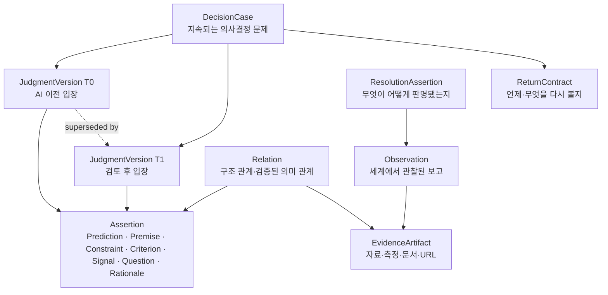
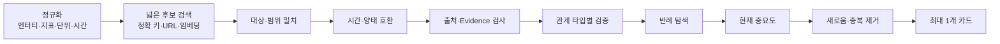
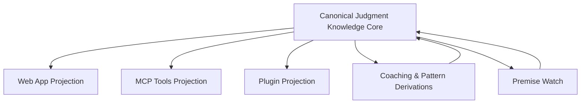

# Argus Judgment Knowledge Core & Coaching 설계

> 상태: **설계 제안(Proposal)**
> 작성일: 2026-07-16
> 범위: Judgment Knowledge Core, 관계 검증, Predict 보존, Patterns 코칭, 전제 자동 감지, 계정 연결
> 결정 효력: 이 문서는 현행 구현을 설명하고 다음 코어를 제안한다. ADR 또는 명시적 승인 전까지 새 정규 스키마를 확정하지 않는다.

---

## 0. 결론

Argus의 현재 코어는 약하지 않다. 오히려 다음 네 가지 헌법적 원칙은 상당히 강하다.

1. AI의 제안과 사용자의 판단을 구분한다.
2. 관찰, 주장, 권한 있는 행위, 시스템 사건을 구분한다.
3. `occurred_at`, `recorded_at`, `authorized_at`을 분리해 과거를 현재 정보로 덮어쓰지 않는다.
4. 해결과 종료를 구분하고, 불확실한 결과도 정직하게 기록한다.

그러나 이 토대 위에 쌓일 **판단 지식체계**는 아직 완전하지 않다. 현재의 가장 큰 결손은 다음과 같다.

- 한 의사결정 문제와 그 문제에 대한 시점별 판단이 모두 `Judgment`에 겹쳐 있다.
- 최초 Prediction은 웹 계약에는 있으나 정규 semantic core의 일급 객체가 아니다.
- Evidence는 `evidence_refs`와 provenance로 흩어져 있고, 재사용 가능한 지식 객체가 아니다.
- `supports`, `contradicts`, `same_fact`, `depends_on`은 철학적으로 언급되지만 타입·검증 규칙·수명주기가 없다.
- 현재 Patterns는 빈도 거울과 일부 휴리스틱에 머물며, “왜 이 패턴이 지금 이 판단에 중요한가”를 인과적으로 설명하지 못한다.
- 자동 전제 추적 엔진은 이미 꽤 정교하지만, 활성화가 설정과 토큰 복사에 의존해 가치 발견 전에 마찰이 크다.

따라서 다음 단계는 새 기능 몇 개를 붙이는 일이 아니다. **인간의 판단 과정을 시간축이 있는 지식 그래프로 정규화하고, 그 그래프에서만 코칭이 나오게 만드는 일**이다.

권고하는 핵심 변화는 다음 여섯 가지다.

1. 지속되는 의사결정 단위인 `DecisionCase`와 시점별 입장인 `JudgmentVersion`을 분리한다.
2. Prediction, Premise, Constraint, Criterion, Change Signal, Open Question, Rationale를 불변 `Assertion`의 명시적 역할로 편입한다.
3. Observation과 분리된 `EvidenceArtifact`를 도입한다.
4. 관계를 구조 관계와 의미 관계로 나누고, 의미 관계에는 타입별 검증 계약을 둔다.
5. 최초 Prediction을 절대 덮어쓰지 않고, 이후 변화는 새 버전·변경 이유·근거의 사건 사슬로 기록한다.
6. Patterns를 빈도 요약에서 시간·저자·인과·그래프·전이 코칭의 5차원으로 확장한다.

이 구조가 자리 잡으면 UI 문구, Capture/Predict의 노출 순서, MCP나 웹의 형태가 바뀌어도 Argus가 보존하는 가치는 흔들리지 않는다.

---

## 1. 현재 구조 감사

### 1.1 잘 갖춰진 부분

현행 DKK v3의 강점은 데이터 필드의 개수가 아니라 **의미론적 절제**에 있다.

| 영역 | 현재 수준 | 평가 |
|---|---:|---|
| Proposal과 Assertion 분리 | 강함 | AI 생성물이 곧 사용자 신념이 되는 것을 막는다. |
| Authorial Act | 강함 | seal, adopt, retire, resolve, close를 사용자 권한 행위로 본다. |
| Provenance | 강함 | 누가, 어떤 경로로, 어떤 자료를 바탕으로 기록했는지 추적할 수 있다. |
| Temporal context | 강함 | 사건 발생·기록·승인 시점을 구분하고 as-of 재구성을 지향한다. |
| 불변 기록 | 강함 | 과거를 수정하기보다 새 사건으로 상태를 진전시킨다. |
| Observation | 강함 | 외부에서 관찰된 사실과 판단을 분리한다. |
| Resolution/Closure 분리 | 강함 | 답을 얻는 것과 판단 장부를 닫는 것을 구분한다. |
| 불확실한 종결 | 강함 | answered 외에 indeterminate, moot를 표현할 수 있다. |

이 원칙은 유지해야 한다. 새 코어가 이보다 풍부해지더라도 이 헌법을 느슨하게 만들면 퇴보다.

### 1.2 부분적으로만 갖춰진 부분

| 개념 | 현재 위치 | 한계 |
|---|---|---|
| Prediction | 웹 `DecisionContract.predicates`, v2 predicate | v3 정규 코어에는 독립 의미가 없다. |
| Evidence | `evidence_refs`, observation provenance | 자료 자체와 그 자료에서 읽은 주장이 구분되지 않는다. |
| Change signal | 웹 ReturnHandle의 date/event/metric 등 | v3 Return Contract는 주로 날짜와 질문 중심이다. |
| Criterion | resolution criterion 등 | 성공 기준, 판단 기준, 가치 우선순위가 분산되어 있다. |
| Open question | v2 premise kind | v3에서 질문의 수명주기와 답변 연결이 불명확하다. |
| Rationale | 자유 텍스트와 history | 판단 변화의 원인으로 질의 가능한 구조가 아니다. |
| Relation | relationship proposal, 정확 일치 연결 | 끝점, 타입, 근거, 검증 상태가 정규화되어 있지 않다. |
| Pattern | 빈도 집계, 웹 휴리스틱 | 인과 구조와 현재 결정으로의 전이가 약하다. |

### 1.3 빠진 핵심

#### Decision과 Judgment의 분리

“우리는 이 기능을 이번 분기에 출시할 것인가?”는 지속되는 의사결정 문제다. “현재는 출시 쪽으로 70% 기운다”는 특정 시점의 판단이다. 둘은 같은 것이 아니다.

현재 하나의 `judgment_id`가 두 역할을 모두 떠맡으면 다음 질문에 정확히 답하기 어렵다.

- 이 판단은 같은 문제에 대한 수정인가, 새로운 문제인가?
- AI 전과 AI 후에 입장이 얼마나 바뀌었는가?
- 무엇이 바뀌었고, 무엇은 그대로인가?
- 과거 시점에서 사용자는 무엇을 알고 있었는가?

따라서 안정적인 컨테이너 `DecisionCase`와 시간에 종속된 `JudgmentVersion`을 분리해야 한다.

#### Evidence의 일급 객체화

“시장 규모는 20% 성장했다”는 주장이고, 이를 뒷받침한 보고서·URL·데이터셋·측정값은 증거 자료다. 자료 하나가 여러 주장과 판단에 사용될 수 있고, 같은 자료에 대한 해석이 달라질 수도 있다.

Evidence가 단순 문자열 참조에 머물면 다음이 어렵다.

- 동일 자료 재사용과 중복 제거
- 자료가 갱신되었을 때 영향받는 판단 찾기
- 출처 품질, 관찰 시점, 유효 범위 비교
- “자료가 틀렸다”와 “자료 해석이 틀렸다”의 분리

#### 관계의 검증 가능한 의미

`same_fact`, `supports`, `contradicts`는 라벨이 아니다. 각각 다른 검증 조건을 가진 주장이다. 타입을 붙이는 것만으로는 지식 그래프가 되지 않는다.

예를 들어 다음 두 문장은 단어가 비슷해도 모순이 아닐 수 있다.

- 2025년 1분기 전환율은 3%다.
- 2026년 1분기 전환율은 4%다.

반대로 단어가 전혀 달라도 같은 제약을 가리킬 수 있다.

- 고객 지원팀은 신규 계정을 하루 30개까지만 온보딩할 수 있다.
- 엔터프라이즈 출시를 다음 주에 하면 첫 주 예상 가입은 80개다.

후자는 단순 유사도가 아니라 “현재 운영 용량이라는 동일 제약”을 매개로 연결해야 한다.

---

## 2. 설계 목표와 비목표

### 2.1 목표

1. 사용자가 AI를 만나기 전의 생각을 원형대로 보존한다.
2. 생각이 바뀌면 무엇 때문에 바뀌었는지 사건 사슬로 재구성한다.
3. 사실, 가치, 제약, 예측, 질문을 서로 다른 검증 규칙으로 다룬다.
4. 관계를 넓게 제안하되 좁게 승인한다.
5. 코칭은 성격 판정이 아니라 현재 판단에 유용한 한 가지 질문을 제공한다.
6. 웹, MCP, 플러그인, 향후 다른 셸이 같은 정규 코어를 투영하게 한다.
7. 사용자가 기록·동기화·자동 추적의 권한을 쉽게 이해하고 회수할 수 있게 한다.

### 2.2 비목표

- 인간 사고 전체를 보편 온톨로지로 완성하지 않는다.
- AI가 사용자의 진짜 의도나 성격을 추정해 확정하지 않는다.
- 모든 문장 사이에 의미 관계를 만들지 않는다.
- 그래프 밀도나 알림 수를 제품 성공으로 보지 않는다.
- 자동 감지를 이유로 사용자 승인 절차를 숨기지 않는다.
- Patterns가 사용자를 대신해 결정을 권고하지 않는다.

---

## 3. 제안하는 정규 지식모델

### 3.1 계층 개요



핵심은 객체 수가 아니라 역할의 경계를 분명히 하는 것이다.

### 3.2 DecisionCase

한 번의 문장이나 세션이 아니라, 시간에 걸쳐 유지되는 의사결정 문제다.

```ts
type DecisionCase = {
  decision_id: string;
  question: string;
  scope: {
    subject_refs?: string[];
    options?: string[];
    horizon?: string;
    context?: string;
  };
  opened_at: string;
  opened_by: ActorRef;
  lifecycle: "open" | "closed" | "withdrawn" | "superseded";
  supersedes_decision_id?: string;
};
```

`DecisionCase`는 쉽게 수정되는 메모가 아니다. 질문 자체가 실질적으로 바뀌면 새 Case를 만들고 `supersedes`로 연결한다.

### 3.3 JudgmentVersion

사용자가 특정 시점에 권한 있게 봉인한 입장이다.

```ts
type JudgmentVersion = {
  judgment_id: string;
  decision_id: string;
  version: number;
  stance: {
    option_ref?: string;
    statement: string;
    confidence?: number;
  };
  assertion_refs: string[];
  sealed_at: string;
  authorized_by: ActorRef;
  basis_known_as_of: string;
  supersedes_judgment_id?: string;
  change_rationale_ref?: string;
};
```

중요한 불변식은 다음과 같다.

- 한 버전을 수정하지 않는다.
- 새 입장은 새 `JudgmentVersion`이다.
- 단순 문구 교정도 의미가 바뀌면 새 버전이다.
- `basis_known_as_of` 이후의 자료가 과거 버전에 소급 삽입되면 안 된다.

### 3.4 Assertion

판단 과정에서 명시적으로 다뤄야 하는 명제를 하나의 불변 구조로 담고, 역할마다 별도 검증 계약을 둔다.

```ts
type AssertionRole =
  | "prediction"
  | "premise"
  | "constraint"
  | "criterion"
  | "change_signal"
  | "open_question"
  | "rationale";

type Assertion = {
  assertion_id: string;
  role: AssertionRole;
  proposition: string;
  scope: AssertionScope;
  modality?: "is" | "may" | "should" | "must" | "expected";
  polarity?: "positive" | "negative";
  valid_time?: TimeRange;
  provenance: Provenance;
  authority: Authority;
  status: "proposed" | "adopted" | "retired" | "answered" | "superseded";
};
```

#### Prediction

미래에 관찰 가능하거나 판정 가능한 기대다. “나는 A를 선택할 것 같다”처럼 자기 선택에 대한 예측도 포함할 수 있지만, 현재의 선택인 Judgment와 혼동하면 안 된다.

Prediction에는 가능하면 다음을 구조화한다.

- 대상 변수 또는 사건
- 예측 방향·값·범위
- 시간창
- 성공/실패 판정 기준
- 최초 기록 시점과 저자

#### Premise

현재 판단이 기대고 있는 채택된 조건이다. Premise는 사실일 수도, 추정일 수도 있다. 채택되었다는 것은 진실이라는 뜻이 아니라 “이 판단이 이것을 전제로 삼았다”는 뜻이다.

#### Constraint

선택지를 제한하는 경계다. 예산, 시간, 인력, 규제, 호환성, 비가역성 등이 여기에 해당한다. Constraint를 Premise 속에 숨기지 않아야 서로 다른 결정에서 반복되는 병목을 찾을 수 있다.

#### Criterion

무엇을 좋은 결정으로 볼지 정의하는 규범적 기준이다. 가치·우선순위·성공 기준은 외부 사실과 다르다. 일반적으로 웹 검색으로 참·거짓을 감시할 대상이 아니다.

#### Change Signal

어떤 관찰이 생기면 판단을 다시 열 것인지 나타내는 조건이다. Return Contract의 “언제 돌아올지”와 결합하지만, 신호 자체는 재사용 가능한 Assertion이다.

#### Open Question

현재 답이 없고 답을 얻으면 판단이 달라질 수 있는 정보 요구다. 답변은 Observation 또는 Assertion에 연결되고, 질문은 `answered`, `moot`, `superseded`로 전이할 수 있다.

#### Rationale

판단 또는 Prediction이 바뀐 이유를 담는다. 자유로운 설명을 허용하되, 원인이 된 Premise·Evidence·Observation·관계에 대한 참조를 함께 보존해야 한다.

### 3.5 EvidenceArtifact와 Observation

두 객체는 반드시 구분한다.

```ts
type EvidenceArtifact = {
  evidence_id: string;
  kind: "url" | "document" | "dataset" | "measurement" | "message" | "manual_note";
  locator?: string;
  content_hash?: string;
  publisher?: string;
  published_at?: string;
  retrieved_at?: string;
  observed_scope?: AssertionScope;
  provenance: Provenance;
};

type Observation = {
  observation_id: string;
  report: string;
  measured_value?: { value: number; unit: string };
  valid_time: TimeRange;
  evidence_refs: string[];
  provenance: Provenance;
  confidence?: number;
};
```

- EvidenceArtifact는 자료다.
- Observation은 자료나 경험을 통해 “무엇을 관찰했다”고 기록한 보고다.
- Assertion은 그 관찰을 판단에 어떤 명제로 채택했는가다.
- 이 셋 중 어느 것도 자동으로 객관적 진실이 되지 않는다.

### 3.6 ReturnContract와 ResolutionAssertion

Return Contract는 “언제, 무엇 때문에, 어떤 질문으로 돌아올지”를 약속한다.

```ts
type ReturnTrigger =
  | { kind: "date"; at: string }
  | { kind: "event"; event: string }
  | { kind: "metric"; metric: string; comparator: string; threshold: number; unit: string }
  | { kind: "evidence"; query: string }
  | { kind: "manual" };

type ReturnContract = {
  return_id: string;
  decision_id: string;
  trigger: ReturnTrigger;
  review_question: string;
  resolution_criterion?: string;
  promised_at: string;
  authorized_by: ActorRef;
  state: "pending" | "due" | "deferred" | "fulfilled" | "superseded";
};
```

Resolution은 결과에 대한 권한 있는 주장이고 Closure는 장부를 닫는 행위다. `still_pending`을 거짓 종결로 만들지 않는다.

---

## 4. 출처·권한·시간: 모든 객체를 가로지르는 헌법

### 4.1 Provenance

최소한 다음 질문에 답할 수 있어야 한다.

- 누가 처음 표현했는가?
- 어떤 인터페이스와 세션에서 들어왔는가?
- AI가 제안했는가, 사용자가 직접 작성했는가?
- 어떤 EvidenceArtifact를 근거로 삼았는가?
- 어떤 모델·프롬프트·validator 버전이 파생시켰는가?

### 4.2 Authority

다음 상태를 구분한다.

| 상태 | 의미 |
|---|---|
| proposed | AI 또는 시스템이 검토를 요청했다. |
| recorded | 기록은 존재하지만 사용자 판단으로 채택되지 않았다. |
| adopted | 사용자가 판단의 전제·기준 등으로 승인했다. |
| authorized | seal, revise, resolve, close 같은 저자 행위가 명시적으로 수행됐다. |
| derived | 시스템이 정해진 규칙으로 계산했다. |

AI는 `proposed`와 `derived`를 만들 수 있다. 사용자의 Judgment, Premise 채택, Resolution을 스스로 `authorized`할 수 없다.

### 4.3 시간

모든 중요한 기록에는 최소 세 시점이 필요하다.

- `occurred_at`: 세계에서 사건이 발생한 때
- `recorded_at`: Argus에 들어온 때
- `authorized_at`: 사용자가 의미를 승인한 때

추가로 명제의 유효 기간인 `valid_time`과 해당 판단이 알고 있던 정보의 상한인 `basis_known_as_of`가 필요하다.

이 시간 분리 덕분에 다음을 정직하게 표현할 수 있다.

> 7월 1일에 실제로 일어난 일을 7월 10일에 알았고, 7월 11일에 과거 판단에 영향을 준 관찰로 승인했다. 그러나 7월 5일 당시 판단 화면에는 이 정보가 나타나지 않는다.

---

## 5. 사건 문법과 명령

### 5.1 제안 이벤트

```text
decision_opened
assertion_proposed
assertion_recorded
assertion_adopted
assertion_retired
assertion_answered
evidence_recorded
evidence_attached
judgment_sealed
judgment_superseded
judgment_withdrawn
relation_proposed
relation_verified
relation_confirmed
relation_rejected
relation_superseded
return_promised
return_deferred
return_fulfilled
observation_recorded
resolution_asserted
decision_closed
decision_erased
```

이벤트를 세분화하되 사용자에게 매번 여러 번 클릭하도록 강요할 필요는 없다. 하나의 승인 명령이 원자적 이벤트 묶음을 만들 수 있다.

### 5.2 사용자 명령과 원자적 묶음

#### `StartDecision`

한 번의 명시적 시작으로 다음을 기록한다.

1. `decision_opened`
2. 최초 Prediction 또는 현재 Judgment
3. 사용자가 이미 말한 성공 기준
4. 선택적 Return Contract

#### `ApprovePremisesAndWatch`

봉인 순간 한 번의 승인으로 다음을 원자적으로 처리한다.

1. 선택된 AI premise proposal 채택
2. Premise와 Judgment의 구조 관계 기록
3. 외부 검증 가능한 Premise의 WatchSpec 승인
4. 필요한 최소 동기화 범위 승인
5. 첫 기준선 확인 예약

중간 단계 하나라도 실패하면 승인된 것처럼 일부만 보이지 않게 한다. 재시도는 동일한 idempotency key를 사용한다.

#### `ReviseJudgment`

다음을 하나의 변화 사건으로 기록한다.

1. 새 JudgmentVersion
2. 이전 버전과 `supersedes`
3. 변경 Rationale
4. 원인이 된 Observation·Evidence·Premise 참조
5. 새 Return Contract 또는 기존 계약 유지 여부

#### `ResolveDecision`

Observation, ResolutionAssertion, 선택적 Closure를 묶되 각각의 의미는 유지한다.

---

## 6. Predict-first와 비덮어쓰기

Predict를 서사상 먼저 보여주는 선택은 코어와 충돌하지 않는다. 오히려 제품 가치의 핵심이다. 중요한 것은 Capture 후 Prediction을 “더 정확한 버전”으로 교체하지 않는 것이다.

### 6.1 권장 시간 순서

| 시점 | 사용자 경험 | 코어 기록 |
|---|---|---|
| T0, AI 이전 | 내 예상·기울기·성공 기준을 짧게 기록 | 최초 Prediction, 최초 JudgmentVersion |
| T1, AI 대화 중 | AI가 숨은 전제·제약·질문을 제안 | `assertion_proposed`만 생성 |
| T2, 봉인 | 사용자가 전제와 자동 추적을 한 번에 검토 | adopt/watch 관련 원자적 이벤트 |
| T3, 입장 변화 | 사용자가 수정된 판단과 이유를 승인 | 새 JudgmentVersion, supersedes, Rationale |
| T4, 현실 관찰 | 자료·측정·사건이 들어옴 | EvidenceArtifact, Observation |
| T5, 해결 | 결과를 판정하고 필요하면 종료 | ResolutionAssertion, Closure |
| T6, 코칭 | 변화의 원인을 되짚음 | 파생 Pattern, 확인된 Relation |

### 6.2 반드시 보존할 세 겹

1. **무엇을 원래 생각했는가**: 최초 Prediction과 Judgment
2. **무엇이 새로 들어왔는가**: AI proposal, Evidence, Observation
3. **무엇 때문에 어떻게 바뀌었는가**: 새 Judgment, Rationale, 관계

이 셋이 있어야 다음과 같은 강한 메타 코칭이 가능하다.

> AI 사용 전에는 즉시 출시 쪽으로 기울어 있었다. 검토 후 2주 연기로 바뀌었고, 기록된 변화 이유는 AI의 권고 자체가 아니라 사용자가 확인한 보안 요구사항이었다. 비슷한 두 결정에서도 외부 요건이 늦게 확인된 뒤 일정이 바뀌었다. 이번 결정에서 아직 검증되지 않은 외부 요건은 무엇인가?

### 6.3 변경 원인을 과도하게 추론하지 않기

시점상 A 이후 B가 일어났다는 이유로 A가 B의 원인이라고 단정하지 않는다.

변화 원인은 신뢰 수준을 나눈다.

- `user_stated`: 사용자가 직접 이유로 지정
- `evidence_linked`: 사용자가 근거를 연결
- `system_inferred`: 시스템이 후보로 추론
- `unknown`: 기록 없음

코칭 문구도 이를 반영한다. `system_inferred`는 “영향을 준 것으로 보인다”가 아니라 “변화 직전에 검토됐지만, 변경 이유로 확인되지는 않았다”고 표현한다.

---

## 7. 관계 체계

### 7.1 구조 관계와 의미 관계 분리

#### 구조 관계

객체 생성과 사용자 행위로 결정되며 대체로 논쟁의 여지가 적다.

- `judgment_of`
- `prediction_for`
- `premise_for`
- `constraint_on`
- `criterion_for`
- `change_signal_for`
- `return_for`
- `evidenced_by`
- `resolves`
- `supersedes`
- `motivated_by`

#### 의미 관계

내용을 해석해야 하므로 제안·검증·거절의 수명주기가 필요하다.

- `same_fact`
- `supports`
- `contradicts`
- `updates`
- `depends_on`
- `shared_constraint`
- `same_question`
- `derived_from`

### 7.2 관계 객체

```ts
type SemanticRelationType =
  | "same_fact"
  | "supports"
  | "contradicts"
  | "updates"
  | "depends_on"
  | "shared_constraint"
  | "same_question"
  | "derived_from";

type Relation = {
  relation_id: string;
  type: SemanticRelationType;
  from_ref: EntityRef;
  to_ref: EntityRef;
  direction: "directed" | "symmetric";
  scope: AssertionScope;
  valid_time?: TimeRange;
  evidence_refs: string[];
  proposed_by: ActorRef;
  validator_version?: string;
  counterexample_checked?: boolean;
  importance_reason?: string;
  status:
    | "proposed"
    | "system_verified"
    | "human_confirmed"
    | "human_rejected"
    | "superseded";
};
```

### 7.3 타입별 검증 계약

#### `same_fact`

두 주장이 같은 현실의 같은 명제를 가리킬 때만 성립한다.

필수 비교 요소:

- 동일한 대상 또는 해소 가능한 동일 엔터티
- 동일한 속성·관계·측정값
- 호환 가능한 단위와 집계 방식
- 겹치는 유효 시간
- 동일한 극성과 호환 가능한 양태
- 동일하거나 포함 관계가 명확한 범위

단어 유사도만으로 만들지 않는다.

#### `supports`

A가 참일 때 B의 개연성이 증가하는 관계다. A가 B를 증명한다는 뜻이 아니다.

필수 요소:

- 구체적 연결 고리
- B와 관련된 범위
- 양립 가능한 시간
- 인용 가능한 Evidence 또는 명시된 사용자 설명
- 반대 방향 설명 가능성 검토

#### `contradicts`

동일 범위·시점·양태에서 둘이 동시에 참일 수 없을 때 성립한다.

다음은 자동 모순이 아니다.

- 시점이 다른 측정값
- 전망과 실측
- “해야 한다”와 “할 것이다”
- 전체 집단과 일부 집단
- 서로 다른 단위 또는 집계 방식

#### `updates`

같은 사실 계열에 대한 더 나중의 유효 정보다. 이전 정보가 당시에는 정당했을 수 있으므로 `contradicts`와 다르다.

#### `depends_on`

A가 B의 성립 또는 실행에 필요한 전제·선행 조건일 때 성립한다. 단순 동시 발생이나 주제 유사성은 제외한다.

#### `shared_constraint`

서로 다른 두 결정이 같은 한정 자원·규제·시간 경계에 실질적으로 묶여 있을 때 성립한다. Patterns를 크게 높일 가능성이 가장 큰 관계 중 하나다.

#### `same_question`

표현이 달라도 동일한 정보 요구와 답 공간을 가질 때 성립한다. 단지 둘 다 “시장”을 묻는다는 이유로 연결하지 않는다.

### 7.4 관계 검증 파이프라인



임베딩과 LLM은 후보를 넓히는 데 사용할 수 있다. 최종 관계는 타입별 규칙과 근거를 통과해야 한다. `unrelated`가 가장 흔한 결과여야 정상이다.

### 7.5 관계의 권한

- 정확히 동일한 ID, 사용자가 직접 연결한 근거 같은 결정적 관계는 `system_verified`가 가능하다.
- 의미 관계는 기본적으로 `proposed`다.
- 코칭의 핵심 근거로 반복 사용하려면 `human_confirmed` 또는 엄격한 system verification이 필요하다.
- 사용자가 거절한 관계는 같은 버전·같은 근거로 다시 제안하지 않는다.
- 관계는 판단의 생명주기를 임의로 바꾸거나 사용자의 Premise를 채택할 수 없다.

---

## 8. Patterns를 다섯 차원 높이는 구조

산술은 필요하지만 코칭은 아니다. “깨진 전제가 4개다”는 증거 요약이고, 통찰은 그 반복 구조가 현재 결정에 어떤 질문을 요구하는지 설명하는 것이다.

### 8.1 1차원: 결과·빈도

현재 구현과 가장 가깝다.

- 해결된 판단 수
- Prediction 적중·빗나감·판정 불가
- 깨진 Premise 빈도
- 연기·미해결 비율

역할은 기초 통계와 표본 경고다. 이 차원만으로 사용자를 평가하지 않는다.

### 8.2 2차원: 시간·저자 궤적

판단이 언제, 누구의 입력 뒤에 바뀌었는지 본다.

- AI 이전 Prediction
- AI가 제안한 Premise
- 사용자가 채택한 것과 거절한 것
- 외부 Evidence 이후의 변화
- 결과를 안 뒤 회고적으로 추가된 설명

여기서 중요한 통찰은 “AI를 사용했다”가 아니라 **어떤 입력이 사용자 판단의 저자성을 실제로 바꿨는가**다.

### 8.3 3차원: 인과·전제 구조

결과와 직접 연결된 Premise, Constraint, Change Signal을 본다.

- 어떤 전제가 반복해서 늦게 드러났는가?
- 어떤 제약이 결정 이후 실제 병목이 되었는가?
- 어떤 관찰이 판단 변화의 명시적 이유였는가?
- 어떤 성공 기준은 결과와 무관했는가?

단순 동시성은 인과로 승격하지 않는다. 사용자 지정 이유와 검증된 관계에 더 높은 가중치를 둔다.

### 8.4 4차원: 교차 결정 그래프와 blast radius

한 사실 변화가 여러 결정에 미치는 영향을 계산한다.

예:

1. “보안 심사 2주”라는 Observation이 갱신된다.
2. 이 Observation은 기존 Premise와 `updates` 관계다.
3. 해당 Premise는 세 DecisionCase의 판단 근거다.
4. 그중 두 판단은 아직 열려 있고 한 판단은 Return Contract가 없다.
5. Argus는 가장 영향이 큰 한 판단을 우선 보여주고 나머지는 접어 둔다.

그래프의 목적은 연결 개수를 늘리는 것이 아니라 **변화의 영향 범위를 정확히 좁히는 것**이다.

### 8.5 5차원: 전이 코칭

과거 구조를 현재 결정의 한 질문으로 옮긴다.

나쁜 코칭:

> 당신은 운영을 과소평가하는 경향이 있습니다.

좋은 코칭:

> 해결된 세 결정에서 운영 용량이 실행 약속 뒤에 기록되었고, 모두 결과 회고에서 깨진 전제로 지목됐습니다. 현재 결정도 동일한 팀 용량에 의존합니다. 이번에는 약속 전에 확인한 용량 근거가 있나요?

좋은 코칭은 다음 다섯 요소를 포함한다.

1. 관찰된 반복 구조
2. 양쪽 판단의 구체적 근거
3. 현재와 연결되는 검증된 관계
4. 지금 중요한 이유
5. 사용자가 답할 수 있는 하나의 질문

### 8.6 코칭 계약

Patterns는 다음 원칙을 지킨다.

- 성격, 능력, 편향을 단정하는 라벨을 붙이지 않는다.
- 개인 반복 패턴은 독립적으로 해결된 사례 3개 이상과 동일한 인과 구조를 기본 최소치로 삼는다.
- 단, 하나의 강한 외부 변화가 여러 열린 판단에 미치는 blast radius는 한 사례만으로도 알릴 수 있다.
- 한 세션 또는 한 사건에 최대 한 개의 주 코칭 카드를 노출한다.
- 근거가 없으면 통찰을 만들어내지 않는다.
- 행동을 지시하기보다 가장 가치 있는 검토 질문을 제시한다.
- 사용자는 근거가 된 원문과 관계를 펼쳐볼 수 있다.
- 거절한 연결은 다시 제안하지 않는다.
- precision을 recall보다 우선한다.

### 8.7 CoachingCard 계약

```ts
type CoachingCard = {
  card_id: string;
  kind: "trajectory" | "premise_pattern" | "blast_radius" | "transfer_question";
  observation: string;
  connection: string;
  evidence_refs: string[];
  relation_refs: string[];
  why_now: string;
  question: string;
  confidence: number;
  actions: ("confirm" | "reject" | "later" | "inspect_evidence")[];
};
```

카드의 생성 과정과 근거는 감사 가능해야 한다. 자연어 문장은 바뀌어도 참조한 사건·관계·검증 버전은 남는다.

---

## 9. 봉인 순간 전제 자동 감지와 한 번의 승인

현재 엔진은 검색 출처 제한, 수치적 materiality, 낮은 신뢰도 침묵, 알림 병합 등 좋은 방어선을 이미 가지고 있다. 필요한 변화는 주로 **활성화 계약과 코어 기록 방식**이다.

### 9.1 AI가 제안할 WatchProposal

```ts
type WatchProposal = {
  premise_ref: string;
  watchable: boolean;
  reason: string;
  target_entity?: string;
  query?: string;
  metric?: string;
  unit?: string;
  comparator?: "gt" | "gte" | "lt" | "lte" | "changed";
  materiality_threshold?: number;
  baseline?: {
    value?: number;
    observed_at?: string;
    evidence_ref?: string;
  };
  cadence?: "daily" | "weekly" | "monthly" | "event_driven";
  source_policy?: {
    allowed_domains?: string[];
    denied_domains?: string[];
    primary_sources_preferred: boolean;
  };
  estimated_cost?: string;
  proposed_by: ActorRef;
};
```

AI는 WatchProposal만 만든다. 사용자 승인이 있어야 Premise 채택과 WatchSpec이 활성화된다.

### 9.2 watchable 판정

자동 추적 대상으로 적합한 것:

- 외부 세계에서 바뀔 수 있는 사실
- 명확한 대상과 시간 범위가 있는 사건
- 수치·상태·공식 공지처럼 다시 조회 가능한 정보
- 변화 시 현재 판단을 재검토할 실질적 이유가 있는 정보

부적합한 것:

- 개인 가치와 선호
- “좋은 제품이어야 한다” 같은 불명확한 규범
- 검증 가능한 대상이 없는 감상
- 민감한 개인 내용을 과도하게 외부 검색해야 하는 전제
- 변화해도 판단에 영향이 없는 장식적 사실

### 9.3 권장 UI

봉인 직후 하나의 짧은 카드만 보인다.

> 외부에서 확인 가능한 전제 2개를 찾았습니다. 바뀌면 이 판단을 다시 알려드릴까요?

행동:

- `자동 확인 2개 켜기`
- `직접 고르기`
- `이번에는 안 함`

세부 보기에서는 각 전제의 검색 대상, 기준선, 변화 임계값, 빈도, 예상 비용을 보여준다.

### 9.4 첫 확인과 알림 규칙

- 첫 자동 확인은 기준선을 세울 뿐 알림을 보내지 않는다.
- 이후 materiality 기준을 넘는 변화만 후보가 된다.
- 동일 변화는 throttle 기간 동안 합친다.
- 낮은 confidence 또는 출처 검증 실패는 침묵한다.
- 알림은 바뀐 사실, 출처, 영향받는 판단, 한 가지 질문을 포함한다.
- 값이 바뀌었다고 Judgment를 자동 수정하지 않는다.

### 9.5 검토자로서의 사용자

사용자는 모든 것을 직접 입력하는 사람이 아니라, AI가 정리한 다음 항목을 한 번에 검토하는 사람이다.

- 이것이 실제 내 전제인가?
- 외부 검증 가능한가?
- 바뀌면 다시 볼 만큼 중요한가?
- 이 범위를 서버와 동기화해도 되는가?

승인은 빠르되 의미는 흐리지 않는다. “동의” 한 번이 무엇을 승인했는지 이벤트 장부에서 각각 추적할 수 있어야 한다.

---

## 10. 계정 연결과 Device Authorization

### 10.1 목표 경험

현재의 토큰 발급·복사·JSON 편집은 개발자용 고급 경로로 남기고, 일반 경로는 다음처럼 만든다.

```text
argus connect
→ 시스템 브라우저에서 Argus 로그인
→ 연결할 기기와 동기화 범위 확인
→ 승인
→ CLI/MCP에 “연결됨: user@example.com” 표시
```

토큰을 채팅에 붙여넣거나 모델 컨텍스트에 노출하지 않는다.

### 10.2 표준 흐름 선택

일반 데스크톱과 로컬 CLI에서는 **Authorization Code + PKCE + 외부 시스템 브라우저 + loopback redirect**를 기본으로 한다. 이는 브라우저를 사용할 수 있는 네이티브 앱에 익숙하고 적절한 방법이다.

브라우저를 자동으로 열 수 없거나 원격·headless 환경이면 **OAuth 2.0 Device Authorization Grant**를 fallback으로 사용한다.

```text
1. CLI가 device_code와 user_code 요청
2. 사용자가 verification URI를 브라우저에서 엶
3. 짧은 코드를 확인하고 기기·권한 승인
4. CLI는 규정된 interval로 polling
5. 승인 후 access/refresh token을 안전한 로컬 저장소에 보관
```

Device Flow를 브라우저 사용이 가능한 모든 환경의 기본값으로 만들 필요는 없다. 표준 자체도 입력이 제한된 기기를 주 사용처로 둔다.

### 10.3 MCP 인증과 Argus 계정 연결의 구분

두 문제를 혼동하지 않는다.

- MCP HTTP transport의 서버 인증은 MCP Authorization 규격을 따른다.
- stdio MCP 서버는 통상 transport 자체에서 OAuth를 수행하지 않는다.
- Argus MCP가 웹 계정에 기록을 동기화하는 것은 별도의 upstream Argus account authorization이다.

즉 `argus connect`는 “MCP 프로토콜에 로그인”하는 것이 아니라 “로컬 Argus 도구가 사용자의 Argus 계정과 동기화할 권한을 얻는 것”이다.

### 10.4 권한 범위

최소 권한부터 단계적으로 요청한다.

1. `records:sync` — 사용자가 승인한 판단 기록 동기화
2. `premises:watch` — 선택된 전제를 서버에서 자동 확인
3. `notifications:write` — 변화 알림 전송

처음 연결할 때 모든 권한을 한꺼번에 강요하지 않는다. 전제 자동 확인을 처음 켤 때 추가 범위를 요청할 수 있다.

### 10.5 토큰과 보안

- Windows Credential Manager, macOS Keychain, Linux Secret Service를 우선한다.
- 불가피한 파일 fallback은 사용자 전용 권한과 명시적 경고를 사용한다.
- access token은 짧게, refresh token은 회전과 폐기를 지원한다.
- `disconnect`, 원격 revoke, 기기 목록, 마지막 사용 시점을 제공한다.
- 토큰은 ledger event, 도구 출력, LLM prompt, 로그에 남기지 않는다.
- Device code polling은 `interval`과 `slow_down`을 준수한다.
- 승인 화면은 앱 이름, 기기 이름, 요청 범위, 만료 시간을 보여준다.
- 사용자는 채팅창에 비밀번호나 user code를 입력하도록 안내받지 않는다.

### 10.6 고급·자동화 환경

`ARGUS_TOKEN`은 CI, 서버, 비대화형 환경을 위한 고급 대안으로 유지한다. 문서에서는 일반 사용자 경로와 분리하고, 만료·회수·scope 제한을 지원한다.

---

## 11. 코어와 제품 셸의 관계

웹, MCP, 플러그인에 각각 다른 의미 체계를 두지 않는다.



`Coaching`과 `Watch`가 코어에 쓰는 것은 사용자 Judgment가 아니라 proposal, relation, observation, system event다. 사용자 승인 없이는 authorial state를 바꾸지 않는다.

현재 웹 `DecisionContract`의 장점—특히 `user_lean` 보존—은 어댑터를 통해 코어로 승격한다. mutable JSONB 자체를 정규 진실로 만들지 않는다.

---

## 12. 마이그레이션 및 버전 전략

### 12.1 조용한 v3 변경 금지

현재 v3의 의미를 바꾸면서 같은 버전 이름을 유지하면 과거 이벤트 재생 결과가 달라질 위험이 있다. 새 스키마는 명시적 semantic version 또는 DKK v4 후보로 다룬다.

### 12.2 어댑터

다음 변환을 명시적으로 둔다.

- v2 predicate → Assertion(role=`prediction` 또는 `premise`)
- 웹 `user_lean` → 최초 Prediction 및 필요 시 최초 JudgmentVersion
- 웹 predicates → typed Assertion
- 기존 `evidence_refs` → EvidenceArtifact stub 후 점진적 보강
- 기존 정확 일치 connection → `system_verified` relation
- legacy ReturnHandle → typed ReturnTrigger

모호한 변환은 추측하지 않고 `legacy_unclassified` provenance를 남긴다.

### 12.3 이중 읽기·이중 쓰기

권장 순서:

1. 새 이벤트를 shadow write한다.
2. 기존 projection과 새 projection의 의미 동등성을 비교한다.
3. read path를 사용자 일부에만 전환한다.
4. 회귀 fixture를 통과한 뒤 canonical read를 전환한다.
5. legacy write를 제거한다.

### 12.4 휴리스틱 코칭 교체

현재 actor override, reframe acceptance, axis gap 같은 휴리스틱은 즉시 삭제하지 않는다. 다만 새 코어 기반 코칭과 별도로 측정한다.

새 코칭이 다음 조건을 충족한 뒤 legacy 휴리스틱을 축소한다.

- 근거 추적 가능
- 사용자 거절률 허용 기준 이내
- 관계 precision 목표 충족
- 동일 입력에서 안정적인 결과
- authorial boundary 위반 없음

---

## 13. 권장 실행 순서

출시와 코어 강화를 직렬로 묶지 않는다. 표면 트랙과 코어 트랙을 병렬적으로 전개한다.

### 단계 S0 — 공개 표면 정리

- LinkedIn 글의 Predict-first 서사를 유지한다.
- CTA와 짧은 제품 문구를 “AI의 결정을 검토”가 아니라 “내 판단의 원점과 변화 이유를 보존” 쪽으로 맞춘다.
- 복잡한 사례를 hero에 다시 모두 넣지 않는다.
- funnel과 첫 봉인 완료율을 계측한다.

이 단계는 코어 완성까지 기다릴 필요가 없다.

### 단계 K0 — 코어 헌법 동결

- 본 문서의 객체 경계와 불변식을 ADR 후보로 검토한다.
- DecisionCase/JudgmentVersion 분리를 확정한다.
- Prediction, Evidence, Relation의 정규 의미를 확정한다.
- betrayal fixture를 먼저 작성한다.

**2026-07-16 구현 상태:** `ADR-2026-07-16-judgment-knowledge-core-k0.md`에서 열
질문의 owner와 확정 상태를 정리했다. 창업자 결정 F1~F5는 완료되었으며, K1은
그 결정의 후속 제품 표면을 선점하지 않는 shadow-only 기본값만 사용한다.

### 단계 K1 — 새 semantic schema

- 새 이벤트 스키마와 reducer를 만든다.
- as-of projection을 구현한다.
- relationship proposal을 구조화한다.
- 기존 v3를 깨지 않고 versioned adapter를 둔다.

**2026-07-16 구현 상태:** 신규 `argus-mcp/src/v4/`에 v4 schema, pure reducer,
관계 타입 검증, watch 판정, 실패 격리 shadow sink를 추가했다. 기본 off인
`ARGUS_SEMANTIC_V4_SHADOW=1` 계약만 존재하며 기존 write path에는 아직 배선하지 않았다.
v3 schema/reducer/store의 의미와 코드는 변경하지 않았다.

### 단계 K2 — Predict 보존과 변화 사슬

- 웹의 `user_lean`을 정규 Prediction으로 기록한다.
- 수정은 새 JudgmentVersion으로만 수행한다.
- Rationale과 원인 Evidence 연결 UI를 최소 마찰로 제공한다.
- “AI 전/후” 비교 projection을 만든다.

**2026-07-16 선행 슬라이스:** `src/lib/semantic-v4/user-lean-shadow.ts`가 최초 유효
`user_lean`을 원문 그대로 Prediction 승격 후보로 만들고, 별도 승인 영수증 없이는
JudgmentVersion을 만들지 않는다. 주입식 sink와 env gate만 추가했으며 기존
DecisionContract callsite와 사용자 표면은 아직 변경하지 않았다.

### 단계 A0 — 계정 연결

- 데스크톱 기본: Authorization Code + PKCE
- headless fallback: Device Authorization Grant
- OS credential storage
- 연결 상태, scope, revoke, disconnect
- 기존 수동 토큰은 advanced path로 유지

**2026-07-16 구현 상태:** 브라우저 사용 환경은 external browser + PKCE + loopback,
headless는 Device Authorization polling을 사용하도록 계정 연결 경로를 추가했다. 기존
`ARGUS_TOKEN`은 명시적 override로 유지한다. 자동 코칭·Patterns 표면과는 연결하지 않는다.

### 단계 W1 — 봉인 시 자동 전제 제안

- AI WatchProposal 생성
- 한 번의 검토 카드
- 선택된 Premise와 WatchSpec의 원자적 승인
- 첫 확인은 기준선 전용
- premise-watch 엔진과 새 core event 연결

### 단계 C1 — 고정밀 연결

- exact entity, shared URL/date/metric 등 결정적 연결부터 사용한다.
- premise drift의 blast radius를 보여준다.
- 한 번에 한 카드, 양쪽 evidence, 거절 기억을 구현한다.

### 단계 C2 — 의미 관계 검증기

권장 도입 순서:

1. `same_fact`
2. `updates`
3. `contradicts`
4. `depends_on`
5. `shared_constraint`
6. `supports`
7. `same_question`

`supports`는 넓고 오판 비용이 높아 뒤에 둔다. `shared_constraint`는 제품 가치가 크지만 인과 검증이 필요하므로 exact 관계 이후에 둔다.

### 단계 C3 — 5차원 Patterns

- 1·2차원은 적은 데이터에서도 제공한다.
- 3차원은 명시적 Rationale과 해결된 사례가 있을 때 제공한다.
- 4차원은 검증된 관계와 열린 판단이 있을 때 제공한다.
- 5차원은 독립 사례와 현재 중요도 기준을 충족할 때만 제공한다.

---

## 14. 테스트와 배신 방지 fixture

코어 테스트는 정상 동작보다 “Argus가 자기 철학을 배신하는 순간”을 먼저 막아야 한다.

§14.1~14.5의 실행 가능한 K1 fixture는
`argus-mcp/src/v4/betrayal-fixtures.test.ts`에 있다. 이 fixture는 v4 구현 파일보다 먼저
추가되어 missing contract로 실패하는 red 상태를 확인한 후 구현되었다. fixture가
통과하더라도 사용자 표면 개방을 승인하는 것은 아니다.

### 14.1 저자성

- AI proposal이 사용자 승인 없이 Premise가 되지 않는다.
- AI가 JudgmentVersion을 seal하지 못한다.
- system-derived 관계가 사용자의 Resolution을 바꾸지 않는다.
- 한 번의 승인에 포함된 정확한 항목을 감사할 수 있다.

### 14.2 시간과 비덮어쓰기

- AI 이전 Prediction이 이후 Capture나 merge로 바뀌지 않는다.
- 수정된 판단은 새 버전이며 원본이 남는다.
- 나중에 기록된 Observation이 과거 as-of 화면에 나타나지 않는다.
- 회고적으로 쓴 Rationale은 contemporaneous reason처럼 표시되지 않는다.

### 14.3 Evidence

- URL 하나를 여러 Assertion이 참조할 수 있다.
- EvidenceArtifact 삭제·접근 제한 시 파생 코칭이 근거 없음 상태가 된다.
- Evidence와 그 해석인 Observation을 독립적으로 수정·반박할 수 있다.
- 출처 없는 Observation은 낮은 신뢰도 또는 사용자 직접 기록으로 명시된다.

### 14.4 관계

- 같은 단어지만 다른 회사·지역이면 `same_fact`가 아니다.
- 같은 지표라도 다른 기간이면 자동 `contradicts`가 아니다.
- prediction과 observation은 값이 달라도 먼저 resolution 후보이며 단순 contradiction으로 취급하지 않는다.
- 다른 표현이지만 동일한 운영 용량을 가리킬 때 검증 후 `shared_constraint`가 가능하다.
- 관계 근거가 한쪽에만 있으면 CoachingCard를 만들지 않는다.
- 거절된 관계는 같은 evidence로 다시 나타나지 않는다.

### 14.5 Watch

- Criterion과 개인 가치에는 자동 웹 감지를 제안하지 않는다.
- 첫 확인은 변화 알림을 보내지 않는다.
- materiality 미만 변화는 조용히 기록하거나 무시한다.
- 출처 검증 실패 시 알림을 보내지 않는다.
- drift가 감지되어도 Judgment를 자동으로 수정하지 않는다.

### 14.6 인증·동기화

- 토큰이 ledger, transcript, LLM context, analytics에 들어가지 않는다.
- revoke 후 refresh가 실패하고 사용자에게 재연결을 안내한다.
- sync conflict가 과거 authorial event를 덮어쓰지 않는다.
- 동일 event 재전송은 멱등적이다.
- 사용자는 계정별 동기화 범위와 기기 목록을 확인·해제할 수 있다.

### 14.7 품질 게이트 제안

| 항목 | 초기 목표 |
|---|---:|
| relation precision | 90% 이상 |
| hard-negative false connection | 5% 미만 |
| CoachingCard 양쪽 evidence 누락 | 0% |
| 최초 Prediction overwrite | 0건 |
| 사용자 거절 relation 재노출 | 0건 |
| 첫 baseline false alert | 0건 |
| 토큰 모델 컨텍스트 노출 | 0건 |

수치는 운영 데이터에 따라 조정하되, 정확도 우선 원칙은 바꾸지 않는다.

---

## 15. 성공 지표

단순 기록량보다 판단 품질과 재방문 가치를 측정한다.

### 코어 품질

- 최초 Prediction 보존율
- 변경 Judgment 중 Rationale 연결률
- Premise·Evidence·Observation의 출처 완결성
- as-of projection 일관성
- event replay 결정성

### 자동 추적

- 봉인 대비 WatchProposal 제안률
- 제안 대비 사용자 승인률
- 승인 후 첫 유효 변화 탐지까지의 시간
- 알림 열람 후 재검토·resolve 전환율
- false alert 및 알림 mute 비율

### 코칭

- 카드 confirm/reject/later 비율
- evidence inspect 비율
- 코칭 후 질문·Premise·Return Contract 보강률
- 동일 관계의 반복 거절률
- “유용했지만 행동을 강요하지 않았다”는 정성 피드백

### 계정 연결

- connect 시작 대비 완료율
- 수동 토큰 복사 경로 사용률 감소
- 평균 연결 시간
- scope 추가 승인 전환율
- 인증 오류와 재연결 성공률

---

## 16. 아직 결정해야 할 질문

K0 결정 초안은 `ADR-2026-07-16-judgment-knowledge-core-k0.md` 한 편에서 관리한다.
별도 정본 문서를 만들지 않으며, 이 문서가 normative design이고 ADR은 결정 상태와
구현 경계를 기록한다.

| # | 질문 | K0 상태 |
|---:|---|---|
| 1 | `JudgmentVersion`을 제품·API에서도 쓸지 | **창업자 결정 F1** — 사용자 UI는 쉬운 말, developer/export API는 코어 명칭 공개 가능 |
| 2 | Assertion 저장과 role projection | 구현 결정 I1 — 단일 canonical union |
| 3 | Premise 채택과 sync 한 번 승인 | **창업자 결정 F2** — 한 흐름으로 승인 가능하되 두 receipt로 의미 분리 |
| 4 | `system_verified` 허용 범위 | 구현 결정 I2 — 결정적 관계만 |
| 5 | semantic relation 확인 정책 | 구현 결정 I3 — 의미 사용 직전에만 확인 |
| 6 | 개인 Pattern 최소 사례 | **창업자 결정 F3** — 기본 3건, 민감 패턴은 후속 정책에서 3~5건 가능 |
| 7 | Evidence 원문 보존 | **창업자 결정 F4** — 기본 최소 저장, 명시 동의 자료는 후속 Evidence Vault 가능 |
| 8 | local-only watch 최소 sync | **창업자 결정 F5** — 전송 전 미리보기와 선택 편집, 선택 premise+WatchSpec만 |
| 9 | DecisionContract read-only 전환 | 구현 결정 I4 — dual-write parity 후 별도 ADR |
| 10 | v4 또는 v3 extension | 구현 결정 I5 — 별도 DKK v4 |

K1은 창업자 결정이 닫혀 있어도 되돌릴 수 있는 shadow schema까지만 진행한다. 사용자
public surface, Evidence Vault 원문 저장, Patterns 생성, legacy read/write cutover는
해당 후속 gate 전까지 금지한다.

---

## 17. 최종 원칙

Argus의 코어는 사용자의 생각을 “요약”하는 저장소가 아니라, 판단이 만들어지고 바뀌고 현실과 만나는 과정을 보존하는 장부여야 한다.

이를 위해 다음 원칙을 제품 헌법으로 삼는다.

1. **최초 생각을 보존한다.** 더 나중의 더 매끈한 표현으로 원점을 덮어쓰지 않는다.
2. **AI의 말과 사용자의 판단을 분리한다.** 제안은 승인 전까지 제안이다.
3. **결정 문제와 시점별 판단을 분리한다.** 변화는 버전과 사건으로 남긴다.
4. **자료, 관찰, 주장을 분리한다.** 출처가 있다는 것과 참이라는 것은 다르다.
5. **관계는 검증 계약을 가진다.** 유사성은 후보일 뿐 연결의 증거가 아니다.
6. **시간을 정직하게 다룬다.** 나중에 안 사실이 과거 판단에 있었던 것처럼 보이지 않게 한다.
7. **코칭은 판결하지 않는다.** 반복 구조와 근거를 보여주고 한 가지 좋은 질문을 남긴다.
8. **자동화는 승인을 없애지 않고 압축한다.** 사용자는 입력 노동자가 아니라 의미의 검토자다.
9. **그래프는 조용해야 한다.** 연결할 수 있다는 이유로 연결하지 않는다.
10. **셸보다 코어가 오래간다.** 웹·MCP·플러그인은 같은 판단 장부의 서로 다른 창이다.

이 원칙대로 구현하면 Patterns는 “당신이 몇 번 틀렸는지” 보여주는 통계 화면을 넘어선다. 사용자가 어떤 전제를 채택했고, 무엇이 그 전제를 바꿨으며, 그 변화가 다른 판단 어디까지 번지는지, 그리고 지금 무엇을 한 번 더 생각해야 하는지를 근거와 함께 보여주는 **판단 훈련 시스템**이 된다.

---

## 18. 참고한 현재 설계와 표준

### 저장소 내부

- `docs/DESIGN-decision-knowledge-kernel-v6-final-2026-07-14.md`
- `docs/ARGUS-REFLECTION-AND-CONNECTION-DESIGN-2026-07-13.md`
- `argus-mcp/src/v3/types.ts`
- `argus-mcp/src/v3/reducer.ts`
- `argus-mcp/src/tools/semantic-record.ts`
- `argus-mcp/src/v2/connection.ts`
- `src/stores/types.ts`
- `src/lib/decision-contract.ts`
- `src/lib/judgment-graph.ts`
- `src/lib/context-builder.ts`
- `src/lib/auto-track-premises.ts`
- `src/lib/premise-researcher.ts`
- `src/lib/notification-gate.ts`
- `src/app/api/cron/premise-watch/route.ts`

### 외부 표준

- [RFC 8252: OAuth 2.0 for Native Apps](https://www.rfc-editor.org/info/rfc8252/)
- [RFC 8628: OAuth 2.0 Device Authorization Grant](https://datatracker.ietf.org/doc/html/rfc8628)
- [MCP Authorization Specification](https://modelcontextprotocol.io/specification/2025-11-25/basic/authorization)
