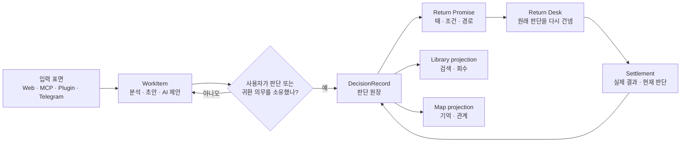

# ARGUS — 판단을 남기는 시스템 통합 설계도

Date: 2026-07-14<br>
Revision: v0.1<br>
Status: **차기 통합 설계 제안(implementation-ready draft)**<br>
Relationship: `docs/ARGUS-BLUEPRINT.md`를 대체하지 않는다. 이 문서는 창업자의
명시적 요청으로 만든, BLUEPRINT §7의 “설계 문서 신설 금지”에 대한 **계획 수립
예외**다. 현재 공정이 끝나고 이 제안이 채택되기 전까지는 BLUEPRINT §8의 대기
항목이다. 채택 뒤에는 이 문서의 Phase를 BLUEPRINT 공정표에 편입한 후에만 제품
코드로 옮긴다.<br>
Foundational dependency: `docs/DESIGN-decision-knowledge-kernel-v0-2026-07-14.md`.
이 문서의 Phase 0–1보다 먼저 그 문서의 K0–K3가 판단 지식 언어·권한·원장·adapter
계약을 검증해야 한다.<br>
Scope: 웹의 판단 생성부터 봉인, 귀환, 정산, 기록, 회고까지와 MCP·Plugin·Telegram
표면의 같은 판단 원장<br>
Out of scope: 이 문서 작성 세션에서의 제품 코드 변경

---

## 0. 이 문서를 쓰는 법

이 문서는 아이디어를 늘어놓은 회의록이 아니다. 이후 구현 세션이 맥락을 다시
추측하지 않아도 되도록, 다음 네 층을 한곳에 고정한 **실행 설계도**다.

1. **정체성:** Argus가 무엇을 위해 존재하고 무엇을 하지 않는가.
2. **제품 구조:** 무엇을 하나의 판단 기록으로 보며, 어떤 상태와 화면으로 읽는가.
3. **공정:** 무엇을 어떤 순서로 바꾸고, 각 단계에서 어디까지 검증해야 다음으로
   넘어가는가.
4. **증거:** “구현했다”가 아니라 “원하는 행동이 실제로 가능해졌다”를 무엇으로
   판정하는가.

문서 안의 판정 표시는 세 가지다.

- **LOCKED:** 기존 정본과 제품 원칙으로 이미 고정된 결정. 구현 중 재논의하지 않는다.
- **PROPOSED:** 이 설계가 제안하는 결정. Phase 0에서 승인하거나 고친 뒤 고정한다.
- **EVIDENCE-GATED:** 취향으로 확정하지 않고 사용 데이터나 여정 검증 뒤 결정한다.

구현 세션은 한 번에 한 Phase의 한 수직 조각만 맡는다. 세션 종료 시 §13의 인수인계
블록을 갱신한다. 앞 Phase의 exit 증거가 없으면 뒤 Phase를 시작하지 않는다.

### 0.1 2026-07-14 현재 위치

- 기존 정본의 웹 **공정 5**에는 아직 미완 exit가 있다. MCP 트랙에도 미완 exit가
  남아 있다.
- 따라서 이 설계의 구현 Phase는 **아직 시작하지 않았다.** 현재 값은
  `proposal / Phase 0 pending`이다.
- 다음 허용 행동은 (a) 기존 공정의 exit를 실제 증거로 닫는 일, 또는 (b) 창업자가
  공정 우선순위를 명시적으로 바꾸고 이 설계를 BLUEPRINT 공정표에 채택하는 일이다.
- 이 문서가 자세하다는 이유로 Phase 1 코드를 미리 짓지 않는다.

### 0.2 빠른 길잡이

| 찾는 것 | 읽을 절 |
|---|---|
| 제품 정체성과 최종 성공 | §1 |
| 현재 문제와 코드 소유자 | §2 |
| 합의한 1–11 전체 | §3 |
| 타입·상태·source adapter | §4 |
| 화면별 책임 | §5 |
| 실패·개인정보·성능·카피 | §6 |
| canonical analytics | §7 |
| Phase 0–7 구현 순서 | §8 |
| E2E·접근성 검증 | §9 |
| 하지 않을 것과 미결정 | §10–11 |
| 최종 준공과 세션 handoff | §12–13 |

---

## 1. 한 문장과 한 약속

### 1.1 제품의 한 문장 — LOCKED

> **Argus는 답을 대신 내리는 도구가 아니라, 사람이 내린 판단과 그 판단이 기대고
> 있던 것을 남기고, 약속한 때 현실과 다시 만나게 하는 시스템이다.**

짧은 제품 언어는 **“판단을 남기는 시스템”**이다. 이 문장은 저장 기능만 뜻하지
않는다. 판단을 남긴다는 것은 다음 다섯 가지가 함께 남는다는 뜻이다.

1. 내가 실제로 내린 판단
2. 당시 중요했던 질문과 전제
3. 무엇이 일어나면 다시 볼지
4. 언제, 어디로, 어떤 방식으로 돌아올지
5. 돌아온 뒤 실제로 일어난 일과 내가 배운 것

### 1.2 제품의 약속 — LOCKED

> **Argus는 사용자의 판단을 빼앗지 않고, 지어내지 않고, 잊지 않고, 약속한 때
> 다시 건넨다.**

이 약속은 기존 정본의 Zero-Judgment Gate와 우정 5조항을 계승한다.

- 사용자 판단은 load-bearing이다. AI가 덮거나 희석하지 않는다.
- 출처와 저자를 숨기지 않는다. 부재를 그럴듯한 값으로 채우지 않는다.
- 사용자를 점수·등급·승패로 평가하지 않는다.
- 정산은 모델의 동의가 아니라 사용자 판단과 현실의 대조다.
- 평평한 결정에 억지 갈림길, 의식, 긴장, 알림을 만들어내지 않는다.
- 연결이 끊겼으면 성공인 척하지 않고 끊겼다고 말한다.

### 1.3 North-star loop — PROPOSED

```text
현실의 고민
  → 판단하기
  → 내가 정한 판단을 봉인
  → 귀환 약속을 확인
  → 약속한 때 원래 판단으로 돌아옴
  → 실제로 일어난 일을 기록
  → 다음 판단에서 필요한 순간에만 과거 기록을 다시 씀
```

첫 방문의 행동 중심은 여전히 **판단하기**다. 제품의 개념적 중심은 **돌아오기**다.
둘을 섞지 않는다. 처음 온 사람에게 빈 기록 보관소를 홈으로 강요하지 않고, 판단을
남긴 사람에게 다시 생성 화면만 보여주지도 않는다.

### 1.4 최종 성공의 정의

아래 문장이 실제 사용자 1명의 실제 판단에서 성립해야 한다.

> “나는 Argus에서 판단을 내렸고, 무엇을 확인할지와 돌아올 방법을 알았으며,
> 나중에 원래 판단을 그대로 다시 보았고, 실제 결과를 내 손으로 남겼다. 어느
> 표면에서 열어도 같은 기록이었다.”

기능 수, 화면 수, 애니메이션 완성도는 이 문장의 대체 지표가 아니다.

---

## 2. 현재 구조에서 지켜야 할 것과 풀어야 할 것

### 2.1 이미 강한 기반 — 유지

- `Project.decision_contract` 안에 봉인·확인일·전제·이력·정산 영수증이 함께 간다.
- `DecisionContract`는 `PrimaryCheckpoint`, `ReturnHandle`, `OpenCheck`,
  `LeanAfter`, `AmbiguityRecord`, `GrowthNote`, provenance를 이미 품고 있다.
- 달력, 이메일, Telegram, 웹 due strip, MCP seal/settle 경로가 존재한다.
- 정산 enum과 정산 계산은 결정론 코드가 소유한다.
- 익명 사용은 localStorage-first이고 로그인 뒤 마이그레이션된다.
- reduced-motion, 키보드 focus, 방어적 데이터 접근, XSS 방어의 선례가 있다.
- `VoyageSea`, Logbook, shared ground는 Argus만의 기억 가능한 시각 언어다.

### 2.2 구조적 마찰 — 해결 대상

1. **기본 단위가 Project로 보인다.** 사용자가 남긴 것은 판단인데 화면은 일을 묶은
   프로젝트를 먼저 요구한다.
2. **생애주기와 은유와 경고가 한 상태처럼 섞인다.** `sealed/due/settled`,
   `docked/sailing/wrecked`, Review와 MCP 상태가 서로 다른 문법을 쓴다.
3. **귀환이 기능은 있지만 장소가 아니다.** due strip, 카드, 지도, 모달, 알림에
   분산되어 “오늘 돌아볼 판단”의 책임 주체가 모호하다.
4. **지도와 목록의 임무가 섞인다.** 지도는 기억과 성찰에 강하지만, 검색·정렬·대량
   관리는 약하다.
5. **봉인 뒤 약속이 설정처럼 보일 수 있다.** 확인일·채널·저장 위치가 하나의
   ‘귀환 영수증’으로 완결되지 않는다.
6. **작업 중인 것과 판단으로 남은 것의 경계가 흐리다.** 초안·AI 제안·봉인된
   판단이 같은 프로젝트 표면에서 경쟁한다.
7. **표면마다 같은 판단의 이름과 상태가 달라질 수 있다.** 웹, MCP, Plugin,
   Telegram의 출처는 달라도 원장은 하나여야 한다.
8. **가치 체감까지 시간이 걸린다.** 실제 결과가 수주 뒤에 오는 제품에서 첫날의
   완결감이 약하면 귀환 루프가 시작되지 않는다.
9. **시각 언어가 화면별로 갈라질 위험이 있다.** 랜딩의 항해·종이 언어와 유틸리티
   카드형 워크스페이스가 한 제품의 문법으로 정리되어야 한다.
10. **접근성·오프라인·실패·대량 데이터가 주요 여정의 계약으로 아직 묶이지 않았다.**
11. **분석 이벤트가 표면별 이름으로 파편화되어 있다.** 어느 단계에서 약속이
    끊겼는지 한 생애주기로 읽기 어렵다.

### 2.3 이번 설계가 추가로 잡는 쟁점

앞의 1–11만 구현하면 화면은 좋아져도 시스템은 다시 갈라질 수 있다. 따라서 다음을
동급의 설계 문제로 취급한다.

- 레거시 데이터의 무손실 투영과 되돌림
- 같은 판단의 중복·충돌·오래된 클라이언트 덮어쓰기 방지
- local-only, sync 실패, 전달 실패의 정직한 표시
- 민감한 판단 원문의 분석 이벤트 유출 금지
- 0·1·10·100·1,000건에서의 정보구조와 성능
- 다국어에서 저장값과 표시 문구의 분리
- feature flag와 route 호환성
- 사용자를 재촉하는 게이미피케이션과 숨은 우선순위 점수의 금지

### 2.4 현재 코드의 소유자 — 구현 전 다시 확인

이 표는 설계 개념을 기존 소유자에 접붙이기 위한 시작점이다. 새 구현은 같은 책임의
두 번째 소유자를 만들기 전에 이 파일들을 다시 읽는다.

| 책임 | 현재 소유자 | 이 설계에서의 처리 |
|---|---|---|
| Project/Contract/Receipt 타입 | `src/stores/types.ts` | Phase 1 adapter의 원본, 즉시 대체 금지 |
| contract 상태·due 계산 | `src/lib/decision-contract.ts` | 공통 lifecycle 엔진에 재사용/수렴 |
| 화면 공통 due 수 | `src/hooks/useDueCount.ts` | shadow comparison의 기준 |
| 귀환 화면 조립 | `src/app/[locale]/project/page.tsx` | Phase 2의 기존 route/호스트 |
| 항해 지도 | `src/components/projects/VoyageSea.tsx` | Phase 5 전까지 유지 |
| 항해 표현 상태 | `src/lib/voyage-state.ts` | 표현 레이어로 격리, 기록 상태로 사용 금지 |
| 봉인과 귀환 영수증 후보 | `src/components/workspace/progressive/SealMoment.tsx` | Phase 3에서 공통 receipt 연결 |
| 정산 쓰기 | `src/components/projects/SettlementModal.tsx` | 새 UI도 기존 action을 먼저 재사용 |
| 분석 이벤트 | `src/lib/analytics.ts`와 각 호출부 | canonical mapper를 추가하고 점진 이관 |

라인 번호는 빠르게 변하므로 문서에 고정하지 않는다. Phase 시작 시 `rg`로 현재
소유자와 소비자를 다시 찾고, 인수인계 블록에 실제 파일을 기록한다.

---

## 3. 1번부터 11번까지 — 제품 결정

### 1. 시작점과 중심: 첫 행동은 판단하기, 제품의 심장은 돌아보기 — PROPOSED

**결정**

- 처음 기능 가치를 만드는 기본 CTA는 `판단하기`다.
- 판단을 하나 이상 봉인한 사용자의 지속 가치 중심은 `돌아보기`다.
- 랜딩의 설명, 봉인 순간, 알림, 재방문 화면은 하나의 귀환 약속으로 연결한다.

**구체 설계**

- 기록 0건: `판단하기`를 첫 CTA로, 과거 실제 판단을 짧게 남기는 보조 경로 제공.
- 봉인 1건·due 없음: 다음 귀환일과 “무엇을 다시 볼지”를 조용히 보여준다.
- due 1건 이상: `돌아보기 > 지금`으로 직접 착지한다.
- 최근 정산 뒤: 배운 한 줄과 다음 판단 시작을 나란히 두되 연속 사용을 강요하지
  않는다.

**금지**

- 모든 사용자에게 빈 귀환 홈을 강제하지 않는다.
- due가 없을 때 긴급함이나 할 일을 만들어내지 않는다.
- “매일 방문”, streak, 연속 정산을 성공으로 정의하지 않는다.

**검증**

- 새 사용자가 30초 안에 첫 행동을 설명할 수 있다.
- 봉인 사용자가 10초 안에 다음 귀환일과 귀환 내용을 찾는다.
- due 사용자가 다른 목록을 헤매지 않고 한 번의 선택으로 정산을 시작한다.

### 2. 상태를 생애주기·주의 신호·은유로 분리 — PROPOSED

**표면 전체의 정본 생애주기**는 오직 다음 다섯 값이다.

| 저장/도메인 값 | 사용자 기본 문구 | 뜻 |
|---|---|---|
| `draft` | 작성 중 | 아직 사용자가 판단 또는 귀환 의무를 소유하지 않음 |
| `sealed` | 기다리는 중 | 사용자 판단과 귀환 약속이 확정됨 |
| `due` | 돌아볼 때 | 귀환 조건이 충족됨. `sealed`에서 파생되는 시간 상태 |
| `settled` | 정산 완료 | 사용자가 실제 결과 또는 현재 판단을 기록함 |
| `archived` | 보관 | 사용자가 활성 표면에서 치웠지만 기록은 유지됨 |

여기서 `draft`는 `WorkItem`의 상태다. `DecisionRecord`는 사용자가 소유한 순간부터
시작하므로 `sealed/due/settled/archived`만 가진다. 한 화면에서 둘을 함께 읽을 때만
다섯 값을 `SurfaceLifecycle`로 합친다. 이 구분으로 “초안도 판단 기록”이 되는 것을
막는다.

`due`는 별도 저장 플래그가 아니라 현재 시각과 `ReturnHandle`에서 파생한다.
`deferred`는 상태가 아니라 “아직”을 선택한 이력 이벤트다. 연기 뒤 기록은 다시
`sealed`, 조건이 오면 `due`다.

**주의 신호**는 생애주기를 덮지 않는 독립 값이다.

```ts
type AttentionSignal =
  | 'premise_changed'
  | 'delivery_failed'
  | 'sync_failed'
  | 'local_only'
  | 'evidence_missing';
```

주의 신호에는 사용자 능력이나 판단을 평가하는 `stale`, `bad`, `failed_decision`,
`low_quality`를 넣지 않는다. `stalled`도 사용하지 않는다. 시스템이 아는 것은
“14일 활동 없음”이지 “사용자가 막혔다”가 아니다.

**항해 은유**는 표현 레이어다. `docked/sailing/beacon/harbor`는 지도에서만 쓰고
필터·API·분석·접근성 이름은 정본 생애주기를 쓴다. 기존 `adrift/wrecked`는 판단
기록 표면의 사용자 상태명으로 승격하지 않는다. 특히 비활동을 “난파”로 부르는
것은 zero-judgment 원칙과 충돌하므로 지도 재설계 시 제거한다.

### 3. 정보구조: 판단하기 · 돌아보기 · 설정 — PROPOSED

**사용자에게 보이는 1차 내비게이션**

```text
판단하기    돌아보기    설정
```

`돌아보기` 내부는 세 책임으로 나눈다.

```text
지금        기록        지도
due/주의     검색/회수    성찰/관계
```

- `판단하기`: 새 판단과 미완 작업의 유일한 집.
- `돌아보기 > 지금`: 지금 사용자의 응답이 필요한 것만.
- `돌아보기 > 기록`: 모든 봉인·정산 기록의 검색과 회수.
- `돌아보기 > 지도`: 기록들의 시간·전제 관계를 기억하게 하는 상징적 투영.
- `설정`: 계정·언어·기본 채널. 개별 판단의 귀환 약속은 설정으로 보내지 않는다.

**호환 전략**

- 초기에는 기존 `/project` route를 유지하고 라벨과 내부 탭만 바꾼다.
- 저장된 링크와 이메일 딥링크가 새 구조에서 같은 기록을 연다.
- route alias는 행동 데이터와 회귀 테스트가 안정된 뒤 추가한다.
- route 제거는 마지막 Phase까지 금지한다.

### 4. Return Desk: ‘지금’의 책임을 좁게 — PROPOSED

Return Desk는 대시보드가 아니다. **지금 돌아볼 이유가 있는 판단을 원래 문맥과
함께 건네는 곳**이다.

**due 카드의 고정 정보 순서**

1. 내가 내린 판단
2. 무엇을 확인하기로 했는지
3. 원래 확인일 또는 귀환 조건
4. 달라진 전제나 전달 실패가 있다면 그 사실
5. 출처와 저장 상태
6. 주 행동 `정산하기`, 보조 행동 `아직`

**필수 화면 상태**

| 상태 | 화면의 책임 | 금지 |
|---|---|---|
| due 1건 | 한 판단에 집중, 바로 정산 | 통계·다른 카드로 분산 |
| due 여러 건 | 오래된 약속 우선, 사용자가 정렬 변경 가능 | 숨은 중요도 점수 |
| due 0건 | 다음 귀환일, 최근 정산 1건, 조용한 종료 | 가짜 할 일 |
| 봉인 1건·아직 due 아님 | 첫 기록 영수증과 다음 귀환 | 빈 지도 취급 |
| 기록 0건 | 판단하기 또는 과거 판단 짧게 남기기 | 빈 대시보드 |
| local-only | 이 기기에서만 돌아올 수 있음을 명시 | 이메일이 갈 것처럼 표시 |
| 전달 실패 | 무엇이 실패했고 웹 기록은 살아 있음을 명시 | 조용한 성공 |
| sync 실패/오프라인 | 로컬에 저장됨, 재시도 상태와 충돌 여부 표시 | 로딩 무한 반복 |
| 전제 변화 | 바뀐 값·출처·시점을 보여주고 사용자가 의미 판단 | “판단이 틀림” 단정 |

**“아직”의 계약**

- 실패나 회피로 기록하지 않는다.
- 이유 입력은 선택 사항이다.
- 새 날짜/사건/신호 중 하나의 가벼운 손잡이를 만든다.
- 최초 귀환일과 연기 이력은 append-only로 보존한다.

### 5. 지도: 관리 도구가 아니라 성찰의 서명 — PROPOSED

지도는 Argus의 **한 가지 signature element**다. 여기서만 시각적 대담함을 쓴다.
목록이 잘하는 검색과 대량 관리를 지도가 흉내 내지 않는다.

**포함**

- 봉인되어 기다리는 판단
- 지금 돌아볼 판단
- 최근 정산한 판단
- 여러 판단이 공유하는 전제 또는 질문

**제외**

- 미봉인 초안
- 일반 생성 결과물
- 사용자가 소유하지 않은 AI 제안
- 숨은 품질/중요도 점수

**동작 원칙**

- 한 판단의 배 위치는 안정적이어야 한다. due가 되었다고 배를 다른 슬롯으로
  순간이동시키지 않는다.
- 귀환 때는 등대의 빛이 해당 배를 비춘다. 사용자의 약속이 돌아온 것이지 배가
  벌을 받거나 구조되는 것이 아니다.
- 전제 변화는 해류·표식의 변화로 보이되 “난파”로 번역하지 않는다.
- 최대 표시 수와 선정 규칙을 UI에 설명한다. 지도 밖 기록도 목록에서 항상 보인다.
- 모바일·스크린리더에는 동일 순서와 관계를 제공하는 텍스트 대체 뷰가 있다.
- 기록 1건은 빈 지도 대신 **첫 항해일지 판**으로 보여준다.
- 지도 위치는 상태 정본이 아니다. 장식 좌표 변경이 기록의 의미를 바꾸지 않는다.

### 6. 판단 기록실: 조밀한 회수 표면 — PROPOSED

기록실은 카드 갤러리가 아니라 시간이 지나도 특정 판단을 찾는 곳이다.

**기본 열/필드**

| 필드 | 기본 노출 | 설명 |
|---|---:|---|
| 판단 | 예 | 사용자가 내린 한 문장 |
| 상태 | 예 | 정본 생애주기 문구 |
| 확인일/결과일 | 예 | 다음 귀환 또는 정산 시점 |
| 결과 | 정산 시 | 실제로 일어난 일의 짧은 표시 |
| 출처 | 예 | web/MCP/plugin/Telegram, 중요도 아님 |
| 묶음 | 선택 | 프로젝트·주제는 선택적 그룹 |

**필터**

- 상태, 날짜 범위, 출처, 프로젝트/주제, 전제
- 기본 정렬은 `due → sealed(가까운 날짜) → 최근 settled`.
- 사용자가 고른 정렬은 보존하되 시스템이 “중요한 판단”을 몰래 정하지 않는다.

**상세 화면의 고정 순서**

1. 내가 정한 것
2. 당시의 진짜 질문
3. 기대고 있던 전제와 확인할 것
4. 귀환 약속
5. 수정·연기·알림·동기화 이력
6. 실제로 일어난 것
7. 내가 남긴 배움
8. AI가 찾아낸 것과 provenance
9. 저장 위치·동기화 상태

결정 상세는 모든 표면이 여는 단일 목적지다. 지도·알림·검색 결과가 서로 다른
요약 객체를 만들지 않는다.

### 7. 귀환 경로는 설정이 아니라 봉인의 일부 — PROPOSED

봉인 완료 순간에 **귀환 영수증(Return Receipt)**을 보여준다.

```text
내가 남긴 판단     [사용자 문장]
다시 볼 때         [2026-08-01 / 이사회 뒤 / 지표가 나오면]
그때 확인할 것     [대표 체크포인트]
돌아오는 길        [웹 + 이메일 / Telegram / 달력]
저장되는 곳        [이 기기만 / 계정에 동기화]
```

채널은 다음 상태를 명시적으로 가진다.

```ts
type ReturnChannelState =
  | 'connected'
  | 'off'
  | 'local_only'
  | 'delivery_failed'
  | 'rescheduled';
```

- 이메일 opt-in, Telegram 연결, `.ics` 내보내기는 하나의 귀환 약속을 표현하는
  서로 다른 운반 수단이다.
- 채널 연결이 안 되어도 웹 기록은 사라지지 않는다.
- 전달 실패는 시스템 실패이며 사용자의 판단 상태를 바꾸지 않는다.
- 채널 문구는 “알림을 켜세요”가 아니라 “이 길로 다시 건네드릴게요”처럼 약속의
  주체와 한계를 정확히 말한다.

### 8. WorkItem과 DecisionRecord의 경계 — PROPOSED

모든 작업을 판단 기록으로 만들지 않는다.

- 분석 중, 초안, 질문, AI 제안은 `WorkItem`이다.
- 사용자가 자신의 판단을 명시적으로 소유했거나, 나중에 확인할 의무를 명시적으로
  받아들인 순간 `DecisionRecord`가 된다.
- 미완 `WorkItem`은 `판단하기 > 이어서 하기`에 있다.
- 봉인된 `DecisionRecord`는 `돌아보기`에 있다.
- 정산된 기록은 `돌아보기 > 기록`에 남는다.

경계 이벤트는 버튼 이름이 아니라 데이터 계약으로 정의한다.

```text
WorkItem
  -- user_owns_judgment OR user_accepts_return_obligation --> DecisionRecord
```

AI가 체크포인트를 자동 제안했다는 이유만으로 판단 기록을 만들 수 없다. 사용자의
소유 행위가 없는 레코드는 지도·기록실·귀환 수에 포함하지 않는다.

### 9. 표면은 여러 개, 원장은 하나 — PROPOSED

웹, MCP, Plugin, Telegram은 서로 다른 제품이 아니라 같은 판단 기록의 입구다.

- 출처는 badge와 provenance이지 별도 생애주기가 아니다.
- 어느 표면에서 정산해도 같은 `record_id`에 append된다.
- stale client가 정산된 기록을 sealed로 되돌리지 못한다.
- 중복 전송은 idempotency key로 한 번만 반영한다.
- 표면이 표현하지 못하는 필드는 지어내지 않고 `unfilled`로 남긴다.
- 원장 충돌 시 자동으로 한쪽을 덮지 않는다. 양쪽 원문과 시각을 보존하고 사용자에게
  합칠 선택을 준다.

### 10. 첫 가치까지의 시간을 두 경로로 줄임 — PROPOSED

**경로 A — 지금의 실제 판단**

현재 고민을 판단하고 봉인한다. 첫날의 보상은 정답이 아니라 명료한 판단 문장과
구체적인 귀환 영수증이다.

**경로 B — 과거의 실제 판단**

결과를 이미 아는 사용자의 실제 과거 판단을 2–3분 안에 기록하고 정산한다. 이것은
귀환 루프의 촉감을 보여주는 연습 기록이며, 미래 예측의 적중률이나 자차표를
부풀리지 않는다(`origin: retro` 격리 유지).

**금지**

- 제품이 만든 가상 데모를 사용자의 기록으로 저장하지 않는다.
- 회고 기록을 미래 판단의 정확도 통계에 섞지 않는다.
- 결과가 빨리 나오는 사소한 결정을 억지로 만들라고 권하지 않는다.

### 11. provenance·시각 문법·접근성을 하나의 신뢰 시스템으로 — PROPOSED

모든 화면은 네 문장을 같은 언어와 형태로 구분한다.

1. **내가 정한 것**
2. **AI가 찾아낸 것**
3. **아직 확인하지 않은 것**
4. **실제로 일어난 것**

**시각 문법**

- 종이·잉크: 오래 남는 기록과 원문
- 금색: 사용자의 약속 또는 한 화면의 단 하나 주 행동
- monospace: 날짜, 출처, 증거, 시스템 상태
- serif: 중요한 질문과 사용자의 판단 문장
- sans-serif: 조작, 설명, 표, 설정
- motion: 봉인, 귀환, 정산처럼 의미 있는 상태 변화에만 사용
- 색만으로 저자·상태·결과를 구분하지 않음

랜딩, 판단하기, 돌아보기, 설정이 서로 다른 테마가 아니라 이 문법의 밀도 차이로
보이게 한다. 지도에 시각적 개성을 집중하고 기록실과 설정은 조용하게 둔다.

**접근성 계약**

- 키보드만으로 봉인→귀환→정산 완주
- 의미 있는 모든 상태에 텍스트 이름 제공
- 200% 확대에서 정보나 행동 손실 없음
- screen reader에서 시각 순서와 읽기 순서 일치
- 색각 차이와 고대비에서 provenance 구분 유지
- `prefers-reduced-motion`에서 움직임 제거 뒤에도 변화가 이해됨
- 모바일 한 손으로 `정산하기`와 `아직` 완료

---

## 4. 시스템 구조

### 4.1 개념 구조



### 4.2 첫 구현의 핵심: 새 테이블보다 통합 읽기 모델 — PROPOSED

초기에 `DecisionRecord` 테이블을 신설하지 않는다. 기존 데이터를 읽어 하나의
안정된 화면 모델로 투영한다. 이 어댑터는 데이터 손실과 대규모 마이그레이션 없이
새 정보구조를 검증하게 한다.

```ts
type WorkLifecycle = 'draft';
type DecisionLifecycle = 'sealed' | 'due' | 'settled' | 'archived';
type SurfaceLifecycle = WorkLifecycle | DecisionLifecycle;
type DecisionSurface = 'web' | 'mcp' | 'plugin' | 'telegram';
type RecordKind = 'current' | 'retrospective';
type Authorship = 'user' | 'ai_surfaced' | 'system_derived';

interface DecisionRecordView {
  // identity
  record_id: string;
  aliases: string[];
  title: string;
  group?: { kind: 'project' | 'topic'; id: string; label: string };
  origin: DecisionSurface;
  record_kind: RecordKind;
  source_refs: Array<{ store: string; id: string; version?: string }>;

  // the user's load-bearing record
  human_judgment?: string;
  real_question?: string;
  ownership: 'owned';

  // truth and provenance
  premises: Array<{
    id: string;
    text: string;
    authorship: Authorship;
    verification: 'verified' | 'unverified' | 'changed' | 'unknown';
    source?: string;
  }>;

  // return contract
  return_promise?: {
    handle: ReturnHandle;
    check_prompt: string;
    channels: Array<{
      kind: 'web' | 'email' | 'telegram' | 'calendar';
      state: ReturnChannelState;
    }>;
    first_promised_at: string;
    current_due_at?: string;
  };

  // state is derived by one shared engine
  lifecycle: DecisionLifecycle;
  attention: AttentionSignal[];

  // append-only story
  history: Array<{
    event_id: string;
    type: string;
    at: string;
    actor: 'user' | 'system';
    surface: DecisionSurface;
    payload_ref?: string;
  }>;

  settlement?: {
    outcome: 'happened' | 'avoided' | 'partial' | 'unknown' | 'missed';
    what_happened?: string;
    learning?: string;
    settled_at: string;
  };

  persistence: {
    mode: 'local_only' | 'account_synced' | 'sync_pending' | 'sync_failed';
    last_synced_at?: string;
  };
}
```

`DecisionRecordView`는 초기에는 **읽기 전용 projection**이다. 원본 저장을 바꾸지
않는다. 쓰기는 현재의 `DecisionContract`, review receipt, MCP/plugin ledger가
계속 소유한다. projection이 안정되고 쓰기 계약을 충분히 검증한 뒤에만 정본
저장 모델 통합을 별도 결정한다.

### 4.3 기록 정체성 해석 계약

“표면은 여러 개, 원장은 하나”를 카피가 아니라 id 규칙으로 강제한다.

1. 기존 bridge/import가 보존한 명시적 ledger/contract/account id가 있으면 그것이
   연결의 유일한 근거다.
2. 계정 row id를 안정된 `record_id`로 삼고, 로컬 ledger id·project contract id는
   `aliases/source_refs`에 보존한다. local-only는 충돌 없는 namespace id를 쓴다.
3. 제목·판단 문장·시간이 비슷하다는 이유로 자동 병합하지 않는다. fuzzy merge는
   타인의 판단 또는 서로 다른 판단을 한 기록으로 만드는 더 큰 오류다.
4. 명시적 연결 근거가 없으면 두 기록으로 정직하게 보여주고, 필요한 경우에만
   사용자가 원문을 대조한 뒤 연결한다.
5. sync/write의 idempotency key는 `source + device namespace + event_id`에서 만든다.
6. 한 번 외부 링크로 공개된 `record_id`는 바꾸지 않는다. 저장 모델 통합 뒤에도
   alias resolver가 과거 id와 deep link를 계속 받는다.

Phase 1의 adapter 테스트는 같은 판단의 mirror가 1개 view가 되는 경우와, 비슷한
문장의 독립 판단 2개가 합쳐지지 않는 경우를 함께 가져야 한다.

### 4.4 원본별 투영 계약

| 원본 | record_id | owned 판정 | 상태 근거 | 손실 금지 |
|---|---|---|---|---|
| `Project.decision_contract` | contract id | `human_judgment` 또는 closing seal | contractStatus/checkpoint | predicates, history, receipt, provenance |
| Review receipt | receipt/ledger id | 사용자가 follow-up을 seal | derived review status | falsifiable follow-ups, authorship |
| MCP/plugin ledger | ledger id namespace | seal event | folded ledger state | device namespace, append-only events |
| `origin: retro` | contract id | 회고 봉인 | settled 가능 | `record_kind: retrospective`로 격리 |

투영 중 모르는 값은 합리적으로 채우지 않는다. `undefined + provenance`가 가짜
`medium`, `0`, 임의 프로젝트명보다 낫다.

### 4.5 상태 계산 계약

정본 상태 엔진은 모든 표면이 공유한다.

```text
not owned ------------------------------> draft
owned + sealed + return not due --------> sealed
sealed + return condition satisfied ----> due
due + user defers ----------------------> sealed + deferred event
sealed/due + user records settlement ---> settled
settled + new explicit return promise ---> sealed + settlement retained
any active + user archives -------------> archived
archived + user restores ---------------> prior derived lifecycle
```

불변식:

1. AI 행동만으로 `draft → sealed`가 되지 않는다.
2. 시간 경과만으로 `settled`가 되지 않는다.
3. `아직`은 `settled_at`을 찍지 않는다.
4. 정산 이후 stale sync가 상태를 되돌리지 않는다.
5. attention signal은 lifecycle을 바꾸지 않는다.
6. retro 기록은 정상 기록 수와 calibration 집계에 섞이지 않는다.
7. 모든 상태 계산은 locale-independent하고 표시 문구만 번역한다.

### 4.6 append-only 사건 어휘

최소 공통 사건은 다음으로 고정한다.

```text
work_started
judgment_owned
decision_sealed
return_path_confirmed
return_due
return_seen
decision_deferred
premise_changed
delivery_failed
sync_failed
sync_recovered
settlement_started
settlement_completed
decision_reopened
decision_archived
```

기존 데이터가 전부 event ledger가 아니어도 projection이 가상 사건을 만들 수 있다.
단, 가상 사건에는 `system_derived` provenance를 붙이고 실제 사용자가 한 사건처럼
기록하지 않는다.

---

## 5. 화면 설계

### 5.1 전체 여정

```text
[판단하기]
새 판단 / 이어서 하기
      │ 사용자 소유
      ▼
[봉인 + 귀환 영수증]
      │ 기다림
      ▼
[돌아보기 · 지금]
원래 판단 + 확인 약속
      │ 정산 / 아직
      ▼
[판단 상세]
원문 + 이력 + 실제 결과 + 배움
      ├── [기록] 검색·회수
      └── [지도] 시간·공유 전제 성찰
```

### 5.2 판단하기

상단에는 한 가지 질문만 둔다: `지금 어떤 판단을 남기고 싶나요?`

- Primary: 새 판단 시작
- Secondary: 이어서 할 미완 작업
- Tertiary: 과거 실제 판단으로 짧은 귀환 연습

미완 작업 카드에는 생성 단계와 마지막 활동만 보여준다. “표류/난파” 같은 평가성
문구는 쓰지 않는다. 지우기·보관은 overflow action에 둔다.

### 5.3 돌아보기 · 지금

```text
돌아볼 때                                              2026.07.14

┌ 내가 남긴 판단 ─────────────────────────────────────────────┐
│ “8월 전에는 가격을 올리지 않는다.”                         │
│                                                            │
│ 확인하기로 한 것  신규 전환율이 3.2%를 넘는가              │
│ 원래 약속           7월 14일 · 이메일 전달됨                │
│ AI가 찾아낸 전제    가격 저항이 낮다는 가정 · 아직 미확인   │
│                                                            │
│ [정산하기]                                      [아직]      │
└────────────────────────────────────────────────────────────┘

다음 귀환  7월 21일 · 1건
```

여러 건이면 카드 높이를 줄이고 판단 문장·날짜·주의 신호만 먼저 보인다. 기본 정렬은
가장 오래 due인 약속부터다. 이것은 중요도 순위가 아니라 **먼저 한 약속 순서**다.

### 5.4 돌아보기 · 기록

Desktop은 table/list, mobile은 같은 정보 순서의 compact row를 쓴다. 필터 영역은
접을 수 있고 결과 수를 즉시 보여준다. 검색은 판단 원문, 실제 결과, 프로젝트/주제,
전제 텍스트를 대상으로 한다.

0건에서는 필터 해제와 판단하기로 돌아가는 두 행동만 제공한다. 검색 결과가 없다고
기록이 없다고 말하지 않는다.

### 5.5 돌아보기 · 지도

지도는 한 화면에 다음 세 층만 그린다.

1. 시간: 항구에서 멀어지는 것이 아니라 봉인→귀환→정산의 시간 위치
2. 귀환: 등대 빛으로 지금 돌아볼 기록 강조
3. 관계: 공유 전제를 얇은 해류/항로로 연결

hover 전용 정보는 금지한다. focus/click/tap으로 동일 정보가 열린다. 애니메이션은
첫 진입 장식이 아니라 상태 변화 때 한 번만 실행한다.

### 5.6 판단 상세와 정산

정산은 한 화면, 기본 30초 완결 계약을 유지한다.

1. 원래 판단과 체크포인트를 먼저 보여준다.
2. 실제 결과 선택: 대체로 일어남 / 피함 / 일부 / 빗나감 / 아직 모름.
3. 실제로 일어난 일 한 줄은 권장하지만 강제하지 않는다.
4. AI는 초안을 제안할 수 있으나 최종 탭과 저장은 사용자만 한다.
5. 저장 직후 완성 영수증을 보여주고 원래 판단과 결과를 나란히 둔다.

`아직 모름`은 정산으로 닫지 않고 더 가벼운 귀환 손잡이를 만든다. verdict 저장값과
표시 문구의 기존 결정적 매핑을 유지한다.

---

## 6. 신뢰·회복력·규모의 설계

### 6.1 오프라인과 동기화

- 모든 쓰기는 먼저 로컬 성공/실패를 명확히 판정한다.
- 계정 sync는 비동기이며 pending/failed/recovered를 화면에 표시한다.
- 이중 클릭·재전송은 idempotency key로 중복 정산을 만들지 않는다.
- 충돌은 `last-write-wins`로 사용자 원문을 버리지 않는다.
- 오래된 클라이언트가 newer terminal state를 되돌리는 것을 계약 테스트로 막는다.
- 익명→로그인 마이그레이션 뒤 원본과 대상 row 수, id, history를 대조한다.

### 6.2 개인정보와 저장 문구

- 판단 원문, 전제 원문, 결과 메모는 analytics property에 보내지 않는다.
- analytics에는 id의 비가역/비민감 참조, 상태, 표면, duration, count만 보낸다.
- local-only와 account-synced를 봉인 영수증 및 상세에 표시한다.
- export/delete 대상 테이블 목록에 새 저장소가 들어가기 전에는 새 정본 테이블을
  만들지 않는다.
- 이메일·Telegram payload에는 사용자가 동의한 최소 내용만 넣고, 잠금화면 노출을
  고려한 짧은 제목을 쓴다.

### 6.3 성능과 대량 기록

| 규모 | 필수 동작 |
|---:|---|
| 0 | 빈 상태가 즉시 렌더되고 행동이 명확함 |
| 1 | 첫 기록 판과 다음 귀환이 온전히 보임 |
| 10 | 지도와 목록이 모두 전체 의미를 유지 |
| 100 | 필터/검색 즉시, 지도는 선정 규칙 표시 |
| 1,000 | 목록 virtualization/pagination, projection 증분 계산 |

지도는 모든 배를 억지로 표시하지 않는다. 기본 viewport의 capacity를 명시하고,
선정 밖 기록 수와 기록실 링크를 제공한다. 목록이 완전한 원장 투영이다.

### 6.4 다국어와 카피

- enum, event, 상태 계산에는 한국어를 저장하지 않는다.
- 모든 사용자 문구는 locale renderer를 통한다.
- 출처 없는 자동 번역 문자열을 receipt에 영구 저장하지 않는다.
- 핵심 명사 한 벌을 glossary test로 잠근다.

| 개념 | 한국어 기본 문구 | 피할 문구 |
|---|---|---|
| create | 판단하기 | 프로젝트 생성 |
| return | 돌아보기 | 관리, 대시보드 |
| due | 돌아볼 때 | 연체, 위험 |
| seal | 판단을 남김/봉인 | AI 확정 |
| settle | 정산 | 채점, 평가 |
| record | 판단 기록 | 적중 기록 |
| premise drift | 전제가 달라짐 | 판단 오류 |

---

## 7. 계측 — 기능 사용량보다 약속의 연결을 본다

### 7.1 공통 사건명

기존 표면별 이벤트를 즉시 삭제하지 않고, 다음 canonical event로 매핑한다.

```text
decision_record_created
decision_sealed
return_path_confirmed
decision_due_seen
settlement_started
settlement_completed
decision_deferred
decision_reopened
record_retrieved
sync_failed
sync_recovered
```

필수 속성은 `surface`, `origin`, `lifecycle_before/after`, `persistence_mode`,
`is_retro`, `duration_bucket` 정도다. 판단 텍스트와 결과 메모는 금지한다.

### 7.2 핵심 지표

| 지표 | 질문 | 경계 |
|---|---|---|
| ownership rate | 작업이 실제 사용자 판단으로 이어졌나 | AI 자동 생성 제외 |
| seal rate | 소유된 판단이 귀환 약속까지 갔나 | retro 별도 |
| return-path clarity | 채널/저장 상태를 확인했나 | 채널 활성 수로 성공 판단 금지 |
| due seen rate | 약속 창 안에 원래 판단을 다시 보았나 | 알림 발송률과 구분 |
| settle completion | 시작한 정산을 사용자 손으로 끝냈나 | `아직`은 실패 아님 |
| cross-surface continuity | 다른 표면에서도 같은 id로 이어졌나 | 중복 row 0 |
| retrieval success | 검색 후 원하는 기록을 열었나 | 검색어 수집 금지 |
| post-settle reuse | 다음 판단에서 과거 기록이 필요한 때 쓰였나 | 자동 주입/과잉 일반화 금지 |

### 7.3 해석 금지

- 정산 횟수를 사용자 성실성으로 해석하지 않는다.
- outcome 분포를 판단력 점수로 만들지 않는다.
- due가 오래됐다는 이유로 판단 중요도를 높이지 않는다.
- 사용 빈도를 제품 신뢰의 단독 대리변수로 쓰지 않는다.

---

## 8. 구현 공정

### 공정 운영 원칙

각 Phase는 `Entry → Build → Validate → Exit → Rollback`을 가진다. **Exit 증거가
없으면 완료가 아니다.** UI snapshot만 통과하고 실제 저장이 끊겼거나, unit test만
통과하고 사용자가 길을 못 찾는 경우를 완료로 올려 적지 않는다.

각 Phase의 검증은 다섯 층을 가능한 범위까지 통과한다.

```text
L0 정적/단위       타입, 상태 계산, 카피 금지어
L1 소비 계약       생성된 데이터가 다음 표면에서 실제 소비됨
L2 여정            실제 사용자 흐름 E2E
L3 지각/접근성      light/dark/mobile/keyboard/screen reader/reduced motion
L4 현실 접촉       실제 저장 행·실제 채널·외부 사용자 행동
```

### Phase 0 · 설계 봉인과 기준선 (S)

**목표:** 구현 전에 애매한 단어와 성공 조건을 없앤다.

**Entry**

- 현재 BLUEPRINT 공정 5와 MCP M-track의 남은 exit 상태를 확인한다.
- 이 제안이 차기 공정으로 채택되었는지 창업자 판정을 기록한다.
- Decision Knowledge Kernel의 K0–K3 exit가 통과했거나, 이 Phase를 UI projection
  설계에만 제한한다는 명시적 예외가 기록되어 있다.

**Build**

- §1–§4의 LOCKED/PROPOSED 판정을 승인 또는 수정한다.
- 사용자 어휘, 생애주기, WorkItem 경계, route 호환 방침을 ADR로 봉인한다.
- 현재 `/project`의 0/1/due/many/local-only 상태 기준 screenshot을 남긴다.
- 현재 이벤트와 저장 소스의 매핑표를 코드 위치까지 확정한다.
- feature flag `judgment_record_ia_v1`의 owner와 기본값을 정한다.

**Validate / Exit**

- [ ] 한 enum에 한 사용자 문구라는 glossary가 ko/en 모두 승인됨
- [ ] 기존 저장 소스별 fixture와 현재 row 수 기준선이 있음
- [ ] 핵심 여정 8종의 before screenshot/trace가 있음
- [ ] route·deep link·analytics·export/delete 영향표가 있음
- [ ] 미결 질문에 owner와 evidence deadline이 있음

**Rollback:** 문서/fixture만 추가하므로 제품 rollback 없음. 합의되지 않은 항목은
다음 Phase로 넘기지 않는다.

### Phase 1 · 통합 읽기 모델과 상태 엔진 (M)

**목표:** 보이는 UI를 바꾸기 전에 모든 표면을 같은 판단 언어로 읽는다.

**Entry:** Phase 0 전 exit 통과.

**Build**

- `DecisionRecordView`와 source adapter를 순수 함수로 구현한다.
- lifecycle과 attention signal을 한 상태 엔진에서 파생한다.
- 기존 due count가 새 projection과 같은 수를 내는 shadow comparison을 넣는다.
- canonical analytics event mapper를 추가하되 기존 이벤트를 유지한다.
- 잘못되거나 오래된 데이터의 defensive fixtures를 만든다.

**Validate / Exit**

- [ ] Project contract, Review receipt, MCP/plugin, retro fixture가 무손실 투영됨
- [ ] draft가 owned decision 수·지도·기록실에 들어가지 않음
- [ ] header, cron, existing due strip, projection의 due count가 완전히 같음
- [ ] `아직`은 settle 수를 늘리지 않고 최초/변경 귀환일을 보존함
- [ ] settled 기록에 stale push를 넣어도 settled 유지
- [ ] 0/1/10/100/1,000 fixture의 projection 시간 예산 통과
- [ ] 사용자 원문이 analytics payload에 없음

**Rollback:** UI는 기존 selector를 계속 사용한다. shadow mismatch 시 flag를 끄고
adapter만 조사한다. 원본 write path는 건드리지 않는다.

### Phase 2 · Return Desk를 기존 `/project` 위에 얹기 (M)

**목표:** 지금 돌아볼 판단의 책임 표면을 만든다.

**Entry:** shadow mismatch 0, 상태 엔진 exit 통과.

**Build**

- `/project` 상단에 flag-gated `지금` 영역을 추가한다.
- due 1/many/none, 0/1 record, local-only, delivery/sync failure, premise changed를
  모두 구현한다.
- 기존 SettlementModal과 상세를 재사용해 수직 여정을 먼저 잇는다.
- due card의 정보 순서와 `정산하기/아직` 행동을 고정한다.
- 기존 지도·목록은 아래에서 그대로 유지한다.

**Validate / Exit**

- [ ] 필수 상태 9종 component/visual fixture
- [ ] 이메일·Telegram deep link가 해당 판단을 Return Desk에서 바로 엶
- [ ] due 1건에서 키보드 1개 primary action으로 정산 시작
- [ ] `아직` 뒤 새 귀환 약속과 append-only history가 즉시 보임
- [ ] local-only가 발송 약속을 하지 않음
- [ ] light/dark, 360/768/1440px, reduced motion snapshot
- [ ] screen reader 이름에 판단·상태·확인일·행동이 포함됨

**Rollback:** flag off 시 기존 `/project`가 그대로 보인다. 새 컴포넌트는 원본을
직접 쓰지 않고 기존 action을 호출한다.

### Phase 3 · 귀환 영수증과 정산 수직 여정 완성 (M)

**목표:** 봉인 때 한 약속이 귀환과 정산까지 같은 문장·id로 이어진다.

**Entry:** Return Desk 기능/접근성 exit 통과.

**Build**

- SealMoment 직후 귀환 영수증을 공통 컴포넌트로 만든다.
- email/Telegram/calendar/web 채널 상태를 공통 모델로 렌더한다.
- 정산 완료 영수증에 원래 판단과 실제 결과를 나란히 둔다.
- web seal→email/Telegram→deep link→settle의 id 연속성을 계약 테스트로 묶는다.
- 전달 실패와 sync 회복 표면을 연결한다.

**Validate / Exit**

- [ ] 봉인 뒤 10초 안에 “언제/무엇/어디로/어디에 저장”을 찾는 사용성 검사
- [ ] 실제 이메일 1건과 Telegram 1건이 같은 record id로 정산 화면 착지
- [ ] 채널 실패 중에도 웹 정산 가능, 실패가 사용자에게 보임
- [ ] double submit/retry가 정산을 한 번만 append
- [ ] web에서 정산 후 MCP/plugin stale sync가 상태를 되돌리지 않음
- [ ] 사용자만 최종 정산을 확정하고 AI verdict 필드가 생기지 않음

**Rollback:** 공통 영수증만 flag off. 기존 채널 발송과 정산 모달은 유지한다.

### Phase 4 · 판단 기록실 (M)

**목표:** 시간이 지나고 기록이 많아져도 원하는 판단을 찾고 맥락을 복원한다.

**Entry:** 공통 상세 목적지와 record id 연속성 통과.

**Build**

- `기록` list/table, 검색, 필터, 정렬, pagination/virtualization을 구현한다.
- 판단 상세의 §3.6 정보 순서를 공통화한다.
- route deep link는 legacy와 새 상세 모두 같은 record를 연다.
- 빈 검색과 빈 기록 상태를 분리한다.

**Validate / Exit**

- [ ] 100·1,000건에서 성능 예산 및 키보드 탐색 통과
- [ ] 상태/출처/날짜/전제 필터 조합의 결정론 테스트
- [ ] legacy 링크 100% 새 상세 착지
- [ ] source adapter의 모든 필드가 상세에서 provenance와 함께 회수 가능
- [ ] 검색어·판단 원문이 analytics로 나가지 않음
- [ ] 모바일에서 표 정보 손실 없이 compact row로 전환

**Rollback:** 기록 탭 flag off, 기존 roster/logbook 유지. route redirect는 제거 가능하게
alias로만 둔다.

### Phase 5 · 지도 재설계 (M/L)

**목표:** 지도를 판단 기록 시스템의 signature reflection으로 정착시킨다.

**Entry:** 기록실이 완전한 회수 표면으로 먼저 존재함.

**Build**

- 지도 입력을 `DecisionRecordView` projection으로 교체한다.
- 배 위치 안정성, 등대 강조, 공유 전제 연결, capacity 설명을 구현한다.
- 0/1/many 상태와 모바일 텍스트 대체를 구현한다.
- `adrift/wrecked` 사용자 상태 문구와 비활동 위험색을 제거한다.
- 모션 토큰과 reduced-motion 대체를 만든다.

**Validate / Exit**

- [ ] due 전후 같은 기록의 위치가 안정적이고 등대 강조만 바뀜
- [ ] 지도에서 누락된 기록이 기록실에는 항상 존재하며 수가 설명됨
- [ ] 1건이 첫 항해일지 판으로 읽힘
- [ ] screen reader/text view가 같은 기록·순서·관계를 전달
- [ ] 100/1,000건에서 capacity와 성능 예산 통과
- [ ] 색 제거·reduced motion에서도 상태 변화 이해 가능
- [ ] 사용자 5명이 지도를 “업무 현황판”보다 “내 판단의 시간/관계”로 설명

**Rollback:** 새 지도 flag off, 기존 VoyageSea 또는 기록 탭으로 fallback. 지도는
write를 소유하지 않으므로 데이터 rollback 없음.

### Phase 6 · 내비게이션과 첫 가치 경로 전환 (M)

**목표:** 검증된 내부 구조를 제품의 겉 구조로 승격한다.

**Entry:** 지금/기록/지도 세 표면과 핵심 deep link가 안정됨.

**Build**

- header 라벨을 `판단하기 · 돌아보기 · 설정`으로 바꾼다.
- `/project`는 유지하고 내부 탭 URL 또는 query를 안정화한다.
- 기록 0건/1건/due/최근 정산별 기본 착지를 정한다.
- 과거 실제 판단 quick loop를 onboarding 선택지로 연결한다.
- 랜딩과 봉인 카피를 “판단을 남기고 다시 만난다”로 통일한다.

**Validate / Exit**

- [ ] 신규 5명이 `판단하기`, 봉인 사용자 5명이 `돌아보기` 목적을 설명
- [ ] 기존 북마크·이메일·Telegram·MCP settle path 100% 작동
- [ ] 실제 현재 판단과 retro 판단이 집계에서 완전히 분리
- [ ] nav 변경 전후 seal/return/settle funnel 악화 없음
- [ ] 언어 전환 뒤 route/state 유지
- [ ] 모바일 한 손 핵심 여정 완주

**Rollback:** 라벨과 기본 착지만 되돌린다. 새 내부 구조와 데이터는 손상되지 않는다.

### Phase 7 · 정본 통합과 구세대 철거 (S/M)

**목표:** 증거가 쌓인 뒤에만 중복 구조를 제거하고 새 운영 정본을 만든다.

**Entry:** 최소 한 코호트가 seal→return→settle을 외부 개입 없이 완주하고, 모든
Phase exit 증거가 저장됨.

**Build**

- 새 Phase와 상태/어휘를 `ARGUS-BLUEPRINT.md` 정본 공정으로 편입한다.
- 기존 due selector, 중복 상태 renderer, 사용되지 않는 roster/map 코드를 grep→
  참조 테스트→삭제 순서로 정리한다.
- source adapter를 계속 둘지, 실제 `DecisionRecord` 저장 모델로 통합할지 현실
  데이터로 결정한다.
- route alias 제거 여부는 traffic과 외부 링크 데이터를 보고 결정한다.
- 운영 runbook, export/delete coverage, schema drift test를 갱신한다.

**Validate / Exit**

- [ ] 외부 사용자 1명 이상이 전 여정 완주, 실제 저장 행 대조
- [ ] legacy fixture 100% 보존 또는 명시적 migration report
- [ ] old/new funnel과 due count 숫자 단위 일치
- [ ] dead code 참조 0, schema/export/delete coverage 초록
- [ ] feature flag 없이도 rollback 가능한 release tag와 DB 계획 존재
- [ ] 정본 문서가 다시 하나이며 이 제안서의 상태가 `adopted` 또는 `rejected`로 봉인

**Rollback:** 구세대 삭제는 별도 커밋/PR로 하고 release tag를 남긴다. 데이터 정본
통합이 필요하면 dry-run report와 역마이그레이션 없이는 실행하지 않는다.

---

## 9. 전 여정 검증 매트릭스

다음 시나리오는 Phase별 토막 테스트가 아니라 최종 준공 때 모두 다시 돈다.

| # | 사용자/상태 | 시작 | 기대 끝 | 핵심 실패 신호 |
|---:|---|---|---|---|
| 1 | 익명·기록 0 | 판단하기 | local-only 귀환 영수증 | 이메일 약속을 함 |
| 2 | 익명→로그인 | 봉인 후 로그인 | 같은 id/history 동기화 | 중복·원문 손실 |
| 3 | 계정·due 1 | 이메일 링크 | 해당 기록 정산 | 다른 프로젝트 착지 |
| 4 | 계정·due many | 돌아보기 | 원하는 순서로 한 건 정산 | 숨은 중요도 순위 |
| 5 | 아직 모름 | due 카드 | 새 손잡이 + 이력 | settled로 닫힘 |
| 6 | 전제 변화 | 알림/지금 | 대조 후 사용자 선택 | 시스템이 오류 단정 |
| 7 | 전달 실패 | 귀환일 | 웹 기록 + 실패 표면 | 성공처럼 보임 |
| 8 | 오프라인 | 정산 | 로컬 저장 + sync 회복 | 중복 정산 |
| 9 | MCP seal→web settle | MCP | 같은 ledger 정산 | 별도 receipt 생성 |
| 10 | web settle→stale plugin | web | settled 유지 | sealed로 회귀 |
| 11 | retro quick loop | onboarding | 완결 경험 | 자차표 집계 오염 |
| 12 | 1,000 records | 기록 검색 | 목표 기록 회수 | UI freeze/누락 |
| 13 | keyboard/screen reader | 봉인 | 정산 완료 | focus/이름 손실 |
| 14 | reduced motion/색 제거 | 지도 | 상태·관계 이해 | 모션/색만 의미 전달 |

### 품질 예산

- Return Desk 핵심 내용: 중간급 모바일에서 usable content가 빠르게 나타나고 skeleton
  이후 레이아웃 점프가 없어야 한다. 구체 ms 예산은 Phase 0 측정 뒤 고정한다.
- primary action: 한 화면에 하나.
- 정산: 기본 선택 경로 30초 이내.
- due deep link: 인증이 살아 있으면 1 click로 해당 판단, 정산 완료까지 최대 4 taps.
- projection: 1,000 fixture에서 main thread 장시간 block 금지. 수치는 Phase 0의
  현 기기 기준선 대비 회귀율로 고정한다.
- WCAG: 자동 axe 0 serious/critical + 수동 키보드/스크린리더 여정. 자동 검사만으로
  완료 처리하지 않는다.

---

## 10. 하지 않는 것

- 한 번에 새 스키마, 새 route, 새 화면, 새 내비게이션을 모두 교체하지 않는다.
- 모든 WorkItem을 판단 기록으로 강제하지 않는다.
- Project를 먼저 삭제하지 않는다. 선택적 묶음으로 강등 가능성을 검증한다.
- 모든 저장 백엔드를 초기 Phase에서 합치지 않는다.
- 지도를 KPI·분석 대시보드나 task board로 만들지 않는다.
- 배 수, 연속 방문, 정산 streak, 적중률로 게이미피케이션하지 않는다.
- 사용자가 보지 못하는 품질·긴급·중요도 점수로 정렬하지 않는다.
- due가 없을 때 알림이나 할 일을 제조하지 않는다.
- 화면 전체를 같은 Phase에서 시각적으로 갈아엎지 않는다.
- 현 이메일·달력·Telegram의 약속이 명확해지기 전에 새 채널을 추가하지 않는다.
- 기존 데이터가 새 모델에 맞지 않는다고 버리거나 가짜 필드를 채우지 않는다.

---

## 11. 아직 증거로 결정할 것

다음은 구현자가 임의로 정하지 않는다.

| 질문 | 현재 기본안 | 필요한 증거 | 결정 시점 |
|---|---|---|---|
| 기존 `/project`의 최종 URL 이름 | route 유지 | 외부 링크/직접 방문 traffic | Phase 6 이후 |
| Project를 사용자 개념에서 완전히 숨길지 | 선택적 묶음으로 유지 | 기록 20+ 사용자 회수 방식 | Phase 4 이후 |
| 지도 기본 capacity | art-directed 제한 | 1/10/100 시각·성능 실험 | Phase 5 |
| due many 기본 정렬 | 가장 오래된 약속 | 사용성 + 약속 공정성 | Phase 2 |
| 첫 착지 개인화 | 0/due/최근 정산만 | 코호트 funnel | Phase 6 |
| 통합 정본 테이블 신설 | 하지 않음 | adapter 복잡도·충돌률·쿼리 비용 | Phase 7 |
| “봉인”을 nav급 사용자 어휘로 유지할지 | 순간 의식에서만 사용 | 한국어/영어 이해도 | Phase 0/6 |

어떤 실험도 판단 원문을 수집하지 않는다. 사용성 연구 기록은 동의와 비식별 원칙을
따른다.

---

## 12. 최종 준공 판정

### 기능적 판정

- [ ] 실제 판단이 WorkItem에서 DecisionRecord로 바뀌는 순간이 명시적이다.
- [ ] 봉인 영수증에서 때·조건·경로·저장 위치가 보인다.
- [ ] 약속한 때 원래 판단이 Return Desk에 나타난다.
- [ ] `정산하기`와 `아직`이 서로 다른 올바른 이력을 만든다.
- [ ] 정산 뒤 원래 판단, 실제 결과, 배움이 한 상세에 남는다.
- [ ] 기록실과 지도는 같은 record set의 서로 다른 projection이다.
- [ ] 웹/MCP/Plugin/Telegram이 같은 id와 terminal state를 공유한다.

### 원칙 판정

- [ ] AI가 사용자 대신 판단·봉인·정산하지 않는다.
- [ ] 부재·실패·local-only를 정직하게 표시한다.
- [ ] 사용자 판단력 점수·등급·숨은 우선순위가 없다.
- [ ] due 없음과 연기를 실패처럼 다루지 않는다.
- [ ] 저자와 검증 상태가 모든 표면에서 같은 언어로 보인다.

### 현실 판정

- [ ] 외부인 1명 이상이 실제 판단으로 seal→return→settle 완주
- [ ] 실제 채널 전달과 실제 저장 행이 화면 약속과 일치
- [ ] 신규 사용자 첫 귀환 중앙값 ≤ 7일이라는 기존 정본 예측을 다시 측정
- [ ] 완주 실패가 있으면 다음 기능이 아니라 실패 지점 사용자 대화를 먼저 함

이 세 묶음이 모두 참일 때만 “판단을 남기는 시스템으로 정착했다”고 말한다.

---

## 13. 세션 인수인계 규약

큰 설계가 세션 사이에서 흐려지는 것을 막기 위해 모든 구현 세션은 아래 블록을 PR
본문과 다음 세션 시작 메모에 남긴다.

```text
Design: docs/DESIGN-judgment-record-system-2026-07-14.md
Phase / vertical slice:
Target user sentence:
Entry evidence checked:
Files changed:
Invariant touched:
Tests added/run:
Visual/a11y states checked:
Actual persistence rows checked:
Exit items satisfied:
Exit items still open:
Feature flag / rollback:
New idea parked (not implemented):
Next smallest slice:
```

### 세션 시작 체크

1. BLUEPRINT의 현재 공정과 이 문서의 Phase가 실행 허가 상태인지 확인한다.
2. 이전 세션의 `Exit items still open`과 feature flag 상태를 읽는다.
3. 같은 로직의 기존 소유자(selector, store, renderer)를 찾는다.
4. 테스트를 먼저 추가하거나 실패를 재현한다.
5. 한 수직 조각만 구현한다.

### 세션 종료 체크

1. 원하는 사용자 문장이 실제 여정에서 참인지 확인한다.
2. UI뿐 아니라 다음 소비자와 실제 저장을 확인한다.
3. light/dark/mobile/keyboard/reduced-motion 중 영향받는 상태를 확인한다.
4. rollback이 실제로 구세대 흐름을 복원하는지 확인한다.
5. 새 아이디어는 이 문서 §11 또는 BLUEPRINT §8에만 남기고 섞어 짓지 않는다.

---

## 14. 설계 봉인

이 변화의 핵심은 `/project`의 이름을 바꾸거나 지도를 더 예쁘게 만드는 것이 아니다.
기본 단위를 프로젝트에서 **사람이 소유한 판단 기록**으로 옮기고, 생성·알림·정산·
검색·지도를 그 기록의 한 생애주기로 맞추는 일이다.

가장 먼저 해야 할 것은 새 화면이 아니라 **같은 판단을 같은 상태로 읽는 기반**이다.
가장 나중에 해야 할 것은 구세대 구조의 삭제다. 그 사이의 모든 Phase는 사용자가
남긴 한 문장이 약속한 때 그대로 돌아오는지로 평가한다.

> **Argus의 날카로움은 더 많이 말하는 데서 나오지 않는다. 사용자가 한 판단을
> 흐리지 않고 남기고, 필요한 날 정확히 다시 건네는 데서 나온다.**
