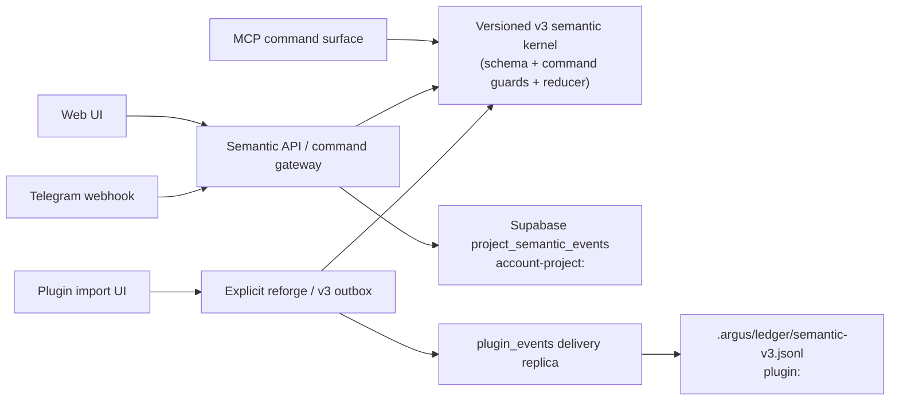

# Decision Knowledge Kernel v6: implementation handoff

Date: 2026-07-14
Status: Implemented in `main`; production rollout and value validation remain pending
Normative authority: `docs/DESIGN-decision-knowledge-kernel-v6-final-2026-07-14.md`

## Purpose and scope

This document is the operational handoff for the Decision Knowledge Kernel
(DKK) v6 work. It records what is in the repository, what was deliberately
not claimed, and what must happen before calling the system production-ready.
It is not a replacement for the v6 normative design or the phase ADRs.

`docs/ARGUS-BLUEPRINT.md` is outside this workstream. It was neither used as
implementation authority nor changed by this delivery.

## Delivered outcome

DKK v6 now has one versioned semantic kernel and surface-specific command
adapters rather than separate decision state machines. A judgment is an
append-only event history: sealing, observing, asserting a resolution,
deferring, and closing are different acts. A resolution does not close a
judgment, and no surface may invent a human authorization or rewrite the
sealed statement from a later outcome.

The diagram distinguishes spaces intentionally. A project account ledger and a
plugin-local ledger are not silently merged into a single mutable record.

## What was implemented

| Phase | Delivered artifact | Status |
|---|---|---|
| P0 | Operating contract, terminology, authority boundaries, and ADR discipline | Complete |
| P1 | Messy/adversarial corpus and explicit P5 measurement criteria | Complete |
| P2 | Versioned v3 semantic package: schemas, commands, reducer, temporal projections, and conformance fixtures | Complete |
| P3 | Loss-aware v2 adapter with explicit exact/split/degraded/opaque outcomes | Complete |
| P4 | Opt-in MCP vertical slice using the shared kernel | Complete |
| P5 | Value gate and measurement harness | **HOLD**: no real pilot or baseline evidence exists yet |
| P6 | Web project canonical ledger, command API, UI projection, export/deletion coverage, and database migration | Code complete; migration not applied to a live database |
| P7 | Telegram and plugin convergence onto v3 semantics | Code complete; live end-to-end rollout not yet performed |

The implementation was delivered in this commit sequence:

| Commit | Meaning |
|---|---|
| `5714443d` | P0 operating contract |
| `3a163393` | P1 corpus and P5 criteria |
| `e724db5c` | P2 semantic package |
| `b60df592` | P3 legacy adapter |
| `cb197fe2` | P4 MCP vertical slice |
| `bb84d271` | P5 value-gate test |
| `a00e0fac` | P6/P7 web, Telegram, plugin, migration, tests, and ADRs |

### Shared kernel and build boundary

- The web application imports the compiled MCP v3 kernel through
  `src/lib/decision-kernel.ts`; it does not copy the reducer.
- Root `predev`, `prebuild`, and `pretest` build `argus-mcp` first. This makes
  a normal development, build, or test invocation use the same current kernel.
- The reducer preflights candidate batches before storage. Storage then gives
  each append batch an idempotency key and an atomic receipt.

### Web project ledger (P6)

- `account-project:<projects.id>` is the semantic space for a project.
- `project_semantic_events` is the canonical, append-only project ledger.
  `projects.decision_contract` remains a legacy projection and can only point
  at `semantic_judgment_id`; it is not the v3 source of truth.
- `POST /api/semantic/projects/:projectId/events` accepts named commands only.
  The browser cannot submit its own recorder, origin, or authorization fields.
- The migration defines a locked, service-role-only RPC that verifies project
  ownership and space identity, serializes concurrent appends per project, and
  rejects altered retries rather than applying last-write-wins.
- `SemanticDecisionCard` displays the sealed judgment, return question, and
  event history. It offers separate actions for observation, answer, defer,
  and close. It does not claim that an observation is verified merely because
  it was recorded.
- Account erasure coverage includes `project_semantic_events`.

### Telegram semantics (P7)

- For a project with `semantic_judgment_id`, a Telegram message or callback is
  recorded as direct-command evidence with its exact update/message/callback
  receipt reference.
- An outcome response creates an atomic observation plus resolution assertion.
  The bot then presents a separate close action. It never one-tap-settles a v3
  judgment.
- `pending` records a return deferral. Mute changes notification delivery only.
- Legacy non-v3 decision-contract behavior remains an explicit compatibility
  path; it was not silently recast as a v3 result.

### Plugin semantics (P7)

- Imported v2 decisions remain readable v2 data. They are not automatically
  upgraded.
- A user may explicitly reforge a v2 decision into a retrospective v3 seal and
  return contract. The source v2 record is retained as import provenance.
- A plugin answer records observation plus resolution, while a separate user
  action closes the judgment.
- `semantic_v3` outbox rows are copied verbatim by `/argus:pull` or
  `/argus:sync` to `.argus/ledger/semantic-v3.jsonl`. The plugin local JSONL is
  that plugin space's canonical ledger; `plugin_events` is a delivery
  replica/outbox, not a second mutable state machine.

## Important invariants now enforced

1. AI/system output can propose or record, but cannot fabricate a human's
   adoption, observation, verdict, or closure.
2. A sealed statement and its future return question are separate fields.
3. Observation, resolution assertion, and closure are separate event types.
4. `return_deferred` remains non-terminal.
5. Conflicts are preserved by the reducer rather than overwritten by a newer
   timestamp.
6. Legacy data is adapted with declared loss; it is never deceptively renamed
   into equivalent v3 evidence.
7. Semantic event content is transferred verbatim across the plugin pull path.

## Validation performed

The following completed successfully against the delivered source:

| Check | Result |
|---|---|
| `npm run build` | Passed; compiled the MCP kernel first and built the Next application including the semantic API route |
| Root Vitest suite | 325 files passed, 3,888 tests passed, 10 skipped as expected |
| MCP package suite | 86 files passed, 844 tests passed |
| Focused semantic web/plugin/Telegram/erasure tests | 4 files, 21 tests passed after the P7 changes |
| `npm run lint` | Passed with 0 errors; 139 existing warnings remained below the repository threshold of 145 |
| `git diff --check` | Passed before commit |
| Plugin pull smoke test | Passed; a `semantic_v3` payload was copied unchanged to the local JSONL ledger |

The implementation tests prove code-level and command-level conformance. They
do not prove a production database deployment, a real Telegram delivery, or
user value.

## Deliberately incomplete or not yet authorized

### P5 remains HOLD

No completed real pilot, blinded comparison, or baseline measurement was found
in the local evidence. Therefore this work does **not** claim a P5 GO, product
value improvement, permission to market the DKK as validated, or authorization
to broaden the product solely on that basis. The decision to complete P6/P7 was
an explicit structural and dogfood-readiness continuation, recorded in
`ADR-2026-07-14-dkk-v6-continuation-after-p5-hold.md`.

### Production rollout has not happened

The repository contains the migration
`supabase/migrations/20260714_project_semantic_events.sql`, but it was not
applied to any live Supabase database. Without it, the semantic API fails
honestly rather than falling back to mutable JSONB. No production Telegram
token, webhook deployment, plugin publication, or live account data was
changed by this work.

### Evidence still required for P6/P7 exit claims

The following have not been represented as complete:

- A real signed-in project flow against the deployed ledger RPC.
- A real Telegram answer followed by a separate close callback on production
  infrastructure.
- A real plugin reforge followed by remote delivery and local pull in a user
  repository.
- A cross-surface dogfood review of conflicts, failed commands, and recovery
  language.
- The full benchmark that decides go, narrow continuation, or stop after P5.

## Required next actions, in order

1. **Review and apply the migration in the approved Supabase environment.**
   Confirm the table, RLS, uniqueness constraints, and service-role-only RPC
   are present. Do not add a browser-write policy or JSONB fallback.
2. **Deploy the web application only after the migration is available.**
   Exercise an authenticated project seal, observation, answer, defer, and
   separate close. Check retry receipts and concurrent-command conflicts.
3. **Run a controlled Telegram dogfood flow.**
   Verify that a reply records an observation/resolution but leaves the
   judgment unclosed until the distinct close callback.
4. **Run a controlled plugin dogfood flow.**
   Reforge a v2 import deliberately, record an answer, close it separately,
   then confirm the pulled `semantic-v3.jsonl` contains the same event IDs and
   content emitted by the outbox.
5. **Verify lifecycle operations.**
   Run account export and deletion against a test account and confirm semantic
   events are included/erased according to the existing deletion process.
6. **Run P5 for real before expanding claims or scope.**
   Use the declared corpus/baseline, record user time and reconstruction
   quality, and produce an explicit GO, narrowed continuation, or stop ADR.
7. **Add operational evidence before general availability.**
   Review gateway failures, duplicate receipts, conflict states, delivery
   failures, and user-facing recovery language from the dogfood period.

## Change and rollback discipline

- Do not edit or delete semantic events to repair a result. Use a new,
  authorized semantic command or an additive repair migration with an ADR.
- Do not silently rewrite a legacy decision, plugin event, or stored event
  during synchronization.
- Any semantic change must update the governing ADR, executable fixture, and
  migration impact together.
- If a rollout is paused, preserve the append-only ledger and receipts. A
  rollback must not turn a valid history into mutable projection state.

## Related documents

- `docs/DESIGN-decision-knowledge-kernel-v6-final-2026-07-14.md` — normative
  design authority.
- `docs/ADR-2026-07-14-dkk-v6-p0-operating-contract.md` through
  `docs/ADR-2026-07-14-dkk-v6-p5-value-gate.md` — P0–P5 decisions.
- `docs/ADR-2026-07-14-dkk-v6-continuation-after-p5-hold.md` — authorized
  continuation while value validation remains HOLD.
- `docs/ADR-2026-07-14-dkk-v6-p6-web-canonical-ledger.md` — web ledger
  design.
- `docs/ADR-2026-07-14-dkk-v6-p7-surface-convergence.md` — Telegram and
  plugin convergence design.
