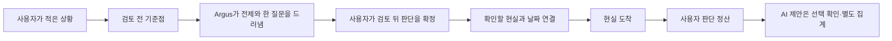

# Argus 판단 여정 재구축 — 구현·검증 보고서

> 작성일: 2026-07-25  
> 구현 PR: [#290 · Rebuild the Argus judgment journey](https://github.com/commet/Argus/pull/290)  
> 구현 병합 커밋: `095a5cc6d181d2a40af783764891620a705de5a7`  
> 구현 소스 커밋: `867dd85730cbc5df574ac57847517c86a296d350`  
> 운영 배포: [한국어](https://argus.voyage/ko) · [English](https://argus.voyage/en)  
> Vercel deployment: `dpl_GrUB9FTfXBpBM8Pu99yAWVxgbZJq`

이 문서는 `docs/ARGUS-BLUEPRINT.md`를 대체하는 새 설계 정본이 아니다.
BLUEPRINT 공정 5에서 실제로 시공한 내용, 그 과정에서 내린 결정, 데이터 계약,
검증 결과와 남은 한계를 한곳에 보존하는 **구현 보고서**다.

---

## 1. 한 문장 요약

Argus의 웹 여정을 “결정을 저장하고 날짜에 다시 알리는 메모”에서
**생각을 벼리고 → 그 판단을 움직인 전제를 구분해 남기고 → 사용자가 최종
판단을 확정하고 → 현실과 비교해 고리를 닫는 제품**으로 재구축했다.

이번 시공에서 가장 중요한 변화는 귀환 알림 자체가 아니다.

1. 첫 입력은 최종 판단이 아니라 **검토 전 기준점**이다.
2. AI는 전제와 질문을 제안하되 사용자의 판단으로 위장하지 않는다.
3. 검토가 끝난 뒤 사용자가 확정한 문장이 유일한 대표 판단이 된다.
4. 현실 확인 때 사용자 판단과 AI 제안을 필수도·점수·표시에서 분리한다.
5. 작성 주체, 확정 주체, 유입 경로와 시각을 각각 저장한다.

---

## 2. 창업자 문제 정의를 구현 언어로 번역한 결과

### 2.1 “귀환만 있으면 reminder 아닌가?”

귀환은 Argus의 마지막 동작이지 제품 전체가 아니다. 따라서 여정을 다음처럼
분리했다.



제품 가치는 `E → F`의 리마인더에만 있지 않다. `A → D`에서 사용자의 판단을
벼리고, `D → H`에서 그 판단이 현실과 어떻게 맞았는지를 정직하게 남기는 데 있다.

### 2.2 “처음에도 묶고 마지막에도 묶는 건 뭐가 다른가?”

이전 UI는 첫 단계와 마지막 단계가 모두 사실상 봉인처럼 보였다. 현재 계약은
다음과 같다.

| 시점 | 의미 | 평가 대상 여부 | 사용자에게 보이는 이름 |
|---|---|---:|---|
| 검토 시작 | 지금 생각의 출발점 | 아니오 | 검토 전 기준점 |
| 검토 종료 | 검토 뒤 유지할 판단 | 예 | 판단 기록 확정 |
| 확인일 | 실제 결과와 비교 | 예 | 현실 확인 |

첫 기준점은 변화량을 보기 위한 비교점이다. 판단 성과에는 들어가지 않는다.
마지막에 확정한 사용자 문장만 귀환의 대표 체크포인트가 된다.

### 2.3 “인간 only / AI only가 정말 엄밀한가?”

단일 `human | ai` 라벨로 해결하지 않았다. 문장 생성과 판단 권한을 분리했다.

- 누가 문장을 표현했는가
- 사용자가 그 문장을 자기 판단으로 확정했는가
- 어느 표면에서 들어왔는가
- 언제 기록됐는가

따라서 “AI가 표현한 문장을 사용자가 채택한 경우”도 출처를 세탁하지 않고
표현 출처는 AI, 판단 권한은 사용자 채택으로 기록할 수 있다.

---

## 3. 최종 사용자 여정

### 3.1 랜딩

#### 구현

- 한국어 헤드라인:
  `AI가 실행을 가져간다. 판단은 어디에 쌓이나?`
- 영어 헤드라인:
  `Decisions pass. Judgment compounds.`
- 메인 CTA:
  `가장 중요한 질문 찾기` / `Find the question that matters`
- 문서 검토는 동급 CTA가 아니라 보조 진입 링크로 강등했다.
- 후기 섹션과 중복 프로젝트 항구 섹션을 제거했다.
- 검증되지 않은 “30초” 완주 약속을 제거했다.
- “로그인 없이 시작”, “기록 내용은 사용자가 확인”이라는 실제 조건을 명시했다.

#### 의도

랜딩의 단일 임무는 기능 목록을 설명하는 것이 아니라 다음 차이를 기억시키는
것이다.

> Argus는 답을 대신 정하는 도구가 아니라, 판단을 움직이는 전제를 드러내고
> 사용자가 확정한 판단을 현실과 다시 만나게 한다.

#### 현재 한계

히어로 오른쪽의 `Decision record` 예시는 구조적으로는
`사용자 원문 → AI 질문 → 사용자 최종 판단 → 현실 귀환`을 담았지만,
시각적으로는 아직 작은 표와 영수증에 가깝다. 자세한 평가는
[§11](#11-정직한-미완성-히어로-decision-record)에 기록한다.

### 3.2 검토 전 기준점

`BindCard`를 압축하고 역할을 다시 정의했다.

- 사용자의 원문을 먼저 보여준다.
- 첫 입력을 `검토 전 기준점`이라고 명명한다.
- 최종 판단은 검토 뒤 별도로 확정된다고 설명한다.
- CTA를 `기준점 남기고 계속`로 변경했다.
- 날짜 칩은 모바일에서 가로 스크롤되며 핵심 행동을 밀어내지 않는다.
- 다음 단계는 여러 AI 리뷰어가 읽는다는 설명이 아니라
  “판단을 바꿀 수 있는 한 질문부터 시작한다”로 바꿨다.
- 사용자에게 아직 기준점이 없으면 건너뛸 수 있다.

기준점 저장 분석 이벤트도 `decision_sealed`가 아니라
`decision_baseline_captured`로 변경했다. 첫 입력을 최종 봉인으로 계측하던 의미
오염을 제거했다.

### 3.3 검토 진행

메인 화면에서 내부 워커 상태가 제품 가치보다 커 보이던 문제를 줄였다.

제거한 요소:

- 아바타 스택
- `1/4 처리` 같은 내부 작업 수
- 메인 진행률 막대
- “AI 검토자가 이미 읽고 있다”는 작위적 문구

남긴 요소:

- 현재 전제를 확인하고 있다는 한 문장
- 완료된 검토가 보존된다는 사실
- 상세 과정을 보고 싶은 사용자를 위한 보조 링크
- 접근성 도구가 읽을 수 있는 숨김 progressbar

### 3.4 중단 후 재개

중단 복구는 문구만 바꾼 것이 아니라 실제 엔진 결함을 수정했다.

#### 기존 결함

1. 완료된 전역 단계 결과를 저장소에서 읽는다.
2. 완료된 워커는 재실행하지 않는다.
3. 그러나 단계 실행용 `currentStageResults`를 빈 맵으로 다시 만든다.
4. 후속 작업은 완료 결과를 찾지 못한다.
5. LLM은 빠진 입력을 그럴듯하게 채우거나 파이프라인이 실패한다.

즉, “완료 작업은 재실행하지 않음”과 “완료 결과는 후속 작업에 전달되지 않음”이
동시에 일어났다.

#### 수정

`currentStageResults`를 `readyOutput`으로 초기화한다.

그 결과:

- 도착한 결과를 재실행하지 않는다.
- 도착한 결과가 후속 프롬프트에 유지된다.
- 부족한 작업만 실행한다.
- 복구 배너는 정확한 내부 개수 대신 “완료된 검토 보존, 남은 검토만 재개”를
  설명한다.

이 결함은 `worker-dependency-gate.test.ts`에 회귀 테스트를 추가했다.

### 3.5 검토 뒤 판단 확정

`SealMoment`는 유일한 최종 판단 확정 장면이 되었다.

- 장면 서두를 `검토의 끝 · 판단 기록`으로 변경했다.
- 기준점과 최종 판단이 다르면 둘을 나란히 보여준다.
- 사용자가 최종 판단을 직접 적을 수 있다.
- 최종 판단을 비우면 기존 사용자 기준점을 유지한다고 명시한다.
- 사용자의 최종 문장을 `user_lean` 대표 predicate로 교체한다.
- AI 전제와 위험은 보조 predicate로 남는다.
- 대표 checkpoint는 항상 최종 사용자 판단을 가리킨다.
- 확정 후 증서가 화면 밖으로 뛰는 스크롤 문제를 수정했다.
- 추출 결과가 비어 있는 복구 경로도 동일한 출처·권한·checkpoint 규칙을 쓴다.

최종 CTA:

- 한국어: `판단 기록 확정 · {날짜}에 확인`
- 영어: `Confirm this judgment · check on {date}`

### 3.6 프로젝트

프로젝트의 정보 순서를 바꿨다.

#### 이전

1. 생성된 분석 또는 프로젝트 아티팩트
2. 상태와 보조 카드
3. 사용자 판단과 귀환 계약

#### 현재

1. 사용자가 확정한 판단
2. 확인할 현실과 귀환 날짜
3. 지금 답해야 할 결과 질문
4. 생성된 분석과 참고 자료

문서는 판단 기록을 먹이는 feeder이고, 최종 제품은 사용자 판단과 현실 확인
기록이라는 현재 정체성을 반영했다.

검토가 끝나지 않은 프로젝트에는 “최종 판단이 이미 저장됐다”고 표시하지 않고
`검토 전 기준점이 저장됨` 카드를 보여준다. 사용자는 여기서 검토를 이어가거나
기준점을 지울 수 있다.

### 3.7 수동 확인과 약속한 날 확인

프로젝트 표면의 두 경로를 같은 `SettlementModal`로 통합했다.

- 확인일 도착: 정산 모달 자동 진입
- 사용자가 `지금 확인하기` 선택: 같은 정산 모달 진입
- 결과 재선택: 같은 정산 모달 진입

카드 안의 별도 간이 채점 UI와 예약일 모달이 서로 다른 제품처럼 움직이던 문제를
제거했다.

### 3.8 현실 확인

정산 순서는 다음과 같다.

1. 그때 사용자가 확정한 판단
2. 현실과 비교한 4개 결과 선택
3. 실제로 일어난 일 한 줄 — 선택 사항
4. Argus가 짚었던 AI 전제 — 접힌 선택 사항

사용자 판단이 하나 이상 명시되어 있다면 사용자 판단만 필수다.
AI 제안은 확인하지 않아도 고리가 닫힌다.

### 3.9 정산 완료

완료 프로젝트에는 사용자 판단 결과만 기본 목록과 점수에 포함된다.

- 사용자 판단 적중/빗나감
- 운 또는 외부 요인으로 분류한 좋은 결과
- 실제로 일어난 사실

AI가 제안한 전제는 접힌 별도 영역에 남는다.

> `Argus가 짚었던 전제 N개 · 사용자 점수와 분리`

---

## 4. 데이터 계약

### 4.1 `JudgmentAttribution`

`src/stores/types.ts`에 다음 선택 필드를 추가했다.

```ts
export interface JudgmentAttribution {
  wording_source:
    | 'user_direct'
    | 'user_reworded'
    | 'ai_surfaced'
    | 'imported'
    | 'legacy_unknown';
  authority:
    | 'user_asserted'
    | 'user_adopted'
    | 'ai_suggested'
    | 'unconfirmed'
    | 'legacy_unknown';
  surface:
    | 'web'
    | 'mcp'
    | 'plugin'
    | 'telegram'
    | 'document_import'
    | 'legacy_unknown';
  recorded_at: string;
  source_ref?: string;
}
```

`Predicate.attribution`과 `JudgmentReceipt.judgment_attribution`이 이 구조를
사용한다.

### 4.2 축을 분리한 이유

| 축 | 답하는 질문 | 예 |
|---|---|---|
| `wording_source` | 이 문장을 누가 표현했는가? | AI가 제안한 문장 |
| `authority` | 이것이 누구의 확정 판단인가? | 사용자가 채택 |
| `surface` | 어디에서 들어왔는가? | 플러그인 |
| `recorded_at` | 언제 기록됐는가? | ISO timestamp |
| `source_ref` | 어떤 단계에서 생겼는가? | `workspace:closing_judgment` |

AI 문장을 사용자가 채택하더라도 `wording_source`를 사용자로 바꾸지 않는다.
사용자가 채택했다는 사실은 `authority`에서 별도로 표현한다.

### 4.3 웹 기록 생성 도우미

`src/lib/decision-contract.ts`에 웹 경로용 생성 도우미를 추가했다.

- `webUserAttribution`
- `webAiAttribution`

다음 웹 경로에 명시적 attribution을 붙였다.

- 사용자가 직접 쓴 decision line
- 검토 전 기준점
- 검토 뒤 최종 판단
- synthesis에서 사용자가 확정한 conflict resolution
- AI mix assumption
- AI review concern
- AI crew dissent
- falsification 단계의 사용자 또는 AI 표현

### 4.4 `JudgmentReceipt`

영수증에 추가한 필드:

- `baseline_judgment`
- `judgment_attribution`

귀환 영수증과 최종 증서에는 attribution이 있으면 다음 정보를 조용한 보조 행으로
표시한다.

> 사용자가 다듬음 · 사용자 확정 · 웹 · 2026년 7월 25일 01:10

legacy 기록은 필드가 없으므로 기존처럼 렌더되며 깨지지 않는다.

### 4.5 DB 마이그레이션이 없는 이유

새 값들은 기존 `decision_contract` JSON 내부의 선택 필드다. 동기화 인터페이스에
새 최상위 SQL 컬럼을 추가하지 않았다. 따라서 별도 Supabase column migration은
필요하지 않았다.

---

## 5. 사용자 판단과 AI 제안의 계산 분리

### 5.1 사용자 소유 판단 판정

`isUserOwnedPredicate`는 다음을 구분한다.

- 명시적 사용자 확정 또는 사용자 채택
- 명시적 AI 제안 또는 미확정
- legacy 데이터의 호환 fallback

`requiredSettlementPredicates`는 명시적 사용자 판단이 있으면 그것만 필수로
돌려준다. legacy contract에 명시적 attribution이 하나도 없을 때만 이전처럼 전체
predicate를 필수로 취급한다.

### 5.2 대표 checkpoint

`pickPrimaryPredicate`의 우선순위:

1. 명시적 사용자 소유 `user_lean`
2. 기타 사용자 소유 governing predicate
3. legacy fallback

따라서 AI가 생성한 governing assumption이 더 앞에 있다는 이유로
`그때 내가 내린 판단`으로 표시되지 않는다.

### 5.3 점수 오염 수정

기존 `summarizeGrades`는 AI가 제안한 held bet을:

- 전체 `betsHeld`에도 더하고
- `betsHeldAiSurfaced`에도 더했다.

결과적으로 사용자가 만들지 않은 예측이 사용자 판단 성과를 부풀릴 수 있었다.

현재:

- AI 제안 held bet → AI 전용 count
- AI 제안 avoided risk → AI 전용 count
- 사용자 소유 held/broke/avoided/happened → 사용자 score
- AI 제안의 행운/외부 요인 → 사용자 `goodOutcomesOnLuck`에 합산하지 않음

정산 완료 UI에서도 AI 결과를 “그중 초안”처럼 사용자 점수의 부분집합으로 쓰지
않고 `AI 제안 확인 N개`로 분리한다.

---

## 6. 카피와 정보 위계 변경

### 6.1 제거하거나 바꾼 표현

| 이전 문제 | 변경 |
|---|---|
| AI 검토자가 이미 읽고 있어요 | 판단을 바꿀 수 있는 한 질문부터 시작 |
| 첫 단계가 봉인처럼 보임 | 검토 전 기준점 |
| 4건 중 1건 처리 | 메인 UI에서 제거 |
| 중단된 작업이 있어요 | 완료된 검토 보존, 남은 검토만 재개 |
| 그때 건 예측 | 그때 남긴 판단 |
| AI 전제도 사용자 예측처럼 표시 | AI가 짚었던 전제 · 선택 |
| 판단 기록 봉인 | 판단 기록 확정 |

### 6.2 한국어와 영어

한국어와 영어는 단어만 치환하지 않고 각각 문장 길이와 화면 폭을 고려했다.

- 한국어는 `판단`, `전제`, `기준점`, `현실 확인`을 일관되게 사용한다.
- 영어는 `judgment`, `premise`, `baseline`, `check against reality`를 사용한다.
- 사용자 판단에는 `you chose`, AI 제안에는 `Argus surfaced/suggested`를 쓴다.

---

## 7. 파일별 구현 지도

### 7.1 랜딩

| 파일 | 변경 |
|---|---|
| `src/components/landing/SirenHero.tsx` | 히어로 메시지·입력·CTA·예시 전면 재작성 |
| `src/app/[locale]/page.tsx` | 랜딩 섹션 순서 단순화 |
| `src/components/landing/Testimonials.tsx` | 삭제 |
| `src/components/landing/voyage/Act3OnDeck.tsx` | 삭제 |
| `src/components/landing/voyage/Act2DecisionVoyage.tsx` | 과장 시간 약속 제거 |

### 7.2 워크스페이스

| 파일 | 변경 |
|---|---|
| `src/components/workspace/progressive/BindCard.tsx` | 검토 전 기준점으로 재설계 |
| `src/components/workspace/progressive/CrewAtWork.tsx` | 내부 작업 수·아바타·메인 진행률 제거 |
| `src/components/workspace/progressive/ProgressiveFlow.tsx` | 복구 배너와 재개 의미 수정 |
| `src/components/workspace/progressive/SealMoment.tsx` | 최종 판단·비교·attribution·스크롤·복구 경로 수정 |
| `src/app/[locale]/workspace/page.tsx` | 기준점 이벤트·프로젝트 제목 안정화 |

### 7.3 프로젝트와 귀환

| 파일 | 변경 |
|---|---|
| `src/app/[locale]/project/page.tsx` | 판단 기록 우선 배치, 수동/예약 정산 통합 |
| `src/components/projects/DecisionContractCard.tsx` | 기준점 상태, 사용자/AI 분리, 공통 정산 진입 |
| `src/components/projects/JudgmentReceipt.tsx` | 기준점·최종 판단·귀환 영수증 위계 |
| `src/components/projects/JudgmentAttributionLine.tsx` | 문장 출처·권한·경로·시각 표시 |
| `src/components/projects/SettlementModal.tsx` | 사용자 필수/AI 선택 정산 분리 |
| `src/components/projects/CheckpointReturnCard.tsx` | 사용자 판단과 AI 제안의 귀환 문구 분기 |

### 7.4 도메인과 엔진

| 파일 | 변경 |
|---|---|
| `src/stores/types.ts` | attribution 및 receipt 필드 |
| `src/lib/decision-contract.ts` | attribution 생성, 필수 정산, 점수 분리 |
| `src/lib/checkpoint-core.ts` | 사용자 소유 판단 우선 checkpoint |
| `src/lib/worker-engine.ts` | 완료 단계 결과를 재개 시 보존 |

### 7.5 테스트

| 파일 | 보장하는 계약 |
|---|---|
| `flow-interactions.test.tsx` | 새 기준점 카피와 모바일 clamp |
| `checkpoint-core.test.ts` | 사용자 판단이 AI governing보다 우선 |
| `decision-contract-bind.test.ts` | attribution과 AI 선택 정산 |
| `decision-contract-live.test.ts` | synthesis 사용자 판단의 명시적 provenance |
| `predicate-basis.test.ts` | AI held bet이 사용자 score에 합산되지 않음 |
| `worker-dependency-gate.test.ts` | 재개 시 완료 결과가 후속 프롬프트에 도달 |
| `mojibake-guard.test.ts` | 새 한국어 귀환 문구의 인코딩 보존 |

---

## 8. 검증 결과

### 8.1 로컬

| 검사 | 결과 |
|---|---|
| TypeScript | 통과 |
| 전체 Vitest | 3,699 passed · 10 skipped |
| Test files | 313 passed · 1 skipped |
| ESLint | errors 0 · 기존 warnings 113 |
| Next.js production build | 통과 |
| `git diff --check` | 통과 |

JSDOM의 `Window.scrollTo()` 미구현 안내는 있었지만 실패는 아니었다.

### 8.2 원격 CI

PR과 `main` push CI에서 다음 gate가 통과했다.

- Argus decision MCP package
- real stdio picker round-trip
- TypeScript
- Lint
- Test + coverage ratchet
- spine static gate
- enforcement gates
- detection corpus
- agentic corpus integrity
- agentic scorers
- sense hook
- secret redaction
- ledger writers
- webapp connect flow
- reminder hook
- install smoke
- generated-contract sync
- plugin validate

`main` CI run:
[30109900077](https://github.com/commet/Argus/actions/runs/30109900077)

### 8.3 실브라우저

검수한 표면:

- 한국어 데스크톱 히어로
- 영어 모바일 히어로
- 한국어·영어 390×844
- 검토 전 기준점
- 예약일 귀환
- 수동 귀환
- 사용자 판단 정산
- AI 전제 선택 영역
- 정산 완료 프로젝트

확인 결과:

- 모바일 기준점 화면에서 원문·설명·입력·날짜·CTA가 첫 viewport에 들어옴
- 귀환 화면에서 대표 판단과 4개 결과 선택이 첫 viewport에 들어옴
- 사용자 판단 하나를 선택하면 AI 전제 미확인 상태에서도 고리가 닫힘
- 완료 프로젝트의 사용자 score는 AI 전제를 포함하지 않음
- 한국어·영어 콘솔 errors 0, warnings 0

### 8.4 운영 배포

병합 뒤 Vercel production deployment 완료를 확인했다.

- `/ko`: HTTP 200, 새 한국어 히어로 확인
- `/en`: HTTP 200, 새 영어 히어로 확인
- production HTML deployment id:
  `dpl_GrUB9FTfXBpBM8Pu99yAWVxgbZJq`

---

## 9. Git 이력

### 구현

- 브랜치: `codex/argus-judgment-journey-r4`
- 커밋: `867dd857 feat: rebuild Argus judgment journey`
- PR: [#290](https://github.com/commet/Argus/pull/290)
- merge commit:
  `095a5cc6d181d2a40af783764891620a705de5a7`
- 병합 방식: squash merge
- 원격 구현 브랜치: 병합 후 삭제

구현 PR은 27개 파일에서 954줄을 추가하고 859줄을 제거했다.

---

## 10. 이번 시공의 경계

### 포함

- 랜딩 히어로와 랜딩 섹션 다이어트
- progressive 웹 여정의 기준점·진행·최종 판단
- 프로젝트 판단 기록 우선순위
- 수동/예약 귀환 통합
- 사용자/AI attribution
- 사용자 score 오염 제거
- 중단 복구의 완료 결과 보존
- KO/EN responsive 검수

### 포함하지 않음

- MCP 또는 플러그인의 provenance 코어 재작성
- 새로운 Supabase schema
- 새로운 알림 유형
- 3-질문 구조 자체의 전면 재설계
- 프로젝트 전체 항구의 완전한 IA 재구축
- 히어로 `Decision record`의 최종 시그니처 디자인

MCP와 플러그인은 이번 PR에서 소스 변경하지 않았다. 그쪽에 이미 존재하는
출처·권한 체계를 참고해 웹 모델을 같은 방향으로 맞췄고, 관련 CI gate가 모두
통과한 것을 확인했다.

---

## 11. 정직한 미완성: 히어로 `Decision record`

운영 배포 뒤 데스크톱과 390×844 모바일을 다시 검토한 결과, 현재 히어로의
`Decision record`는 기능 의미는 맞지만 제품의 시그니처 장면으로는 실패했다.

### 11.1 무엇을 담으려 했는가

현재 카드는 다음 네 단계를 한 장에 담는다.

1. 사용자가 적은 원문
2. Argus가 짚은 한 질문
3. 검토 뒤 사용자가 확정한 판단
4. 현실과 확인할 날짜

이는 데이터와 사용자 여정의 구조로는 정확하다.

### 11.2 왜 시각적으로 약한가

1. **변화를 체험시키지 않고 표로 설명한다.**  
   Argus의 핵심은 문장이 벼려지는 과정인데, 완성된 결과를 네 행으로 진열한다.

2. **히어로의 주인공이 둘이다.**  
   왼쪽 입력 폼과 오른쪽 설명 카드가 동시에 중심이 되려 한다.

3. **레이블이 많고 행정적이다.**  
   원문, 사용자, AI, 판정 없음, 한 번 벼림, RETURN 등이 판단의 긴장보다
   내부 데이터 스키마를 먼저 보이게 한다.

4. **모바일에서 payoff가 잘린다.**  
   390×844 첫 viewport에는 카드의 앞부분만 보이고 최종 판단과 현실 귀환은
   아래로 밀린다.

5. **시간 이동이 문구에만 있다.**  
   날짜와 `RETURN →`이 있지만 현재와 미래의 시각적 온도 차이가 없다.

6. **예시가 그로스 도구처럼 보인다.**  
   재방문율 25%, CAC, 예산 증액은 정확하지만 첫 인상을 B2B 지표 검토 도구로
   좁힐 수 있다.

7. **시각 언어가 안전하다.**  
   따뜻한 종이, 명조, 얇은 선, 금색은 브랜드와 맞지만 현재 카드는 이를 가장
   익숙한 “빈티지 문서 UI” 방식으로 사용한다.

### 11.3 수정 방향

현재 카드를 미세 조정하지 않고 삭제한 뒤 **한 문장이 시간에 따라 변하는
단일 장면**으로 다시 만드는 것이 맞다.

```text
내가 처음 적은 문장
“이 제안을 받아들일까?”

                  Argus가 한 곳만 건드린다
                  밑줄: “나를 뽑은 팀장”

내가 검토 뒤 확정한 문장
“팀장이 아니라 역할과 권한이 유지될 때 간다.”

────────────────────────
4개월 뒤
그 팀장이 다른 조직으로 이동했습니다.

그래서, 지금도 같은 판단인가요?
```

원칙:

- 네 칸 표가 아니라 문장 하나가 주인공
- AI는 답안이 아니라 한 부분에만 흔적을 남김
- 사용자가 바꾼 단어가 시각적으로 드러남
- 현실 사건이 나중에 같은 기록 위로 들어옴
- attribution 감사 정보는 히어로가 아니라 실제 기록 상세에 둠
- 모바일 첫 viewport에서 최소한 `원문 → 한 질문`의 변화가 보임
- 최종 판단과 귀환은 사용자 상호작용 뒤 이어지는 한 번의 전환으로 표현

이 항목은 이번 PR #290에서 완료됐다고 주장하지 않는다.

---

## 12. 회귀 시 반드시 지켜야 할 불변식

1. 첫 기준점은 최종 판단 또는 seal로 계측하지 않는다.
2. AI가 표현한 문장은 사용자가 채택해도 표현 출처를 사용자로 바꾸지 않는다.
3. 명시적 사용자 판단이 있으면 AI 제안은 정산 필수가 아니다.
4. AI 제안 결과는 사용자 판단 score에 합산하지 않는다.
5. 대표 checkpoint는 사용자 확정 판단을 우선한다.
6. 완료된 워커 결과는 재개 시 후속 단계 입력에 남아야 한다.
7. 수동 확인과 예약일 확인은 같은 정산 계약을 사용한다.
8. legacy attribution 부재가 기존 기록을 깨뜨려서는 안 된다.
9. 사용자·LLM 텍스트는 JSX로 렌더하고 임의 HTML을 허용하지 않는다.
10. 히어로의 다음 수정은 설명 카드 장식이 아니라 시그니처 장면 재설계여야 한다.

---

## 13. 결론

이번 시공은 Argus의 핵심 고리를 데이터와 사용자 여정에서 바로잡았다.

- 사용자의 출발 생각과 최종 판단을 구분했다.
- AI가 제안한 문장을 사용자 판단으로 위장하지 않는다.
- 사용자 판단과 AI 제안을 정산 필수도와 성과 집계에서 분리했다.
- 중단된 검토가 완료 결과를 잃던 실제 구조 결함을 고쳤다.
- 수동과 예약 귀환을 하나의 현실 확인 과정으로 만들었다.
- 판단 기록을 프로젝트의 첫 번째 자산으로 올렸다.

남은 가장 큰 시각적 부채는 랜딩 히어로의 `Decision record`다. 현재 구현은
제품 구조를 설명하지만 제품의 고유한 감각을 만들지 못한다. 다음 수정에서는
영수증을 꾸미는 대신 **한 판단이 벼려지고 시간이 지난 뒤 현실과 충돌하는
장면**을 히어로의 유일한 시그니처로 만들어야 한다.

